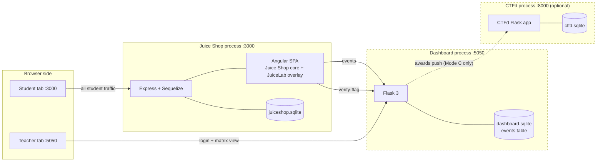
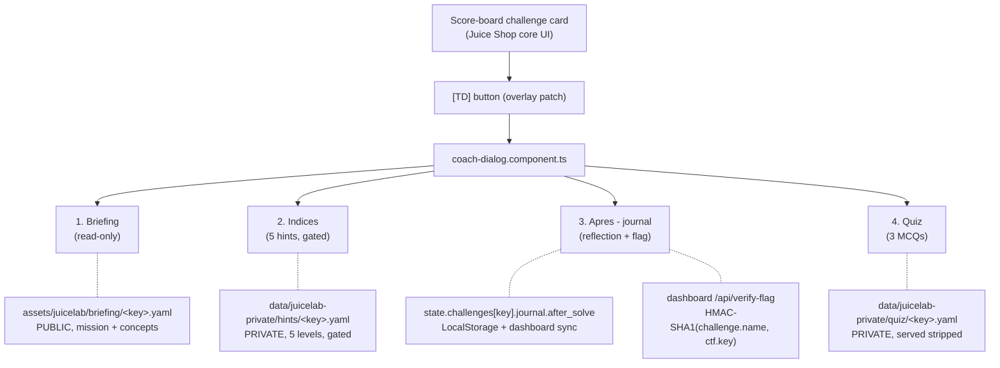
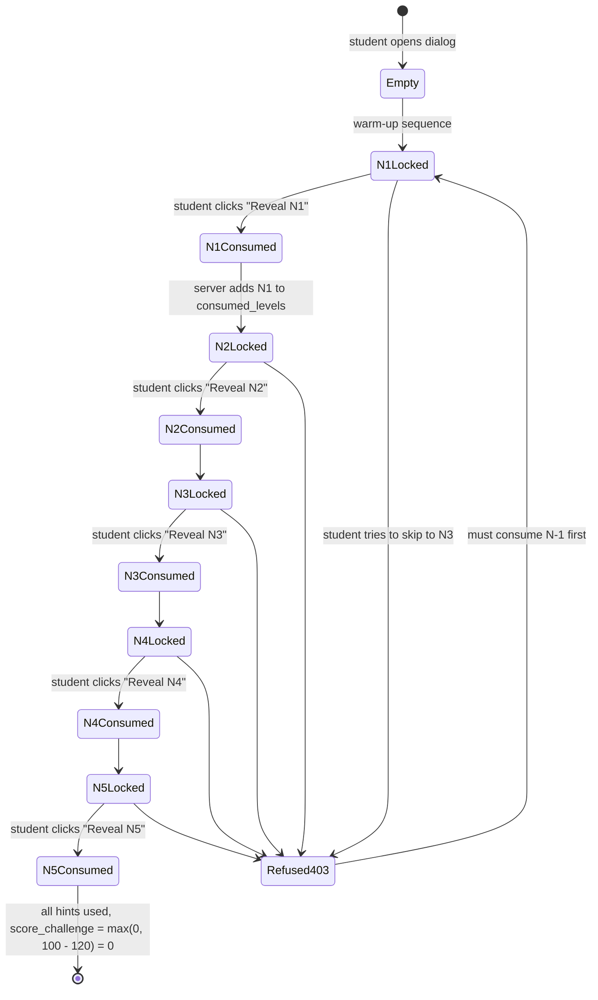
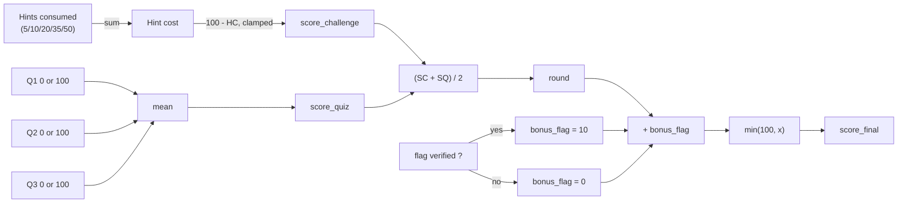
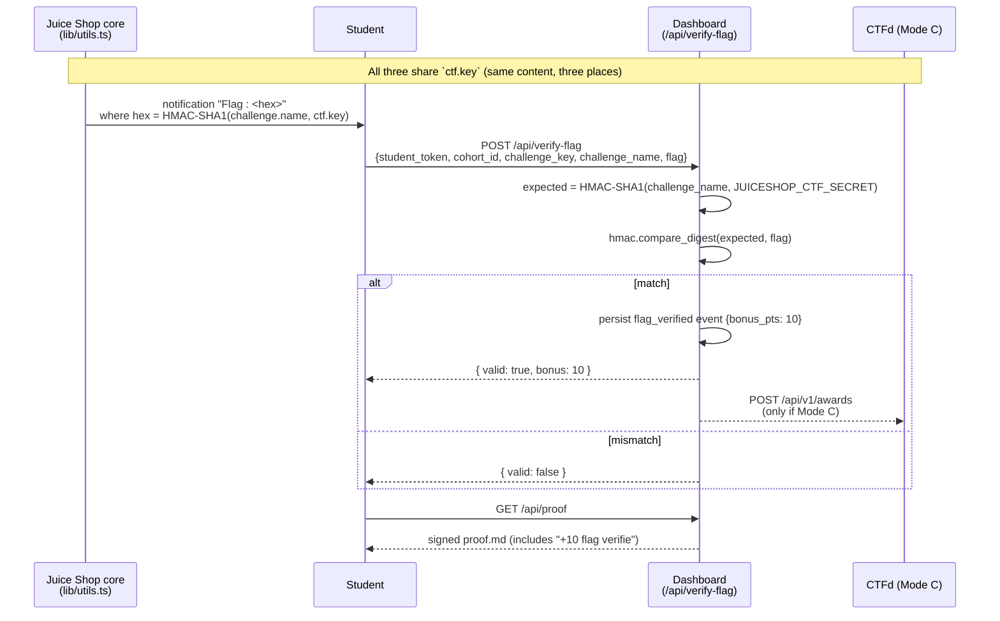
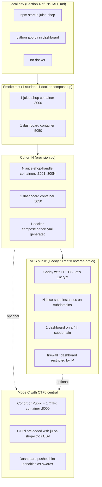

# ARCHITECTURE

This document explains how JuiceLab is structured, how data flows between the three independent components, and how the anti-leak guarantee is enforced. Everything is illustrated with Mermaid diagrams.

> **Audience** — engineers and OWASP reviewers who want to evaluate the security and pedagogical claims of the README. Teachers who only want to *run* JuiceLab should read [`INSTALL.md`](./INSTALL.md) instead.

## Table of contents

- [Three components, three independent processes](#three-components-three-independent-processes)
- [Overlay files vs upstream Juice Shop](#overlay-files-vs-upstream-juice-shop)
- [The four Coach tabs](#the-four-coach-tabs)
- [Anti-leak data flow](#anti-leak-data-flow)
- [Hint gating state machine](#hint-gating-state-machine)
- [Score formula](#score-formula)
- [CTF flag verification chain](#ctf-flag-verification-chain)
- [Tamper-evident proof contract](#tamper-evident-proof-contract)
- [Deployment topologies](#deployment-topologies)
- [Threat model and trust boundaries](#threat-model-and-trust-boundaries)

---

## Three components, three independent processes

JuiceLab is deliberately built around three loosely coupled processes. Any one of them can crash without taking the others down.



| Component | Process | Port | Persistence | Optional |
|---|---|---|---|---|
| Juice Shop + JuiceLab overlay | Node.js (Juice Shop core) | 3000 | `juiceshop.sqlite` (per instance) | mandatory |
| Dashboard | Python Flask | 5050 | `dashboard.sqlite` (single, shared) | mandatory in Mode B / C |
| CTFd | Python Flask | 8000 | `ctfd.sqlite` | Mode C only |

The three components communicate **only via HTTP** — there is no shared memory, no shared filesystem (other than the static `ctf.key`), and no direct DB access. This makes it easy to deploy them on three different machines if needed.

---

## Overlay files vs upstream Juice Shop

JuiceLab is a **non-fork overlay**. We add new files and apply two minimal patches to upstream Juice Shop.

### New files (we ship these)

```
juice-shop/
├── routes/
│   └── juicelab.ts                      [NEW] Express routes : /api/juicelab/{hint,quiz,walkthrough}
├── data/
│   └── juicelab-private/                [NEW] private packs, never served as static files
│       ├── hints/<key>.yaml
│       ├── quiz/<key>.yaml
│       └── walkthroughs/<key>.md
└── frontend/
    └── src/
        ├── app/
        │   └── juicelab-overlay/        [NEW] Angular 20 standalone components
        │       ├── briefing-panel/
        │       ├── coach-dialog/        4-tab dialog opened from the score-board card
        │       ├── hints-panel/
        │       ├── journal-form/        After-solve reflection + flag verification
        │       ├── juicelab-panel/      /#/juicelab parcours overview
        │       ├── quiz-form/
        │       ├── trophy-room/         /#/cabinet hidden gold-trophy display
        │       ├── badges-display/
        │       ├── models/
        │       │   ├── juicelab-i18n.ts UI strings catalogue (no hardcoded text)
        │       │   └── juicelab.types.ts shared types
        │       ├── services/
        │       │   ├── juicelab-pack.service.ts        HTTP calls to /api/juicelab/*
        │       │   ├── juicelab-state.service.ts       LocalStorage v1
        │       │   ├── juicelab-scoring.service.ts     deductive plancher 50
        │       │   ├── juicelab-sync.service.ts        POST /api/sync (offline queue)
        │       │   ├── juicelab-bridge.service.ts      socket.io listener (Juice Shop core)
        │       │   └── juicelab-badge-engine.service.ts 4 rules, extensible
        │       └── juicelab-overlay.routes.ts          /#/juicelab + /#/cabinet
        └── assets/
            └── juicelab/                [NEW] PUBLIC assets (no solutions)
                ├── briefing/<key>.yaml  mission + 3 concepts (no payload)
                ├── selected_challenges.yml
                └── config.json          dashboard_url + cohort_id
```

### Patches (small, listed here so OWASP can audit)

```
juice-shop/
├── server.ts                                    +5 lines : mount routes/juicelab.ts after the whoami route
├── frontend/src/app/app.routing.ts              +2 entries : /#/juicelab and /#/cabinet (lazy-loaded)
├── frontend/src/app/navbar/navbar.component.html +1 button : "school" icon → /#/juicelab
└── frontend/src/app/score-board/components/
    └── challenge-card/                          +1 button : "TD" → opens coach-dialog
```

That is the entire footprint on upstream Juice Shop : five touched files and three new top-level directories. Everything else is overlay.

---

## The four Coach tabs

The coach dialog is opened from the **TD** button on a Juice Shop score-board card. It has exactly four tabs, in this order, and the order is part of the pedagogical contract.



| # | Tab | Role | Data flow |
|---|---|---|---|
| 1 | **Briefing** | The student reads the mission (3-6 lines, imperative voice) and 2 to 4 security concepts they should internalise *before* they attack. No textarea, no input. | Public YAML loaded once at dialog open. |
| 2 | **Indices** | The 5 graduated hints. The button to reveal level N is enabled only after level N-1 is consumed (server-side gating). Each click costs `cost_pct` points off the challenge score. | `GET /api/juicelab/hint?key=X&level=N` (JWT-gated). |
| 3 | **Apres - journal** | After solving, the student writes a free-text reflection (min 5 words to enable Save). Pastes the flag from the Juice Shop notification, clicks **Verify flag** for +10 bonus. | `POST /api/sync` (journal_filled), `POST /api/verify-flag`. |
| 4 | **Quiz** | 3 multiple-choice questions about the *concept*, not the trick. Score is binary 0/100 per question, average = quiz score. | `GET /api/juicelab/quiz/questions?key=X` returns questions stripped of `correct` and `expected_keywords`. `POST /api/juicelab/quiz/score` with the answers. |

A live total score `min(100, (score_challenge + score_quiz)/2 + bonus_flag)` is shown in the dialog title bar.

> **Why no "before-solve" journal?** The legacy "Avant - journal" tab was removed in 2026-05-09. Students did not understand what to do — *"what is your hypothesis?"* is useless without context. The Briefing tab (mission + concepts) is the canonical pre-attack view.

---

## Anti-leak data flow

The single most important security property of JuiceLab is :

> A student cannot dump the hints, the quiz answers, or the walkthroughs by querying static assets — even if they know the URL.

This is enforced by physically **separating** public from private files, and by gating the private files behind JWT-authenticated Express routes.

```mermaid
flowchart TB
  subgraph Public["Public assets — served as static files"]
    A1["assets/juicelab/briefing/&lt;key&gt;.yaml<br/>(mission + concepts, NO payload)"]
    A2["assets/juicelab/selected_challenges.yml<br/>(13 keys + categories, NO solution)"]
    A3["assets/juicelab/config.json<br/>(dashboard URL, cohort ID)"]
  end

  subgraph Private["Private packs — NEVER served as static files"]
    P1["data/juicelab-private/hints/&lt;key&gt;.yaml<br/>(5 levels, full text)"]
    P2["data/juicelab-private/quiz/&lt;key&gt;.yaml<br/>(questions + correct + explanations)"]
    P3["data/juicelab-private/walkthroughs/&lt;key&gt;.md<br/>(complete solution)"]
  end

  Browser([Browser]) -->|"GET /assets/juicelab/...<br/>200 OK"| Public
  Browser -.X.->|"GET /data/juicelab-private/...<br/>404 Not Found (forced)"| Private

  Browser -->|"GET /api/juicelab/hint?key=X&level=N<br/>(JWT cookie + sequential gate)"| Routes["routes/juicelab.ts"]
  Routes -->|"reads with allowlist"| Private
  Routes -->|"returns ONLY level N"| Browser

  Browser -->|"GET /api/juicelab/quiz/questions?key=X"| Routes
  Routes -->|"reads + strips correct/keywords"| Private

  Browser -->|"GET /api/juicelab/walkthrough?key=X<br/>(must have solved=true)"| Routes
```

Three guarantees enforced by `routes/juicelab.ts` :

1. **Hint level N is refused with 403 if N-1 was not consumed.** State per `(student_token, challenge_key, set<HintLevel>)` lives in an in-memory map.
2. **Quiz questions are stripped on the wire.** The client receives the `question` and `options` only — no `correct` field, no `expected_keywords`. Scoring is server-side : the client posts the chosen index, the server compares with `q.correct` (strict equality).
3. **Walkthrough is refused with 403 unless `challenge.solved === true` for this student** (lookup in the Juice Shop `challenges` table).

A static-file `curl` of the private path is force-404'd by the express router — even though the file exists on disk, the express middleware refuses the URL prefix `/data/juicelab-private/`.

---

## Hint gating state machine

The hint gate is the single most-touched piece of overlay logic. Here is the state machine, server-side.



State key : `(student_token, challenge_key)`. Value : `Set<HintLevel>` (`{N1, N2}` after two reveals).

> **Restart caveat.** The state map is in-memory. If the Juice Shop container restarts, the map is empty and the warm-up sequence (sequential `getHint(N1)` → wait → `getHint(N2)` → ...) re-populates from the client's LocalStorage view. Migrating to Redis is on the roadmap.

---

## Score formula

The final score for a challenge is canonical :

```
score_challenge = max(0, 100 - sum(hints_costs))
                # 100 if no hints
                # if all 5 (5+10+20+35+50 = 120), clamped to 0
score_quiz      = (Q1_score + Q2_score + Q3_score) / 3
                # each Q is 0 or 100 (multiple_choice strict equality)
bonus_flag      = 10 if a flag_verified event exists for (student, challenge), else 0
score_final     = min(100, round((score_challenge + score_quiz) / 2) + bonus_flag)
```



Edge cases :

- **Quiz not submitted** → `score_quiz` undefined → the proof shows `Score final partiel : <score_challenge + bonus> / 100 (composante challenge seule [+10 flag CTF verifie])`. Never replace missing quiz with 0.
- **Hint cohort** is fixed by `HINT_COST_BY_LEVEL` in `models/juicelab.types.ts` (5/10/20/35/50). Both files (the constants and the YAML cost_pct) must change together.
- **Bonus flag** is awarded only via `/api/verify-flag` after server-side HMAC check. The Coach UI cannot set it on its own.

---

## CTF flag verification chain

The CTF flag chain ties three independent components together by sharing a single HMAC secret. This is the only point in JuiceLab where cross-component cryptographic coordination is required.



**Canary** — for `challenge.name = "Score Board"` with the default `ctf.key`, the expected HMAC-SHA1 is `2614339936e8282e2f820f023d4d998a1f95e02a`. If the dashboard returns `{valid: false}` for a flag a student copied verbatim, this is the canonical alignment to verify.

**Trust model** — the dashboard does *not* verify the Juice Shop JWT. It trusts the `student_token` field of the request. The cryptographic anti-tampering is on :

1. The **proof signature** (HMAC-SHA-256 of the markdown body, key = `DASHBOARD_PROOF_SECRET`).
2. The **flag** (HMAC-SHA-1 of `challenge.name`, key = `ctf.key`).

A student who falsifies their own `student_token` only produces a valid proof for their fake identity. Cross-checking `student_token` against the email is the teacher's job (the dashboard does not do it for them).

---

## Tamper-evident proof contract

The downloadable proof is a Markdown file with a fixed structure. The teacher reads it by hand ; the structure must be stable across versions because `verify_proof.py` only validates the signature, not the structure.

```mermaid
flowchart TB
  subgraph Proof[".md proof structure (fixed)"]
    H1["# JuiceLab proof - challenge name"]
    Meta["Meta table : email, key, category, difficulty, cohort, token (UUID)"]
    Brief["## Brief : OWASP description"]
    Journal["## Journal de l'etudiant : after_solve text"]
    Hints["## Indices consommes : table Niveau / Cout / Horodatage<br/>+ Score apres indices = 100 - sum(cost_pct)"]
    Quiz["## Quiz : Score quiz = (Q1+Q2+Q3)/3<br/>+ table Question / Reponse / Score"]
    Score["## Score final (REQUIRED, even if partial)"]
    Trace["## Trace : Resolution Juice Shop, Export proof"]
    Sig["--- PROOF: HMAC-SHA256 / SCHEME: v1 / TIMESTAMP / STUDENT / CHALLENGE / SIGNATURE: hex"]

    H1 --> Meta --> Brief --> Journal --> Hints --> Quiz --> Score --> Trace --> Sig
  end
```



Verification — offline, no dashboard required :

```bash
python dashboard/verify_proof.py /path/to/proof.md
# expected output : "Signature OK"
```

The script reads the proof, recomputes HMAC-SHA-256 of everything above the `--- PROOF:` separator with the shared `DASHBOARD_PROOF_SECRET`, and compares with the stored signature. A modified proof — even a typo — fails verification.

---

## Deployment topologies



`docker/provision.py` is the bridge from a `roster.txt` (one student handle per line) to a `docker-compose.cohort.yml` (one service per student). It also prints the exact `DASHBOARD_CORS_ORIGINS` value to paste into `.env` — the dashboard rejects events from any origin not on the allowlist.

---

## Threat model and trust boundaries

JuiceLab is **not** an authentication system. It assumes :

1. The student is honest about their own student_token. The dashboard does not verify the Juice Shop JWT.
2. The teacher controls the `DASHBOARD_TEACHER_TOKEN` and the `DASHBOARD_PROOF_SECRET`. These are coarse-grained credentials.
3. The cohort runs on a private network during the TD. CORS allowlists protect the dashboard from cross-origin events. HTTPS is the responsibility of the deployment (Caddy, Traefik) when going public.

What it **does** guarantee :

| Property | Mechanism |
|---|---|
| A student cannot dump all hints / quiz answers / walkthroughs by hitting static URLs | Files live under `data/juicelab-private/`, served only via JWT-gated routes |
| A student cannot skip from N1 to N3 | Server-side `Set<HintLevel>` gate refuses N+1 unless N is consumed |
| A student cannot read the walkthrough before solving | Server-side `challenges[key].solved` check |
| A student cannot fake the quiz answers | The `correct` field never reaches the client ; scoring is server-side strict equality |
| A student cannot fake their score on the proof | HMAC-SHA-256 of the markdown body with `DASHBOARD_PROOF_SECRET` |
| A student cannot fake a CTF flag | HMAC-SHA-1 of `challenge.name` with `ctf.key` ; the dashboard recomputes and compares |

What it **does not** guarantee :

| Risk | Mitigation outside JuiceLab |
|---|---|
| A student copies their classmate's flag | The flag is the same for every student of the same cohort. CTF anti-collusion is the teacher's problem. |
| A student inspects the JS bundle for hint texts | They will only see the bundle's compiled code — the hints live server-side and are loaded on demand. |
| A student tampers with the HMAC keys | The keys live on the teacher's deployment, not in the student's container. |
| A student opens `/#/cabinet` without earning trophies | The trophy room only renders trophies the student's own LocalStorage marks as captured. Other students' state is invisible. |

---

## Further reading

- [`README.md`](./README.md) — what JuiceLab is and why
- [`INSTALL.md`](./INSTALL.md) — how to deploy it
- [`docs/PEDAGOGY.md`](./docs/PEDAGOGY.md) — the learning theory that drives the design
- [`docs/CTF-INTEGRATION.md`](./docs/CTF-INTEGRATION.md) — Mode C deep-dive
- [`CONTEXTE-JuiceLab.md`](./CONTEXTE-JuiceLab.md) — design history (working notes, 2026)
- [`.claude/skills/juicelab-add-challenge/SKILL.md`](./.claude/skills/juicelab-add-challenge/SKILL.md) — the contract that every contributor follows when editing a pack
