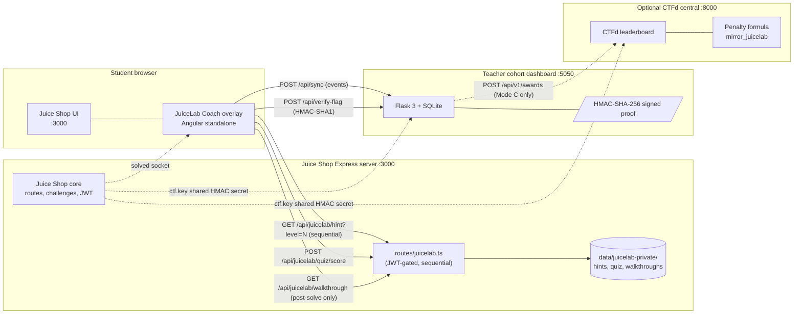
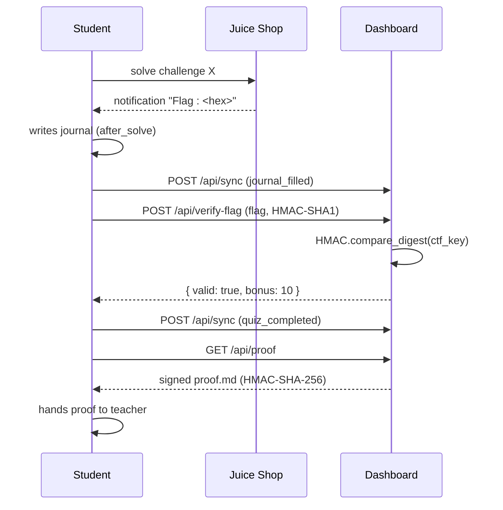
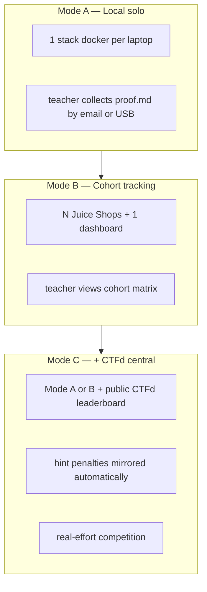

# JuiceLab — Pedagogy Companion for OWASP Juice Shop

[](./LICENSE)
[](https://owasp.org/www-project-juice-shop/)
[](./docker/)
[](#)

> A graduated, scaffolded teaching layer on top of [OWASP Juice Shop](https://github.com/juice-shop/juice-shop), built for a 12-hour M2 Master classroom (Sorbonne, Paris) and designed to scale to any cybersecurity training programme.

JuiceLab does **not** modify Juice Shop's challenges. It adds a thin coaching overlay (briefings, graduated hints, post-solve quiz), a tamper-evident lab proof, a teacher dashboard, and an opt-in bridge to a CTFd scoreboard. The student plays the same OWASP challenges; the *experience around them* is what changes.

> **Read this in French:** [README_FR.md](./README_FR.md)

---

## Table of contents

- [Why this project](#why-this-project)
- [What it adds to Juice Shop](#what-it-adds-to-juice-shop)
- [Architecture at a glance](#architecture-at-a-glance)
- [The pedagogical contract](#the-pedagogical-contract)
- [CTF integration (Mode A / B / C)](#ctf-integration-mode-a--b--c)
- [Quick start](#quick-start)
- [Repository layout](#repository-layout)
- [Roadmap](#roadmap)
- [Contributing](#contributing)
- [Acknowledgements](#acknowledgements)
- [License](#license)

---

## Why this project

OWASP Juice Shop is the gold standard for hands-on web-app security training, but the raw experience has two pedagogical gaps when used in a classroom with heterogeneous beginners:

1. **No scaffolding.** A student who cannot solve `loginAdmin` either gives up, peeks at the upstream walkthrough (and gets the full solution in one click), or asks the teacher who then has to interrupt the room. There is no graduated cognitive support between *zero hint* and *full solution*.
2. **No teacher signal.** The teacher cannot see, in real time, which students are stuck on which step, who has read hints (and how many), and who needs a one-on-one intervention. The Juice Shop score-board reports binary completion, not learning.

JuiceLab fills both gaps without forking Juice Shop:

- A **5-level Vygotsky-style hints ladder** with an explicit cost (5 % / 10 % / 20 % / 35 % / 50 % of the challenge score), gated server-side so a student cannot skip ahead.
- A **post-solve journal + 3-question multiple-choice quiz** that anchors the security concept, not just the trick.
- A **tamper-evident lab proof** signed HMAC-SHA-256, downloadable as a Markdown file the student can hand in or the teacher can grade.
- A **cohort dashboard** (Flask + SQLite) that shows, in a single matrix, every student × every challenge with hints consumed, journal status, quiz score, and CTF flag verification.
- An **opt-in CTFd push** that mirrors the JuiceLab hint penalties into a public CTFd leaderboard so the competition reflects *real effort*, not just paste-the-flag speed.

---

## What it adds to Juice Shop

JuiceLab is a **non-fork overlay**. The OWASP Juice Shop sources stay on the upstream `juice-shop/juice-shop` main branch; we only add new files and apply two small patches (one Express route, one Angular route + navbar button + score-board card).

| Layer | What we add | Where it lives |
|---|---|---|
| Pedagogy | 13 selected challenges with briefings, hints (5 levels), quiz (3 questions), journal | `juice-shop/data/juicelab-private/`, `juice-shop/frontend/src/assets/juicelab/` |
| Anti-leak gating | Express routes that serve hints/quiz/walkthrough only after the previous level is consumed and the challenge is solved | `juice-shop/routes/juicelab.ts` |
| Coach UI | Angular 20 standalone overlay (4 tabs: Briefing / Indices / Apres-journal / Quiz) opened from the score-board card | `juice-shop/frontend/src/app/juicelab-overlay/` |
| Hidden trophy room | URL-guess-only `/#/cabinet` that displays gold trophies for verified CTF flags (gamified discovery) | `juice-shop/frontend/src/app/juicelab-overlay/trophy-room/` |
| Teacher dashboard | Flask 3 + SQLite, real-time cohort matrix, signed proof generator | `dashboard/` |
| Deploy | Docker Compose (single instance, cohort of N, VPS) + CTFd opt-in | `docker/` |
| Local launcher | PowerShell orchestration script (start / stop / health / logs / build) | `juice.ps1` |

> **The 13 selected challenges** — five DJ1 reconnaissance challenges (`scoreBoard`, `privacyPolicy`, `directoryListing`, `exposedCredentials`, `passwordHashLeak`), four DJ2 auth/access (`loginAdmin`, `adminSection`, `basketAccess`, `feedback`), four DJ3 XSS (`localXss`, `reflectedXss`, `xssBonus`, `bullyChatbot`). The list is the contract: see [`selected_challenges.yml`](./juice-shop/frontend/src/assets/juicelab/selected_challenges.yml).

---

## Architecture at a glance



Three independent moving parts — none of them required to run the others — and a **single shared HMAC secret** (`ctf.key`) that ties Juice Shop, the dashboard, and CTFd together when the student validates a flag.

For deeper diagrams (data flow, anti-leak gating, score formula, deployment modes), see [`ARCHITECTURE.md`](./ARCHITECTURE.md).

---

## The pedagogical contract

JuiceLab is grounded in three explicit pedagogical decisions. The "why" of every UI element traces back to one of these.

### 1. Vygotsky's Zone of Proximal Development — graduated hints

A challenge is in a student's ZPD when they can solve it *with the right amount of help*. Too little help → frustration; too much → no learning. JuiceLab encodes this as a 5-level ladder the student climbs *in sequence* (server enforces N+1 only after N is consumed):

| Level | Cost | Pedagogical intent |
|---|---|---|
| **N1** | 5 % | Socratic question — re-orient attention without revealing |
| **N2** | 10 % | Research direction — name the OWASP / MITRE / CWE family |
| **N3** | 20 % | Technical clue — the surface and the *kind* of payload |
| **N4** | 35 % | Guided steps — ordered list of what to do, no payload yet |
| **N5** | 50 % | Complete solution — the exact payload + walkthrough |

The cost cohort `5/10/20/35/50` is not arbitrary — it is calibrated so a student who consumes all five hints can still pass with a non-zero score (50 challenge + bonus quiz + bonus flag), but a student who solves the challenge unaided is unambiguously rewarded.

### 2. Bloom's Taxonomy — quiz anchors the concept

Once a challenge is solved, the student does not move on. They face three multiple-choice questions that target the **conceptual** understanding, not the trick:

- *What category of OWASP Top 10 did I exploit?*
- *Which defence would have prevented this in code?*
- *How do I generalise this to a different application?*

The quiz score `(Q1 + Q2 + Q3) / 3` averages with the challenge score, so the final mark rewards both *doing* and *understanding* — the gap Juice Shop alone leaves open.

### 3. Tamper-evident proof — student handover

At the end of each challenge the student downloads a Markdown file signed HMAC-SHA-256 by the dashboard. The file contains the brief, the journal entry, the consumed hints, the quiz answers, the score breakdown, and the timestamp. The teacher verifies signatures with `dashboard/verify_proof.py` — no need to trust anyone's screenshot.



Full pedagogical rationale, references, and design notes in [`docs/PEDAGOGY.md`](./docs/PEDAGOGY.md).

---

## CTF integration (Mode A / B / C)

JuiceLab supports three orthogonal deployment modes — all selected by environment variables, no code change needed.



| Mode | Trigger | Use case | Visibility |
|---|---|---|---|
| **A** Local solo | (no extra env) | 1 student, 1 laptop, the teacher collects signed proofs | none (private TD) |
| **B** Cohort tracking | `DASHBOARD_TEACHER_TOKEN` set | Classroom with N students + central dashboard | teacher only |
| **C** + CTFd central | `CTFD_URL` and `CTFD_ADMIN_TOKEN` set | Course with a public scoreboard, competition dynamic | full leaderboard |

**Key insight (Mode C).** A naive CTFd integration only sees the flag paste — so a student who burns 4 hints and a student who solves unaided land on the same leaderboard line. JuiceLab pushes the *hint penalties* to CTFd as negative awards, so the leaderboard reflects real effort. This is the difference between a CTF that drives learning and a CTF that just rewards Googling.

Full setup (CTFd hosting, `juice-shop-ctf-cli` import, HMAC alignment, team pre-provisioning, troubleshooting) in [`docs/CTF-INTEGRATION.md`](./docs/CTF-INTEGRATION.md) and [`docker/README.md`](./docker/README.md).

---

## Quick start

> Full instructions in [`INSTALL.md`](./INSTALL.md). Below is the 3-command path.

```bash
# 1. Clone this repo + clone Juice Shop next to it
git clone https://github.com/mo0ogly/juicelab.git
git clone https://github.com/juice-shop/juice-shop.git    # see INSTALL.md to apply the overlay

# 2. Configure secrets
cd juicelab/docker
cp .env.example .env
# edit .env — set DASHBOARD_TEACHER_TOKEN (>= 16 chars) and DASHBOARD_PROOF_SECRET (>= 16 chars)

# 3. Smoke test (1 student instance + dashboard)
docker compose --env-file .env up -d --build
```

Open:

- Student: <http://127.0.0.1:3000/#/score-board> — click any challenge card, then the **TD** button to open the Coach overlay.
- Teacher: <http://127.0.0.1:5050/dashboard?cohort=M2-IA-2026> — log in with `DASHBOARD_TEACHER_TOKEN`.

For a cohort of N students, see [`docker/README.md`](./docker/README.md) section 2.

---

## Repository layout

```
juicelab/
├── README.md                    this file
├── README_FR.md                 French mirror
├── INSTALL.md                   step-by-step install (laptop, cohort, VPS, CTFd)
├── ARCHITECTURE.md              full architecture with mermaid diagrams
├── CONTRIBUTING.md              how to add a new pedagogical pack
├── CODE_OF_CONDUCT.md           Contributor Covenant 2.1
├── SECURITY.md                  vulnerability disclosure policy
├── LICENSE                      MIT
├── CONTEXTE-JuiceLab.md         design history (2026 working notes)
│
├── docs/
│   ├── PEDAGOGY.md              Vygotsky / Bloom rationale, references
│   ├── COHORT_WORKFLOW.md       Trilateral workflow, login, i18n, help, OAuth, troubleshooting
│   ├── CTF-INTEGRATION.md       Mode C deep-dive (CTFd, HMAC, awards)
│   ├── CLASSROOM-DEPLOYMENT.md  Teacher deployment guide (4 scenarios + security)
│   ├── DOCKER.md                Detailed Docker operator's guide
│   ├── VPS_HARDENING.md         VPS deploy with Caddy/TLS/fail2ban/systemd hardening
│   ├── PEDAGOGY_COMPANION_PHASE0_OUTREACH.md  Ready-to-post text for upstream sondage
│   └── REBRAND_PLAN.md          Deferred plan to rename JuiceLab -> Pedagogy Companion
│
├── dashboard/                   Flask 3 + SQLite teacher dashboard
│   ├── app.py                   routes (login, /dashboard, /api/sync, /api/proof, /api/verify-flag)
│   ├── db.py                    SQLite helpers
│   ├── schema.sql               events table
│   ├── verify_proof.py          standalone HMAC verifier (offline)
│   ├── templates/               Jinja2 (dashboard.html, login.html, journal_modal.html)
│   ├── tests/                   pytest (10 tests, hermetic SQLite)
│   └── requirements.txt
│
├── docker/                      Docker Compose deploy
│   ├── Dockerfile.juicelab      Juice Shop + JuiceLab overlay (multi-stage)
│   ├── Dockerfile.dashboard     Flask + SQLite
│   ├── docker-compose.yml       1 student + 1 dashboard + (optional) CTFd
│   ├── entrypoint.sh            rewrites config.json from env (cohort, dashboard URL)
│   ├── provision.py             generates docker-compose.cohort.yml from a roster.txt
│   ├── roster.example.txt
│   ├── .env.example             secrets template
│   └── README.md                deploy scenarios (smoke, cohort, VPS, Mode C)
│
├── ctfd/                        CTFd opt-in artefacts (Mode C)
│
├── juice.ps1                    Windows launcher (start / stop / health / logs)
│
└── .claude/                     Claude Code agent tooling (used during development;
                                  not required to run JuiceLab — kept for transparency)
```

> **Why is `juice-shop/` not in this repo?** The Juice Shop fork lives in its own repository (1.2 GB with `node_modules/`). This repo holds only the *additions* — the overlay, dashboard, docker, docs. See [`INSTALL.md`](./INSTALL.md) for how to apply the overlay to a vanilla Juice Shop clone.

---

## Roadmap

- [x] **Phase A** — anti-leak architecture (private packs, server-side gating)
- [x] **Phase B** — JWT-gated Express routes (hint sequence enforcement, walkthrough post-solve, quiz strip-on-the-wire)
- [x] **Phase C** — Flask cohort dashboard + signed proof
- [x] **Phase D** — Docker Compose multi-instance, cohort provisioning
- [x] **Mode C** — CTFd opt-in push (hint penalties → CTFd awards)
- [ ] **Volume push to OWASP** — pedagogical packs for the remaining 98 native Juice Shop challenges, see [`.claude/rules/owasp-pedagogy-companion.md`](./.claude/rules/owasp-pedagogy-companion.md)
- [ ] **i18n** — full FR / EN / BR coverage of the overlay UI labels
- [ ] **Persistence** — migrate the in-memory hint state to Redis for multi-instance HA

---

## Contributing

Contributions are welcome — especially on the **pedagogical content** side (new packs for the 98 challenges not yet covered) and the **i18n** front.

Read [`CONTRIBUTING.md`](./CONTRIBUTING.md) before opening a PR. Two hard rules upfront:

1. **No new Juice Shop challenge.** This is upstream OWASP territory. We only build *on top of* what Juice Shop already ships.
2. **Sources before content.** Every pack must cite the upstream `challenges.yml` description, the `hacking-instructor` walkthrough (if any), the `codefixes/` defence (if any), and the `routes/<key>.ts` server code (if relevant) — *before* writing one line of pedagogy. No invention. The full source-grounding protocol is in [`.claude/rules/owasp-pedagogy-companion.md`](./.claude/rules/owasp-pedagogy-companion.md).

---

## Acknowledgements

- **OWASP Juice Shop** team and community — without the original challenges, this overlay would have nothing to teach. Special thanks to Bjoern Kimminich and the maintainers.
- **Sorbonne Paris-Cite Master IA / Cybersecurity** programme (cohort 2026) — the in-classroom feedback shaped every UI decision.
- **Vygotsky (1978)** *Mind in Society*, **Bloom (1956)** *Taxonomy of Educational Objectives*, **Keshav (2007)** *How to Read a Paper* — for the pedagogical framework.

---

## License

[MIT](./LICENSE) — use it, fork it, teach with it. Not affiliated with the OWASP Foundation.

---

**Author** Fabrice Pizzi (`mo0ogly`) — M2 IA / Cybersecurity, Sorbonne Paris-Cite — `mo0ogly@proton.me`

If you are a teacher and want to use JuiceLab in your own course, open a Discussion. I will be happy to help you adapt the parcours to your cohort.
