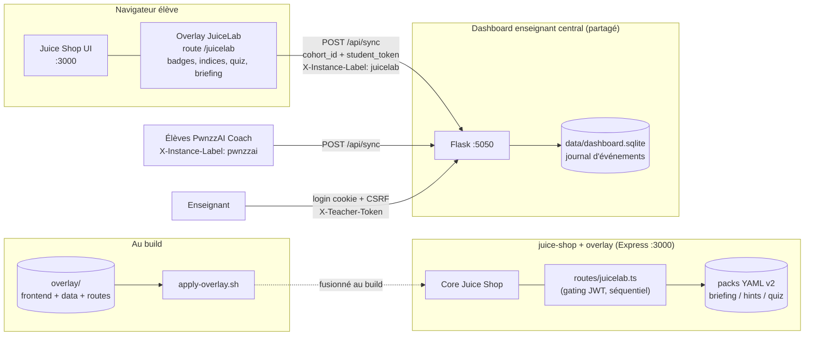
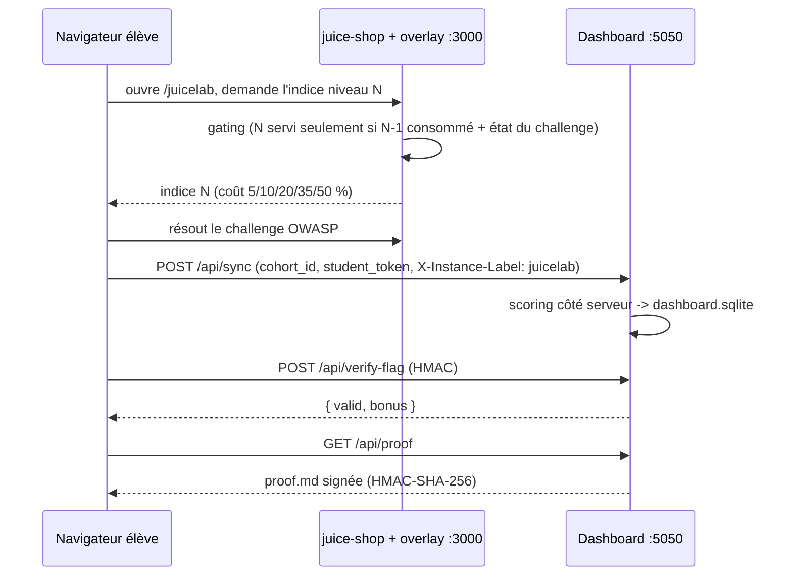
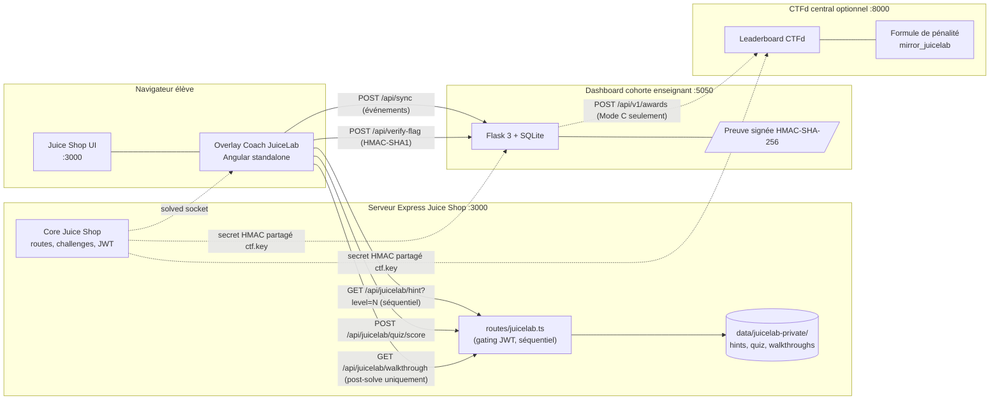
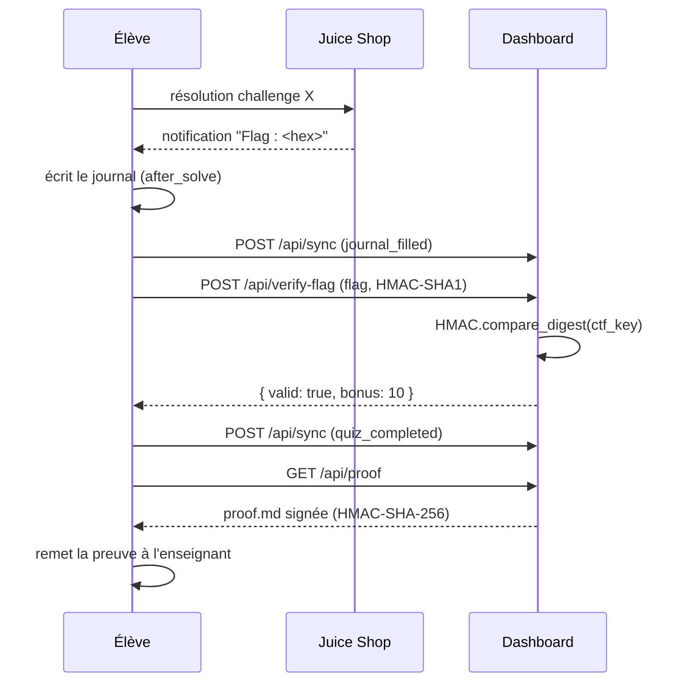
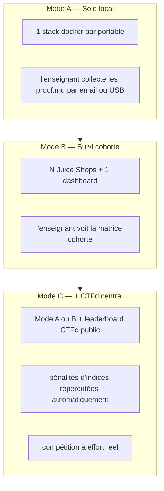

# JuiceLab — Compagnon pédagogique pour OWASP Juice Shop

[](./LICENSE)
[](https://owasp.org/www-project-juice-shop/)
[](./docker/)
[](#)

> Une couche d'enseignement graduée et étayée par-dessus [OWASP Juice Shop](https://github.com/juice-shop/juice-shop), conçue pour un TD de 12 h en M2 (Sorbonne, Paris) et pensée pour s'adapter à n'importe quelle formation en cybersécurité.

JuiceLab **ne modifie pas** les challenges Juice Shop. Il ajoute une fine couche de coaching (briefings, indices gradués, quiz après résolution), une preuve de lab inviolable, un dashboard pour l'enseignant, et un pont opt-in vers un scoreboard CTFd. L'élève joue les mêmes challenges OWASP ; ce qui change, c'est *l'expérience qui les entoure*.

> **Read this in English:** [README.md](./README.md)

---

## Table des matières

- [Pourquoi ce projet](#pourquoi-ce-projet)
- [Ce que cela ajoute à Juice Shop](#ce-que-cela-ajoute-à-juice-shop)
- [Architecture](#architecture)
- [Le contrat pédagogique](#le-contrat-pédagogique)
- [Intégration CTF (Mode A / B / C)](#intégration-ctf-mode-a--b--c)
- [Démarrage rapide](#démarrage-rapide)
- [Organisation du dépôt](#organisation-du-dépôt)
- [Feuille de route](#feuille-de-route)
- [Contribuer](#contribuer)
- [Remerciements](#remerciements)
- [Licence](#licence)

---

## Pourquoi ce projet

OWASP Juice Shop est la référence pour la formation pratique en sécurité applicative web, mais l'expérience brute laisse deux trous pédagogiques quand on l'utilise dans une classe de débutants hétérogènes :

1. **Aucun étayage.** Un élève qui ne sait pas résoudre `loginAdmin` abandonne, va lire le walkthrough upstream (et obtient la solution complète en un clic), ou interpelle l'enseignant qui doit alors interrompre toute la salle. Il n'y a pas de gradation cognitive entre *aucun indice* et *solution complète*.
2. **Aucun signal pour l'enseignant.** L'enseignant ne peut pas voir, en temps réel, qui est bloqué sur quelle étape, qui a lu combien d'indices, qui aurait besoin d'une intervention individuelle. Le score-board Juice Shop ne signale qu'une complétion binaire, pas un apprentissage.

JuiceLab comble les deux trous sans forker Juice Shop :

- Une **échelle d'indices à 5 niveaux** inspirée de Vygotsky, chacun avec un coût explicite (5 % / 10 % / 20 % / 35 % / 50 % du score du challenge), avec un gating côté serveur qui empêche l'élève de sauter une marche.
- Un **journal après résolution + un quiz QCM de 3 questions** qui ancre le concept de sécurité, pas seulement l'astuce.
- Une **preuve de lab inviolable** signée HMAC-SHA-256, téléchargeable comme fichier Markdown que l'élève rend à l'enseignant ou que celui-ci utilise pour noter.
- Un **dashboard cohorte** (Flask + SQLite) qui affiche, dans une seule matrice, chaque élève × chaque challenge avec les indices consommés, le statut du journal, le score du quiz, la vérification du flag.
- Un **push CTFd opt-in** qui répercute les pénalités d'indices JuiceLab vers un leaderboard CTFd public, pour qu'une compétition reflète *l'effort réel*, pas la rapidité à copier-coller un flag.

---

## Ce que cela ajoute à Juice Shop

JuiceLab est un **overlay sans fork**. Les sources OWASP Juice Shop restent sur la branche `main` de `juice-shop/juice-shop` upstream ; nous ajoutons uniquement de nouveaux fichiers et appliquons deux petits patches (une route Express, plus une route Angular + un bouton de navbar + une carte sur le score-board).

| Couche | Ce qu'on ajoute | Où ça vit |
|---|---|---|
| Pédagogie | 13 challenges sélectionnés avec briefings, indices (5 niveaux), quiz (3 questions), journal | `juice-shop/data/juicelab-private/`, `juice-shop/frontend/src/assets/juicelab/` |
| Anti-fuite | Routes Express qui ne servent les indices / quiz / walkthrough que si le niveau précédent est consommé et le challenge résolu | `juice-shop/routes/juicelab.ts` |
| UI Coach | Overlay Angular 20 standalone (4 onglets : Briefing / Indices / Après-journal / Quiz) ouvert depuis la carte du score-board | `juice-shop/frontend/src/app/juicelab-overlay/` |
| Trophées cachés | URL `/#/cabinet` accessible uniquement par devinette, qui affiche des trophées en or pour les flags CTF vérifiés (découverte gamifiée) | `juice-shop/frontend/src/app/juicelab-overlay/trophy-room/` |
| Dashboard enseignant | Flask 3 + SQLite, matrice cohorte temps réel, générateur de preuve signée | `dashboard/` |
| Déploiement | Docker Compose (instance unique, cohorte de N, VPS) + CTFd opt-in | `docker/` |
| Lanceur local | Script PowerShell d'orchestration (start / stop / health / logs / build) | `juice.ps1` |

> **Les 13 challenges sélectionnés** — cinq de la DJ1 reconnaissance (`scoreBoard`, `privacyPolicy`, `directoryListing`, `exposedCredentials`, `passwordHashLeak`), quatre de la DJ2 auth/accès (`loginAdmin`, `adminSection`, `basketAccess`, `feedback`), quatre de la DJ3 XSS (`localXss`, `reflectedXss`, `xssBonus`, `bullyChatbot`). La liste est le contrat : voir [`selected_challenges.yml`](./juice-shop/frontend/src/assets/juicelab/selected_challenges.yml).

---

## Architecture

La stack a trois pièces mobiles indépendantes : l'instance Juice Shop côté élève (avec l'overlay JuiceLab), le **dashboard enseignant central** (une seule instance partagée — voir [`docs/DASHBOARD-CENTRAL.md`](./docs/DASHBOARD-CENTRAL.md)), et un leaderboard CTFd optionnel.

### Topologie d'exécution

L'arborescence `overlay/` n'est **pas** un composant d'exécution : c'est le miroir des fichiers pédagogiques (overlay Angular, packs YAML, routes Express) que `scripts/apply-overlay.sh` fusionne dans un clone Juice Shop vanilla au moment du build. À l'exécution, le résultat fusionné est l'unique image Juice Shop sur le port 3000.



Le dashboard fait **autorité côté serveur** : scores, pénalités d'indices et ordre des événements sont calculés côté dashboard à partir du flux `/api/sync`, jamais fait confiance au client. Une seule instance de dashboard sert **à la fois** les cohortes JuiceLab et PwnzzAI ; l'en-tête `X-Instance-Label` étiquette la source pour que les deux produits arrivent dans la même matrice enseignant.

### Séquence événement + preuve



### Surfaces de déploiement

| Fichier compose | Démarre | Usage |
|---|---|---|
| `docker/docker-compose.yml` | dashboard + juice-shop (stack complète) | smoke test mono-machine / lab solo |
| `docker/docker-compose.dashboard.yml` | dashboard seul | l'instance centrale partagée (VPS) |
| `docker/Dockerfile.juicelab` | Juice Shop avec l'overlay fusionné | image élève |
| `docker/Dockerfile.dashboard` | Flask + SQLite | image dashboard |

### Diagramme de référence complet (gating + CTFd + HMAC partagé)



Trois pièces mobiles indépendantes — aucune n'est requise pour faire tourner les autres — et **un seul secret HMAC partagé** (`ctf.key`) qui relie Juice Shop, le dashboard, et CTFd quand l'élève valide un flag.

Pour des diagrammes plus détaillés (flux de données, anti-fuite, formule de score, modes de déploiement), voir [`ARCHITECTURE.md`](./ARCHITECTURE.md).

---

## Le contrat pédagogique

JuiceLab est fondé sur trois décisions pédagogiques explicites. Le « pourquoi » de chaque élément d'UI remonte à l'une d'entre elles.

### 1. Zone proximale de développement (Vygotsky) — indices gradués

Un challenge est dans la ZPD d'un élève quand il peut le résoudre *avec la bonne dose d'aide*. Trop peu d'aide → frustration ; trop d'aide → pas d'apprentissage. JuiceLab encode cela comme une échelle à 5 niveaux que l'élève monte *dans l'ordre* (le serveur impose N+1 seulement après N consommé) :

| Niveau | Coût | Intention pédagogique |
|---|---|---|
| **N1** | 5 % | Question socratique — réorienter l'attention sans rien révéler |
| **N2** | 10 % | Direction de recherche — nommer la famille OWASP / MITRE / CWE |
| **N3** | 20 % | Indice technique — la surface et le *type* de payload |
| **N4** | 35 % | Étapes guidées — liste ordonnée à suivre, sans le payload |
| **N5** | 50 % | Solution complète — le payload exact + le walkthrough |

Le barème `5/10/20/35/50` n'est pas arbitraire — il est calibré pour qu'un élève qui consomme les 5 indices garde un score non nul (50 challenge + bonus quiz + bonus flag), tout en récompensant sans ambiguïté l'élève qui résout sans aide.

### 2. Taxonomie de Bloom — le quiz ancre le concept

Une fois le challenge résolu, l'élève ne passe pas au suivant. Il affronte trois QCM qui visent la compréhension **conceptuelle**, pas l'astuce :

- *À quelle catégorie de l'OWASP Top 10 appartient ce que je viens d'exploiter ?*
- *Quelle défense aurait empêché cela dans le code ?*
- *Comment je généralise à une autre application ?*

Le score du quiz `(Q1 + Q2 + Q3) / 3` se moyenne avec le score du challenge, la note finale récompense donc à la fois *faire* et *comprendre* — l'écart que Juice Shop seul laisse ouvert.

### 3. Preuve inviolable — passation à l'enseignant

À la fin de chaque challenge, l'élève télécharge un fichier Markdown signé HMAC-SHA-256 par le dashboard. Le fichier contient le brief, l'entrée de journal, les indices consommés, les réponses du quiz, le détail du score, et l'horodatage. L'enseignant vérifie la signature avec `dashboard/verify_proof.py` — pas besoin de faire confiance à un screenshot.



Justification pédagogique complète, références et notes de conception dans [`docs/PEDAGOGY.md`](./docs/PEDAGOGY.md).

---

## Intégration CTF (Mode A / B / C)

JuiceLab supporte trois modes de déploiement orthogonaux — tous sélectionnés par variables d'environnement, sans aucun changement de code.



| Mode | Déclencheur | Cas d'usage | Visibilité |
|---|---|---|---|
| **A** Solo local | (pas d'env supplémentaire) | 1 élève, 1 portable, l'enseignant collecte les preuves signées | aucune (TD privé) |
| **B** Suivi cohorte | `DASHBOARD_TEACHER_TOKEN` défini | Salle de classe avec N élèves + dashboard central | enseignant seul |
| **C** + CTFd central | `CTFD_URL` et `CTFD_ADMIN_TOKEN` définis | Cours avec scoreboard public, dynamique compétition | leaderboard complet |

**Insight clé (Mode C).** Une intégration CTFd naïve ne voit que le paste du flag — donc un élève qui brûle 4 indices et un élève qui résout sans aide atterrissent sur la même ligne du leaderboard. JuiceLab pousse les *pénalités d'indices* vers CTFd sous forme de points négatifs, pour que le leaderboard reflète l'effort réel. C'est la différence entre un CTF qui pousse à l'apprentissage et un CTF qui ne récompense que Google.

Setup complet (hébergement CTFd, import `juice-shop-ctf-cli`, alignement HMAC, pré-provisioning des teams, dépannage) dans [`docs/CTF-INTEGRATION.md`](./docs/CTF-INTEGRATION.md) et [`docker/README.md`](./docker/README.md).

---

## Démarrage rapide

> Instructions complètes dans [`INSTALL.md`](./INSTALL.md). Ci-dessous le chemin en 3 commandes.

```bash
# 1. Cloner ce dépôt + cloner Juice Shop à côté
git clone https://github.com/mo0ogly/juicelab.git
git clone https://github.com/juice-shop/juice-shop.git    # voir INSTALL.md pour appliquer l'overlay

# 2. Configurer les secrets
cd juicelab/docker
cp .env.example .env
# éditer .env — remplir DASHBOARD_TEACHER_TOKEN (>= 16 caractères) et DASHBOARD_PROOF_SECRET (>= 16 caractères)

# 3. Test de fumée (1 instance élève + dashboard)
docker compose --env-file .env up -d --build
```

Ouvrir :

- Élève : <http://127.0.0.1:3000/#/score-board> — cliquer sur n'importe quelle carte de challenge, puis le bouton **TD** pour ouvrir l'overlay Coach.
- Enseignant : <http://127.0.0.1:5050/dashboard?cohort=M2-IA-2026> — se connecter avec `DASHBOARD_TEACHER_TOKEN`.

Pour une cohorte de N élèves, voir [`docker/README.md`](./docker/README.md) section 2.

---

## Organisation du dépôt

```
juicelab/
├── README.md                    version anglaise
├── README_FR.md                 ce fichier
├── INSTALL.md                   installation pas à pas (portable, cohorte, VPS, CTFd)
├── ARCHITECTURE.md              architecture complète avec diagrammes mermaid
├── CONTRIBUTING.md              comment ajouter un nouveau pack pédagogique
├── CODE_OF_CONDUCT.md           Contributor Covenant 2.1
├── SECURITY.md                  politique de divulgation des vulnérabilités
├── LICENSE                      MIT
├── CONTEXTE-JuiceLab.md         historique de conception (notes de travail 2026)
│
├── docs/
│   ├── PEDAGOGY.md              justification Vygotsky / Bloom, références
│   └── CTF-INTEGRATION.md       Mode C en profondeur (CTFd, HMAC, awards)
│
├── dashboard/                   Dashboard enseignant Flask 3 + SQLite
│   ├── app.py                   routes (login, /dashboard, /api/sync, /api/proof, /api/verify-flag)
│   ├── db.py                    helpers SQLite
│   ├── schema.sql               table events
│   ├── verify_proof.py          vérificateur HMAC standalone (offline)
│   ├── templates/               Jinja2 (dashboard.html, login.html, journal_modal.html)
│   ├── tests/                   pytest (10 tests, SQLite hermétique)
│   └── requirements.txt
│
├── docker/                      Déploiement Docker Compose
│   ├── Dockerfile.juicelab      Juice Shop + overlay JuiceLab (multi-stage)
│   ├── Dockerfile.dashboard     Flask + SQLite
│   ├── docker-compose.yml       1 élève + 1 dashboard + (optionnel) CTFd
│   ├── entrypoint.sh            réécrit config.json à partir de l'env (cohort, URL dashboard)
│   ├── provision.py             génère docker-compose.cohort.yml depuis un roster.txt
│   ├── roster.example.txt
│   ├── .env.example             template des secrets
│   └── README.md                scénarios de déploiement (smoke, cohorte, VPS, Mode C)
│
├── ctfd/                        artefacts CTFd opt-in (Mode C)
│
├── juice.ps1                    lanceur Windows (start / stop / health / logs)
│
└── .claude/                     outillage agent Claude Code (utilisé pendant le dev ;
                                  non requis pour faire tourner JuiceLab — gardé par transparence)
```

> **Pourquoi `juice-shop/` n'est pas dans ce dépôt ?** Le fork Juice Shop vit dans son propre dépôt (1,2 Go avec `node_modules/`). Ce dépôt ne contient que les *ajouts* — l'overlay, le dashboard, docker, la doc. Voir [`INSTALL.md`](./INSTALL.md) pour appliquer l'overlay sur un clone vierge de Juice Shop.

---

## Feuille de route

- [x] **Phase A** — architecture anti-fuite (packs privés, gating côté serveur)
- [x] **Phase B** — routes Express avec gating JWT (séquence d'indices, walkthrough post-solve, strip des réponses quiz sur la ligne)
- [x] **Phase C** — dashboard cohorte Flask + preuve signée
- [x] **Phase D** — Docker Compose multi-instance, provisioning cohorte
- [x] **Mode C** — push CTFd opt-in (pénalités d'indices → awards CTFd)
- [ ] **Push volumique vers OWASP** — packs pédagogiques pour les 98 challenges Juice Shop natifs restants, voir [`.claude/rules/owasp-pedagogy-companion.md`](./.claude/rules/owasp-pedagogy-companion.md)
- [ ] **i18n** — couverture complète FR / EN / BR des libellés UI
- [ ] **Persistance** — migrer l'état des indices in-memory vers Redis pour HA multi-instance

---

## Contribuer

Les contributions sont bienvenues — surtout côté **contenu pédagogique** (nouveaux packs pour les 98 challenges non encore couverts) et **i18n**.

Lire [`CONTRIBUTING.md`](./CONTRIBUTING.md) avant d'ouvrir une PR. Deux règles strictes en amont :

1. **Aucun nouveau challenge Juice Shop.** C'est le territoire OWASP upstream. On ne construit que *par-dessus* ce que Juice Shop livre déjà.
2. **Sources avant contenu.** Chaque pack doit citer la description de `challenges.yml` upstream, le walkthrough `hacking-instructor` (s'il existe), la défense `codefixes/` (si elle existe), et le code serveur `routes/<key>.ts` (si pertinent) — *avant* d'écrire une seule ligne de pédagogie. Pas d'invention. Le protocole complet d'ancrage aux sources est dans [`.claude/rules/owasp-pedagogy-companion.md`](./.claude/rules/owasp-pedagogy-companion.md).

---

## Remerciements

- L'équipe et la communauté **OWASP Juice Shop** — sans les challenges originaux, cet overlay n'aurait rien à enseigner. Remerciements particuliers à Bjoern Kimminich et aux mainteneurs.
- Le programme **Master IA / Cybersécurité Sorbonne Paris-Cité** (cohorte 2026) — les retours en classe ont façonné chaque décision d'UI.
- **Vygotsky (1978)** *Mind in Society*, **Bloom (1956)** *Taxonomy of Educational Objectives*, **Keshav (2007)** *How to Read a Paper* — pour le cadre pédagogique.

---

## Licence

[MIT](./LICENSE) — utilisez-le, forkez-le, enseignez avec. Non affilié à la fondation OWASP.

---

**Auteur** Fabrice Pizzi (`mo0ogly`) — M2 IA / Cybersécurité, Sorbonne Paris-Cité — `mo0ogly@proton.me`

Si vous êtes enseignant et que vous voulez utiliser JuiceLab dans votre propre cours, ouvrez une Discussion. Je serai heureux de vous aider à adapter le parcours à votre cohorte.
