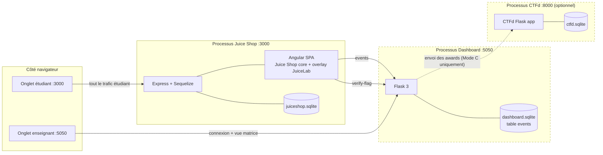
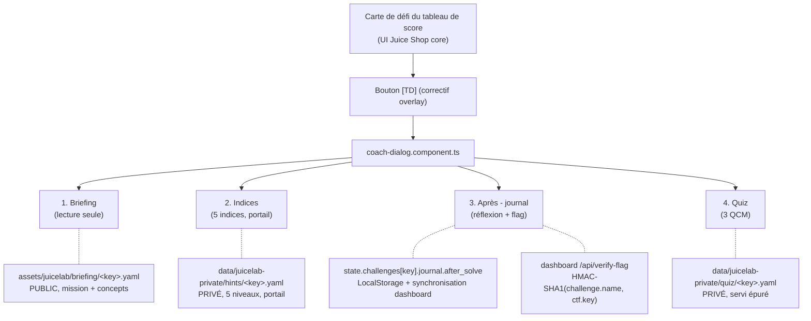
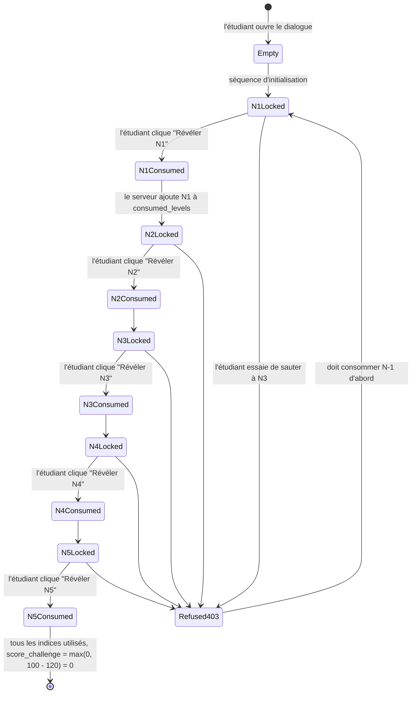
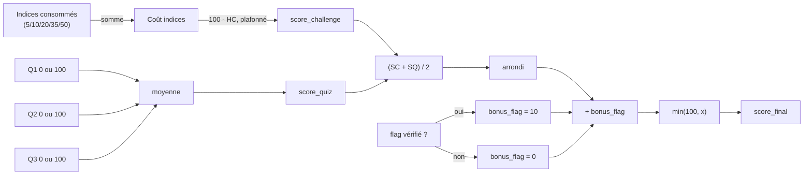
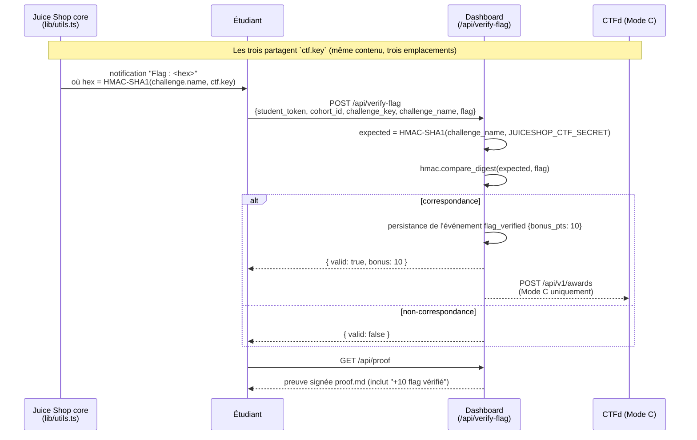
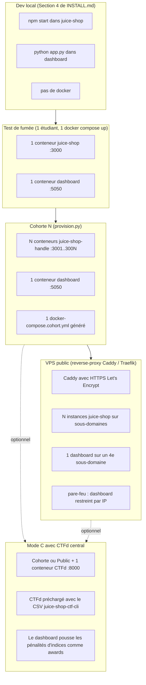

# ARCHITECTURE

> Version anglaise : [ARCHITECTURE.md](./ARCHITECTURE.md).

Ce document explique comment JuiceLab est structuré, comment les données circulent entre les trois composants indépendants, et comment la garantie anti-fuite est appliquée. Tout est illustré par des diagrammes Mermaid.

> **Audience** — ingénieurs et relecteurs OWASP souhaitant évaluer les affirmations de sécurité et pédagogiques du README. Les enseignants qui veulent uniquement *déployer* JuiceLab doivent lire [`INSTALL.md`](./INSTALL.md) à la place.

## Table des matières

- [Trois composants, trois processus indépendants](#trois-composants-trois-processus-indépendants)
- [Fichiers overlay vs Juice Shop upstream](#fichiers-overlay-vs-juice-shop-upstream)
- [Les quatre onglets Coach](#les-quatre-onglets-coach)
- [Flux de données anti-fuite](#flux-de-données-anti-fuite)
- [Machine à états du portail d'indices](#machine-à-états-du-portail-dindices)
- [Formule de score](#formule-de-score)
- [Chaîne de vérification du flag CTF](#chaîne-de-vérification-du-flag-ctf)
- [Contrat de preuve infalsifiable](#contrat-de-preuve-infalsifiable)
- [Topologies de déploiement](#topologies-de-déploiement)
- [Modèle de menace et frontières de confiance](#modèle-de-menace-et-frontières-de-confiance)

---

## Trois composants, trois processus indépendants

JuiceLab est délibérément construit autour de trois processus faiblement couplés. N'importe lequel peut planter sans entraîner les autres.



| Composant | Processus | Port | Persistance | Optionnel |
|---|---|---|---|---|
| Juice Shop + overlay JuiceLab | Node.js (Juice Shop core) | 3000 | `juiceshop.sqlite` (par instance) | obligatoire |
| Dashboard | Python Flask | 5050 | `dashboard.sqlite` (unique, partagé) | obligatoire en Mode B / C |
| CTFd | Python Flask | 8000 | `ctfd.sqlite` | Mode C uniquement |

Les trois composants communiquent **uniquement via HTTP** — il n'y a pas de mémoire partagée, pas de système de fichiers partagé (excepté le fichier statique `ctf.key`), et pas d'accès direct à la base de données. Cela facilite le déploiement sur trois machines distinctes si nécessaire.

---

## Fichiers overlay vs Juice Shop upstream

JuiceLab est un **overlay sans fork**. Nous ajoutons de nouveaux fichiers et appliquons deux correctifs minimaux à Juice Shop upstream.

### Nouveaux fichiers (fournis par JuiceLab)

```
juice-shop/
├── routes/
│   └── juicelab.ts                      [NOUVEAU] Routes Express : /api/juicelab/{hint,quiz,walkthrough}
├── data/
│   └── juicelab-private/                [NOUVEAU] packs privés, jamais servis en fichiers statiques
│       ├── hints/<key>.yaml
│       ├── quiz/<key>.yaml
│       └── walkthroughs/<key>.md
└── frontend/
    └── src/
        ├── app/
        │   └── juicelab-overlay/        [NOUVEAU] composants standalone Angular 20
        │       ├── briefing-panel/
        │       ├── coach-dialog/        dialogue à 4 onglets ouvert depuis la carte du tableau de score
        │       ├── hints-panel/
        │       ├── journal-form/        Réflexion après résolution + vérification du flag
        │       ├── juicelab-panel/      vue d'ensemble du parcours /#/juicelab
        │       ├── quiz-form/
        │       ├── trophy-room/         affichage des trophées dorés cachés /#/cabinet
        │       ├── badges-display/
        │       ├── models/
        │       │   ├── juicelab-i18n.ts catalogue de chaînes UI (pas de texte codé en dur)
        │       │   └── juicelab.types.ts types partagés
        │       ├── services/
        │       │   ├── juicelab-pack.service.ts        appels HTTP vers /api/juicelab/*
        │       │   ├── juicelab-state.service.ts       LocalStorage v1
        │       │   ├── juicelab-scoring.service.ts     déductif plancher 50
        │       │   ├── juicelab-sync.service.ts        POST /api/sync (file hors ligne)
        │       │   ├── juicelab-bridge.service.ts      écouteur socket.io (Juice Shop core)
        │       │   └── juicelab-badge-engine.service.ts 4 règles, extensible
        │       └── juicelab-overlay.routes.ts          /#/juicelab + /#/cabinet
        └── assets/
            └── juicelab/                [NOUVEAU] ressources PUBLIQUES (pas de solutions)
                ├── briefing/<key>.yaml  mission + 3 concepts (pas de payload)
                ├── selected_challenges.yml
                └── config.json          dashboard_url + cohort_id
```

### Correctifs (mineurs, listés ici pour que l'OWASP puisse les auditer)

```
juice-shop/
├── server.ts                                    +5 lignes : montage de routes/juicelab.ts après la route whoami
├── frontend/src/app/app.routing.ts              +2 entrées : /#/juicelab et /#/cabinet (chargement différé)
├── frontend/src/app/navbar/navbar.component.html +1 bouton : icône "school" → /#/juicelab
└── frontend/src/app/score-board/components/
    └── challenge-card/                          +1 bouton : "TD" → ouvre coach-dialog
```

Voilà l'empreinte complète sur Juice Shop upstream : cinq fichiers modifiés et trois nouveaux répertoires de premier niveau. Tout le reste est overlay.

---

## Les quatre onglets Coach

Le dialogue Coach est ouvert depuis le bouton **TD** sur une carte du tableau de score de Juice Shop. Il comporte exactement quatre onglets, dans cet ordre, et l'ordre fait partie du contrat pédagogique.



| # | Onglet | Rôle | Flux de données |
|---|---|---|---|
| 1 | **Briefing** | L'étudiant lit la mission (3 à 6 lignes, voix impérative) et 2 à 4 concepts de sécurité à intérioriser *avant* d'attaquer. Pas de zone de texte, pas de saisie. | YAML public chargé une fois à l'ouverture du dialogue. |
| 2 | **Indices** | Les 5 indices progressifs. Le bouton pour révéler le niveau N n'est activé qu'après la consommation du niveau N-1 (portail côté serveur). Chaque clic coûte `cost_pct` points sur le score du défi. | `GET /api/juicelab/hint?key=X&level=N` (protégé par JWT). |
| 3 | **Après - journal** | Après résolution, l'étudiant rédige une réflexion en texte libre (minimum 5 mots pour activer Enregistrer). Il colle le flag depuis la notification Juice Shop, clique sur **Vérifier le flag** pour +10 points bonus. | `POST /api/sync` (journal_filled), `POST /api/verify-flag`. |
| 4 | **Quiz** | 3 questions à choix multiples portant sur le *concept*, pas sur la technique. Le score est binaire 0/100 par question, la moyenne = score quiz. | `GET /api/juicelab/quiz/questions?key=X` retourne les questions sans `correct` ni `expected_keywords`. `POST /api/juicelab/quiz/score` avec les réponses. |

Un score total en temps réel `min(100, (score_challenge + score_quiz)/2 + bonus_flag)` est affiché dans la barre de titre du dialogue.

> **Pourquoi pas de journal « avant résolution » ?** L'onglet « Avant - journal » hérité a été supprimé le 09/05/2026. Les étudiants ne comprenaient pas quoi faire — *« quelle est votre hypothèse ? »* est inutile sans contexte. L'onglet Briefing (mission + concepts) est la vue canonique avant l'attaque.

---

## Flux de données anti-fuite

La propriété de sécurité la plus importante de JuiceLab est la suivante :

> Un étudiant ne peut pas récupérer les indices, les réponses au quiz ou les walkthroughs en interrogeant des ressources statiques — même s'il connaît l'URL.

Cela est garanti en **séparant** physiquement les fichiers publics des fichiers privés, et en protégeant les fichiers privés derrière des routes Express authentifiées par JWT.

```mermaid
flowchart TB
  subgraph Public["Ressources publiques — servies en fichiers statiques"]
    A1["assets/juicelab/briefing/&lt;key&gt;.yaml<br/>(mission + concepts, PAS de payload)"]
    A2["assets/juicelab/selected_challenges.yml<br/>(13 clés + catégories, PAS de solution)"]
    A3["assets/juicelab/config.json<br/>(URL dashboard, cohort ID)"]
  end

  subgraph Private["Packs privés — JAMAIS servis en fichiers statiques"]
    P1["data/juicelab-private/hints/&lt;key&gt;.yaml<br/>(5 niveaux, texte complet)"]
    P2["data/juicelab-private/quiz/&lt;key&gt;.yaml<br/>(questions + correct + explications)"]
    P3["data/juicelab-private/walkthroughs/&lt;key&gt;.md<br/>(solution complète)"]
  end

  Browser([Navigateur]) -->|"GET /assets/juicelab/...<br/>200 OK"| Public
  Browser -.X.->|"GET /data/juicelab-private/...<br/>404 Not Found (forcé)"| Private

  Browser -->|"GET /api/juicelab/hint?key=X&level=N<br/>(cookie JWT + portail séquentiel)"| Routes["routes/juicelab.ts"]
  Routes -->|"lecture avec liste d'autorisation"| Private
  Routes -->|"retourne UNIQUEMENT le niveau N"| Browser

  Browser -->|"GET /api/juicelab/quiz/questions?key=X"| Routes
  Routes -->|"lecture + suppression de correct/keywords"| Private

  Browser -->|"GET /api/juicelab/walkthrough?key=X<br/>(doit avoir solved=true)"| Routes
```

Trois garanties appliquées par `routes/juicelab.ts` :

1. **Le niveau N d'un indice est refusé avec 403 si N-1 n'a pas été consommé.** L'état par `(student_token, challenge_key, set<HintLevel>)` vit dans une map en mémoire.
2. **Les questions du quiz sont épurées sur le fil.** Le client reçoit uniquement le `question` et les `options` — pas de champ `correct`, pas de `expected_keywords`. Le score est calculé côté serveur : le client envoie l'index choisi, le serveur compare avec `q.correct` (égalité stricte).
3. **Le walkthrough est refusé avec 403 si `challenge.solved !== true` pour cet étudiant** (recherche dans la table `challenges` de Juice Shop).

Un `curl` de fichier statique vers le chemin privé renvoie un 404 forcé par le routeur Express — même si le fichier existe sur le disque, le middleware Express refuse le préfixe d'URL `/data/juicelab-private/`.

---

## Machine à états du portail d'indices

Le portail d'indices est la pièce de logique overlay la plus sollicitée. Voici la machine à états, côté serveur.



Clé d'état : `(student_token, challenge_key)`. Valeur : `Set<HintLevel>` (`{N1, N2}` après deux révélations).

> **Mise en garde au redémarrage.** La map d'état est en mémoire. Si le conteneur Juice Shop redémarre, la map est vide et la séquence d'initialisation (`getHint(N1)` → attente → `getHint(N2)` → ...) se repeuple depuis la vue LocalStorage du client. La migration vers Redis est prévue dans la feuille de route.

---

## Formule de score

Le score final d'un défi est canonique :

```
score_challenge = max(0, 100 - sum(hints_costs))
                # 100 si aucun indice
                # si tous les 5 (5+10+20+35+50 = 120), plafonné à 0
score_quiz      = (Q1_score + Q2_score + Q3_score) / 3
                # chaque Q vaut 0 ou 100 (choix multiple, égalité stricte)
bonus_flag      = 10 si un événement flag_verified existe pour (student, challenge), sinon 0
score_final     = min(100, round((score_challenge + score_quiz) / 2) + bonus_flag)
```



Cas limites :

- **Quiz non soumis** → `score_quiz` indéfini → la preuve affiche `Score final partiel : <score_challenge + bonus> / 100 (composante challenge seule [+10 flag CTF vérifié])`. Ne jamais remplacer un quiz manquant par 0.
- **Cohorte d'indices** fixée par `HINT_COST_BY_LEVEL` dans `models/juicelab.types.ts` (5/10/20/35/50). Les deux fichiers (les constantes et le `cost_pct` du YAML) doivent changer ensemble.
- **Le bonus flag** n'est accordé que via `/api/verify-flag` après vérification HMAC côté serveur. L'interface Coach ne peut pas le définir de son propre chef.

---

## Chaîne de vérification du flag CTF

La chaîne CTF flag relie trois composants indépendants en partageant un unique secret HMAC. C'est le seul point de JuiceLab où une coordination cryptographique inter-composants est requise.



**Vecteur de référence** — pour `challenge.name = "Score Board"` avec le `ctf.key` par défaut, le HMAC-SHA-1 attendu est `2614339936e8282e2f820f023d4d998a1f95e02a`. Si le dashboard retourne `{valid: false}` pour un flag qu'un étudiant a copié mot pour mot, c'est l'alignement canonique à vérifier.

**Modèle de confiance** — le dashboard ne vérifie *pas* le JWT de Juice Shop. Il fait confiance au champ `student_token` de la requête. La protection cryptographique contre les falsifications porte sur :

1. La **signature de la preuve** (HMAC-SHA-256 du corps Markdown, clé = `DASHBOARD_PROOF_SECRET`).
2. Le **flag** (HMAC-SHA-1 de `challenge.name`, clé = `ctf.key`).

Un étudiant qui falsifie son propre `student_token` ne produit qu'une preuve valide pour sa fausse identité. Le contrôle croisé de `student_token` par rapport à l'adresse e-mail est du ressort de l'enseignant (le dashboard ne le fait pas à sa place).

---

## Contrat de preuve infalsifiable

La preuve téléchargeable est un fichier Markdown à structure fixe. L'enseignant le lit manuellement ; la structure doit rester stable entre les versions car `verify_proof.py` ne valide que la signature, pas la structure.

```mermaid
flowchart TB
  subgraph Proof["Structure du fichier .md de preuve (fixe)"]
    H1["# JuiceLab proof - nom du défi"]
    Meta["Table méta : email, key, catégorie, difficulté, cohorte, token (UUID)"]
    Brief["## Brief : description OWASP"]
    Journal["## Journal de l'étudiant : texte after_solve"]
    Hints["## Indices consommés : table Niveau / Coût / Horodatage<br/>+ Score après indices = 100 - sum(cost_pct)"]
    Quiz["## Quiz : Score quiz = (Q1+Q2+Q3)/3<br/>+ table Question / Réponse / Score"]
    Score["## Score final (OBLIGATOIRE, même si partiel)"]
    Trace["## Trace : Résolution Juice Shop, Export preuve"]
    Sig["--- PROOF: HMAC-SHA256 / SCHEME: v1 / TIMESTAMP / STUDENT / CHALLENGE / SIGNATURE: hex"]

    H1 --> Meta --> Brief --> Journal --> Hints --> Quiz --> Score --> Trace --> Sig
  end
```



Vérification — hors ligne, sans dashboard :

```bash
python dashboard/verify_proof.py /path/to/proof.md
# sortie attendue : "Signature OK"
```

Le script lit la preuve, recalcule le HMAC-SHA-256 de tout ce qui se trouve au-dessus du séparateur `--- PROOF:` avec le `DASHBOARD_PROOF_SECRET` partagé, et compare avec la signature stockée. Une preuve modifiée — même d'une faute de frappe — échoue à la vérification.

---

## Topologies de déploiement



`docker/provision.py` est le pont entre un `roster.txt` (un identifiant étudiant par ligne) et un `docker-compose.cohort.yml` (un service par étudiant). Il affiche également la valeur exacte de `DASHBOARD_CORS_ORIGINS` à coller dans `.env` — le dashboard rejette les événements provenant de toute origine absente de la liste d'autorisation.

---

## Modèle de menace et frontières de confiance

JuiceLab n'est **pas** un système d'authentification. Il suppose :

1. L'étudiant est honnête quant à son propre `student_token`. Le dashboard ne vérifie pas le JWT de Juice Shop.
2. L'enseignant contrôle le `DASHBOARD_TEACHER_TOKEN` et le `DASHBOARD_PROOF_SECRET`. Ce sont des identifiants à granularité grossière.
3. La cohorte s'exécute sur un réseau privé pendant le TD. Les listes d'autorisation CORS protègent le dashboard des événements cross-origin. Le HTTPS est de la responsabilité du déploiement (Caddy, Traefik) pour une exposition publique.

Ce qu'il **garantit** :

| Propriété | Mécanisme |
|---|---|
| Un étudiant ne peut pas récupérer tous les indices / réponses au quiz / walkthroughs en frappant des URL statiques | Les fichiers vivent sous `data/juicelab-private/`, servis uniquement via des routes protégées par JWT |
| Un étudiant ne peut pas sauter de N1 à N3 | Le portail `Set<HintLevel>` côté serveur refuse N+1 si N n'est pas consommé |
| Un étudiant ne peut pas lire le walkthrough avant de résoudre | Vérification de `challenges[key].solved` côté serveur |
| Un étudiant ne peut pas falsifier ses réponses au quiz | Le champ `correct` n'atteint jamais le client ; le score est calculé côté serveur par égalité stricte |
| Un étudiant ne peut pas falsifier son score sur la preuve | HMAC-SHA-256 du corps Markdown avec `DASHBOARD_PROOF_SECRET` |
| Un étudiant ne peut pas falsifier un flag CTF | HMAC-SHA-1 de `challenge.name` avec `ctf.key` ; le dashboard recalcule et compare |

Ce qu'il **ne garantit pas** :

| Risque | Atténuation hors JuiceLab |
|---|---|
| Un étudiant copie le flag de son camarade | Le flag est identique pour tous les étudiants d'une même cohorte. La lutte anti-collusion CTF est du ressort de l'enseignant. |
| Un étudiant inspecte le bundle JS à la recherche de textes d'indices | Il ne verra que le code compilé du bundle — les indices vivent côté serveur et sont chargés à la demande. |
| Un étudiant falsifie les clés HMAC | Les clés se trouvent dans le déploiement de l'enseignant, pas dans le conteneur de l'étudiant. |
| Un étudiant ouvre `/#/cabinet` sans avoir gagné de trophées | La salle des trophées n'affiche que les trophées que le LocalStorage de l'étudiant marque comme capturés. L'état des autres étudiants est invisible. |

---

## Pour aller plus loin

- [`README.md`](./README.md) — ce qu'est JuiceLab et pourquoi
- [`INSTALL.md`](./INSTALL.md) — comment le déployer
- [`docs/PEDAGOGY.md`](./docs/PEDAGOGY.md) — la théorie d'apprentissage qui guide la conception
- [`docs/CTF-INTEGRATION.md`](./docs/CTF-INTEGRATION.md) — approfondissement du Mode C
- [`CONTEXTE-JuiceLab.md`](./CONTEXTE-JuiceLab.md) — historique de conception (notes de travail, 2026)
- [`.claude/skills/juicelab-add-challenge/SKILL.md`](./.claude/skills/juicelab-add-challenge/SKILL.md) — le contrat que tout contributeur suit lors de la modification d'un pack
