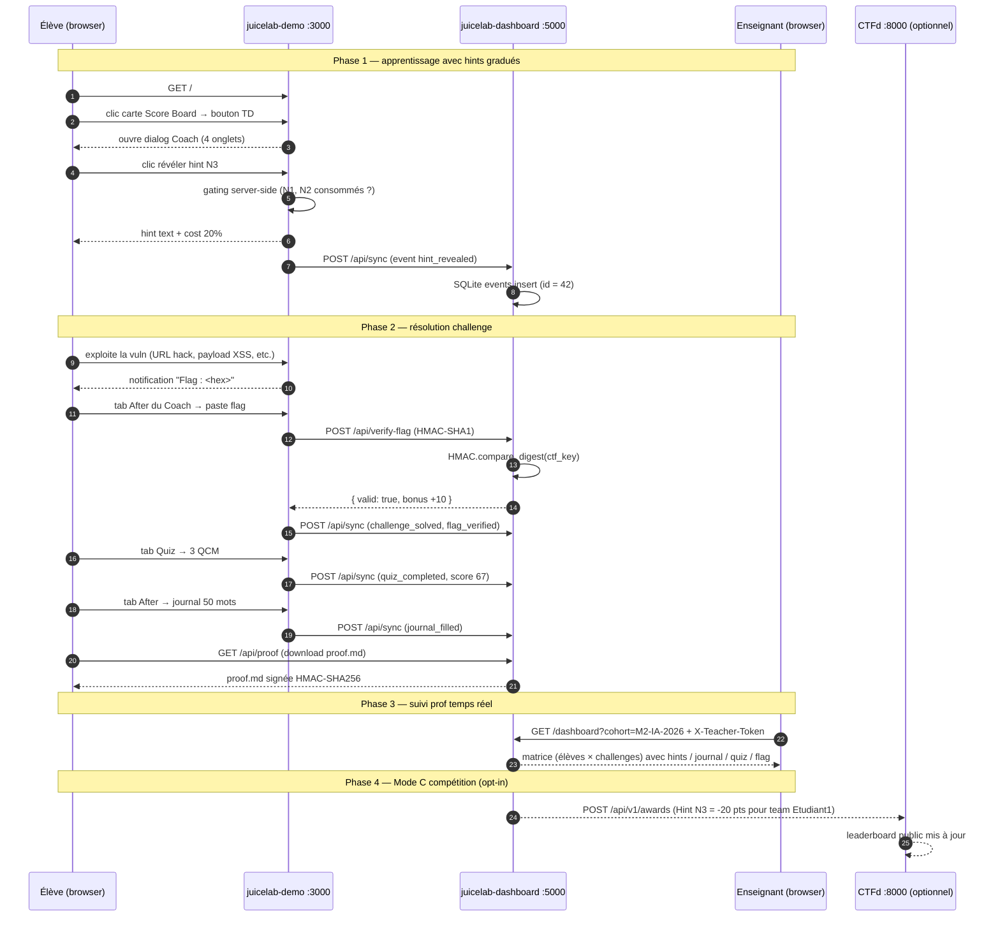
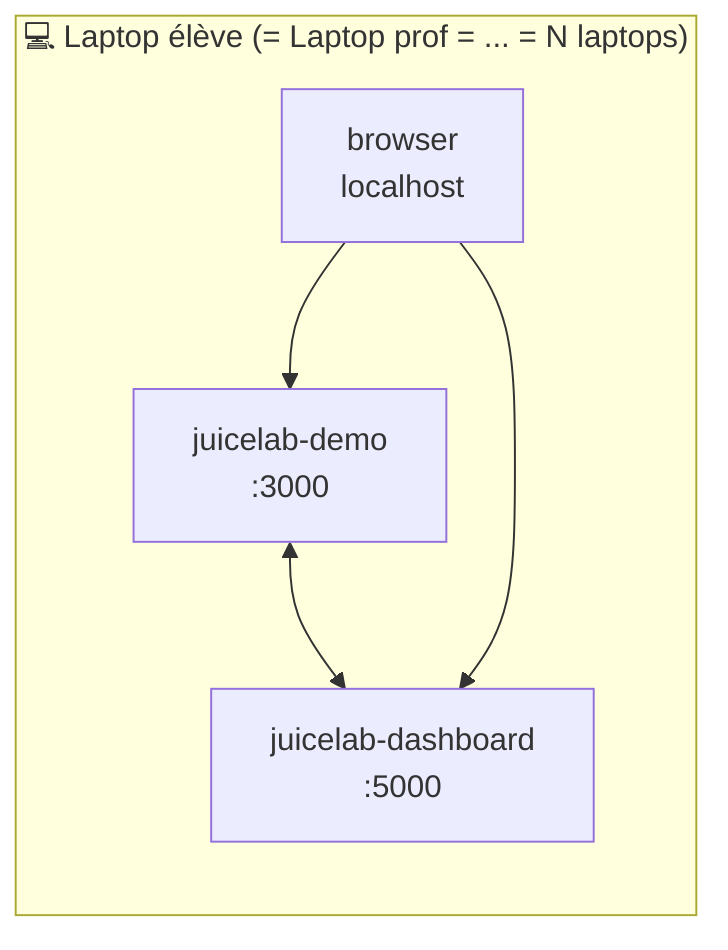
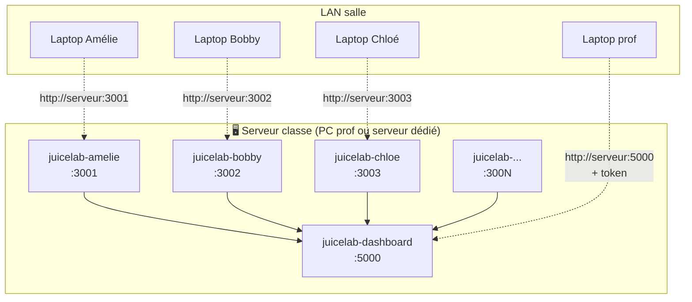
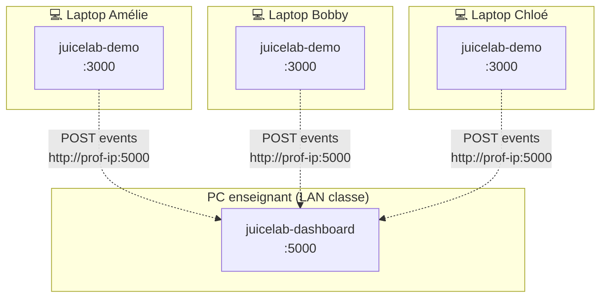

# Guide de déploiement enseignant

Ce document s'adresse à un **enseignant ou coordinateur de cours** qui doit décider :

- Combien de machines il faut pour un TD JuiceLab
- Où installer le `dashboard` (lui), où installer `juice-shop` (les élèves)
- Quel type de matériel et quelle bande passante
- Comment configurer le réseau (LAN classe, VPS public, mix)

Aucune connaissance Docker préalable n'est requise — chaque scénario est complet, du clone Git au check final.

> Lecture complémentaire :
> - [`INSTALL.md`](../INSTALL.md) : les commandes brutes (smoke test, cohorte, Mode C)
> - [`ARCHITECTURE.md`](../ARCHITECTURE.md) : l'architecture interne (gating anti-fuite, score, proof signing)
> - [`DOCKER.md`](./DOCKER.md) : opération avancée (rebase OWASP, sécurité runtime)

---

## Table des matières

- [Vocabulaire essentiel](#vocabulaire-essentiel)
- [Qui parle à qui — diagramme](#qui-parle-à-qui--diagramme)
- [Les 4 scénarios de déploiement](#les-4-scénarios-de-déploiement)
  - [Scénario 1 — Solo sur le laptop de chaque élève](#scénario-1--solo-sur-le-laptop-de-chaque-élève)
  - [Scénario 2 — Serveur central en salle de classe](#scénario-2--serveur-central-en-salle-de-classe)
  - [Scénario 3 — VPS partagé (cours en ligne / hybride)](#scénario-3--vps-partagé-cours-en-ligne--hybride)
  - [Scénario 4 — Hybride : Juice Shop chez les élèves + dashboard chez le prof](#scénario-4--hybride--juice-shop-chez-les-élèves--dashboard-chez-le-prof)
- [Sizing : combien de matériel pour N élèves](#sizing--combien-de-matériel-pour-n-élèves)
- [Réseau et sécurité](#réseau-et-sécurité)
- [FAQ enseignant](#faq-enseignant)
- [Troubleshooting classroom](#troubleshooting-classroom)

---

## Vocabulaire essentiel

### Trois services

| Service | Image docker | Port par défaut | Joué par | Rôle |
|---|---|---|---|---|
| **`juicelab-demo`** | `juicelab:latest` (~700 MB) | **3000** | **L'élève** dans son navigateur | OWASP Juice Shop + overlay Coach (briefings, hints gradués, journal, quiz). C'est le « jeu ». |
| **`juicelab-dashboard`** | `juicelab-dashboard:latest` (~180 MB) | **5000** | **L'enseignant** dans son navigateur (avec un token) | Aggrège les événements de toute la cohorte, signe les preuves de lab, vérifie les flags HMAC, push optionnel vers CTFd |
| **`ctfd`** *(optionnel)* | `ctfd/ctfd:3.7.x` (~600 MB) | **8000** | Tout le monde (leaderboard public) | Compétition CTF classique. Activé seulement en Mode C. |

Les noms `juicelab-demo` et `juicelab-dashboard` viennent du `container_name` dans `docker-compose.yml`. Le nom `juicelab-amelie`, `juicelab-bobby`, etc. apparaît dès qu'on passe en cohorte (un container Juice Shop par élève, généré par `provision.py`).

### Trois modes opérationnels

| Mode | Quand l'utiliser | Activation |
|---|---|---|
| **A — Solo local** | TD individuel, élève chez lui, pas de compétition | Default (aucune env var supplémentaire) |
| **B — Cohorte trackée** | TD en présentiel ou distanciel, le prof veut une vue temps réel | `DASHBOARD_TEACHER_TOKEN` partagé, dashboard accessible aux élèves via `dashboard_url` |
| **C — + Leaderboard CTFd public** | Compétition avec un classement public (challenge classroom, hackathon) | `CTFD_URL` + `CTFD_ADMIN_TOKEN` set en plus |

Les modes sont **orthogonaux** au scénario de déploiement : on peut faire un Scénario 1 (solo laptop) en Mode A, ou un Scénario 3 (VPS) en Mode B, etc.

---

## Qui parle à qui — diagramme



**Points clés** :

- L'élève communique **uniquement** avec :3000. Il ne tape jamais l'URL du dashboard dans son navigateur.
- Le `juicelab-demo` fait office de proxy pour les events : il reçoit les actions de l'élève, fait son travail propre, puis push les events au dashboard derrière la scène.
- Le prof tape **uniquement** :5000 (avec son token). Il ne touche jamais à :3000 sauf pour vérifier l'overlay côté élève.
- CTFd (si Mode C) reçoit des **awards négatifs** depuis le dashboard, jamais directement depuis l'élève.

---

## Les 4 scénarios de déploiement

### Scénario 1 — Solo sur le laptop de chaque élève



**Le concept** : l'élève télécharge tout sur son PC. Le dashboard, le Juice Shop, et la SQLite tournent en local. L'enseignant n'a accès à rien en temps réel — il récupère les `proof.md` signés en fin de TD (USB, email).

**Audience cible** :
- TD à distance asynchrone (élèves font le TD quand ils veulent)
- Cohortes très hétérogènes (chaque élève à son rythme, pas de classement)
- Évaluation par remise de preuve, pas par observation live

#### Hardware

| Composant | Recommandé | Minimum |
|---|---|---|
| RAM | 8 GB | 4 GB |
| CPU | 4 cores | 2 cores |
| Disque libre | 5 GB | 3 GB |
| OS | Linux / macOS / Windows 10+ avec Docker Desktop | Idem |

Le Docker build initial prend 8-10 min et consomme ~2 GB de cache. Les rebuilds incrémentaux sont ~10 s.

#### Étapes (à donner à chaque élève)

```bash
# 1. Installer Docker Desktop
#    Windows : https://docs.docker.com/desktop/install/windows-install/
#    macOS   : https://docs.docker.com/desktop/install/mac-install/
#    Linux   : https://docs.docker.com/engine/install/

# 2. Cloner le repo JuiceLab
git clone https://github.com/mo0ogly/juicelab.git
cd juicelab/docker

# 3. Préparer les secrets
cp .env.example .env
# éditer .env : choisir une chaîne random pour DASHBOARD_TEACHER_TOKEN (>= 16 chars)
# et une autre pour DASHBOARD_PROOF_SECRET (>= 16 chars)

# 4. Lancer (premier build : 8-10 min)
docker compose --env-file .env up -d --build

# 5. Ouvrir le browser
#    Jeu       : http://127.0.0.1:3000/#/score-board
#    Dashboard : http://127.0.0.1:5000/dashboard?cohort=M2-IA-2026 (token requis)

# 6. Une fois le TD fini, exporter les preuves
docker compose --env-file .env exec dashboard \
    tar czf /tmp/proofs.tgz /app/data
docker compose --env-file .env cp dashboard:/tmp/proofs.tgz ./proofs.tgz
# l'élève envoie proofs.tgz à l'enseignant par email
```

#### Limites du Scénario 1

| Limite | Impact |
|---|---|
| L'enseignant ne voit rien en temps réel | Pas de remédiation immédiate, pas d'aide ciblée |
| Aucune compétition possible | Pas de leaderboard, pas de classement |
| Chaque élève doit savoir installer Docker | Friction technique au démarrage du TD |
| Les `proof.md` sont la seule traçabilité | Risque de perte (oubli de remise, fichier corrompu) |

---

### Scénario 2 — Serveur central en salle de classe



**Le concept** : **un seul** serveur (PC enseignant boosté ou serveur de classe) fait tourner tout. Les élèves arrivent avec leurs laptops, ouvrent un browser, se connectent à `http://<IP serveur>:30XX` selon leur handle. Le dashboard live affiche la matrice cohorte.

**Audience cible** :
- TD en présentiel en salle équipée
- Cohortes 5 à 30 élèves (au-delà, voir Scénario 3)
- Volonté de visibilité live (remédiation pendant le TD)

#### Hardware

Pour N élèves :

| Composant | Calcul | Exemples |
|---|---|---|
| RAM | 2 GB par juicelab + 1 GB dashboard + 4 GB OS | 5 élèves : 16 GB ; 15 élèves : 32 GB ; 30 élèves : 64 GB |
| CPU | 1 core par juicelab actif (les Juice Shops sont peu sollicités au runtime) | 5 élèves : 6 cores ; 30 élèves : 12+ cores |
| Disque | 1.5 GB par juicelab (image partagée) + 500 MB par container actif | 5 élèves : ~15 GB ; 30 élèves : ~40 GB |
| Réseau | 100 Mbps suffit pour 30 élèves en salle | — |

**Astuce** : les containers Juice Shop sont **light** au runtime (juste un Node.js qui sert du Angular static + quelques routes JSON). Le bottleneck c'est la **RAM** et le **disque** pour stocker les images, pas le CPU.

#### Étapes (à exécuter une fois par l'enseignant)

```bash
# Sur le serveur classe :

# 1. Installer Docker Engine (pas besoin de Docker Desktop sur un serveur Linux)
curl -fsSL https://get.docker.com | sh
sudo usermod -aG docker $USER && newgrp docker

# 2. Cloner le repo
git clone https://github.com/mo0ogly/juicelab.git
cd juicelab/docker

# 3. Préparer le roster (la liste des élèves)
cp roster.example.txt roster.txt
$EDITOR roster.txt
# une ligne par élève, alphanumérique, max 30 chars :
# amelie
# bobby
# chloe
# ...

# 4. Provisionner le compose cohorte
python provision.py roster.txt --port-base 3001 \
    --output docker-compose.cohort.yml \
    --print-cors
# affiche la liste des origines CORS — la copier !

# 5. Préparer le .env
cp .env.example .env
$EDITOR .env
# remplir au minimum :
#   DASHBOARD_TEACHER_TOKEN   = <32 chars random>
#   DASHBOARD_PROOF_SECRET    = <32 chars random>
#   JUICELAB_COHORT_ID        = M2-IA-2026   (libre, choisir un id stable)
#   DASHBOARD_PUBLIC_HOST     = <IP du serveur visible depuis le LAN, ex. 192.168.1.10>
#   DASHBOARD_CORS_ORIGINS    = <coller la valeur donnée par provision.py>

# 6. Booter la cohorte (premier build : 10 min)
docker compose -f docker-compose.yml -f docker-compose.cohort.yml \
    --env-file .env up -d --build

# 7. Distribuer aux élèves leur URL et leur compte
#    Amélie  -> http://192.168.1.10:3001/#/juicelab
#    Bobby   -> http://192.168.1.10:3002/#/juicelab
#    Chloé   -> http://192.168.1.10:3003/#/juicelab
#    ...
#    Chaque élève s'inscrit sur SON URL (page /#/register), puis joue.

# 8. Le prof ouvre la dashboard
#    http://192.168.1.10:5000/dashboard?cohort=M2-IA-2026
#    (login avec DASHBOARD_TEACHER_TOKEN)
```

#### Trouver l'IP du serveur

| OS | Commande |
|---|---|
| Linux | `ip addr show \| grep "inet " \| grep -v 127.0.0.1` |
| macOS | `ipconfig getifaddr en0` |
| Windows | `ipconfig \| findstr "IPv4"` |

#### Pourquoi `DASHBOARD_PUBLIC_HOST` ?

L'overlay Angular bundled dans `juicelab-demo` lit `config.json` qui contient `dashboard_url`. Cette URL est appelée **par le browser de l'élève**, pas par le container `juicelab-demo`. Si on mettait `http://dashboard:5000` (le nom DNS interne Docker), le browser ne saurait pas le résoudre. Il faut donc l'IP **visible depuis le poste élève**.

L'`entrypoint.sh` du container `juicelab-demo` regénère `config.json` au boot avec la valeur de `JUICELAB_DASHBOARD_URL`, dérivée de `DASHBOARD_PUBLIC_HOST:DASHBOARD_PORT`.

#### Limites du Scénario 2

| Limite | Impact |
|---|---|
| Un seul point de défaillance (le serveur) | Si le serveur crashe, tous les TDs sont à l'arrêt |
| Salle obligatoire avec switch / wifi local | Pas adapté au cours en ligne |
| Configuration du firewall (ports 3001-3030 + 5000 ouverts dans le LAN) | Friction administrateur réseau |
| 1 fenêtre par élève dans `docker ps` | Visibilité système plus chargée |

---

### Scénario 3 — VPS partagé (cours en ligne / hybride)

```mermaid
flowchart TB
    subgraph cloud["☁️ VPS (DigitalOcean, Scaleway, Hetzner, AWS EC2)"]
        subgraph proxy["Caddy / Traefik (HTTPS + reverse-proxy)"]
            CA[Caddyfile]
        end
        D[juicelab-dashboard<br/>:5000]
        J1[juicelab-amelie<br/>:3001]
        J2[juicelab-bobby<br/>:3002]
        Jn[juicelab-...]
        CA --> D
        CA --> J1
        CA --> J2
        CA --> Jn
    end

    subgraph internet["Internet"]
        E1[Amélie chez elle] -. https://amelie.juicelab.tld .-> CA
        E2[Bobby au café] -. https://bobby.juicelab.tld .-> CA
        P[Enseignant] -. https://dashboard.juicelab.tld<br/>+ token .-> CA
    end
```

**Le concept** : un VPS public héberge la stack. Chaque élève a un sous-domaine qui pointe vers son `juicelab-<handle>`. HTTPS via Let's Encrypt. Le prof a un sous-domaine séparé pour le dashboard, protégé par IP allow-listing.

**Audience cible** :
- Cours en ligne (Sorbonne distanciel, MOOC interne, formation continue)
- Cohortes 10 à 100 élèves
- Volonté d'accès depuis n'importe où, n'importe quand
- Budget VPS (~ 20 €/mois pour 30 élèves)

#### Hardware VPS

| Cohorte | RAM | CPU | Disque | Coût (Hetzner CCX13 ou équivalent) |
|---|---|---|---|---|
| 5-10 élèves | 16 GB | 4 vCPU | 80 GB | ~ 30 €/mois |
| 10-30 élèves | 32 GB | 8 vCPU | 160 GB | ~ 80 €/mois |
| 30-100 élèves | 64 GB | 16 vCPU | 320 GB | ~ 200 €/mois |

**Note** : pas besoin de SSD ultra-rapide. Les Juice Shops sont in-memory, la SQLite dashboard est sollicitée ~ 50 events/h/élève (négligeable).

#### Étapes

```bash
# Sur le VPS Linux (Ubuntu 22.04+ ou Debian 12+) :

# 1. Installer Docker + Caddy
curl -fsSL https://get.docker.com | sh
sudo usermod -aG docker $USER && newgrp docker
sudo apt install -y caddy

# 2. Clone + provision (idem Scénario 2 étapes 2-5)
git clone https://github.com/mo0ogly/juicelab.git /opt/juicelab
cd /opt/juicelab/docker
# ... éditer roster, .env, etc.

# 3. Caddyfile sous /etc/caddy/Caddyfile (générer un par élève)
sudo tee /etc/caddy/Caddyfile <<'EOF'
amelie.juicelab.tld {
    reverse_proxy localhost:3001
}
bobby.juicelab.tld {
    reverse_proxy localhost:3002
}
# ... une entrée par élève

dashboard.juicelab.tld {
    # restreindre par IP : seule l'IP du prof peut accéder
    @allowed remote_ip 203.0.113.42      # IP du prof
    reverse_proxy @allowed localhost:5000
    respond 403
}
EOF
sudo systemctl restart caddy
# Caddy obtient automatiquement les certificats Let's Encrypt

# 4. DNS : créer un wildcard ou des A records
#    *.juicelab.tld    A    <IP du VPS>
#    dashboard.juicelab.tld  A  <IP du VPS>

# 5. Booter
docker compose -f docker-compose.yml -f docker-compose.cohort.yml \
    --env-file .env up -d --build

# 6. Distribuer aux élèves leur URL HTTPS
#    Amélie  -> https://amelie.juicelab.tld/#/juicelab
#    Bobby   -> https://bobby.juicelab.tld/#/juicelab
#    ...
```

#### Configuration `.env` adaptée

```
DASHBOARD_PUBLIC_HOST=dashboard.juicelab.tld
DASHBOARD_CORS_ORIGINS=https://amelie.juicelab.tld,https://bobby.juicelab.tld,...
DASHBOARD_PORT=5000
JUICELAB_DEFAULT_LANGUAGE=fr
```

**Important** : la liste `DASHBOARD_CORS_ORIGINS` doit contenir **toutes les URLs HTTPS** (avec le `https://`, sans le port si 443).

#### Limites du Scénario 3

| Limite | Impact |
|---|---|
| Surface publique exposée | Sécuriser avec IP allow-listing prof, mots de passe forts, monitoring |
| Coût mensuel récurrent | À budgéter |
| Maintenance OS (mises à jour, certificats) | Prévoir un cron `caddy reload` ou un service géré |
| Pas d'accès en cas de coupure VPS provider | SLA du provider à vérifier |

---

### Scénario 4 — Hybride : Juice Shop chez les élèves + dashboard chez le prof



**Le concept** : chaque élève fait tourner son `juicelab-demo` sur son propre laptop (pas de Juice Shop centralisé). Mais ils configurent leur `dashboard_url` pour pointer vers le PC de l'enseignant sur le LAN. Le prof voit la matrice cohorte temps réel.

**Audience cible** :
- Salle équipée mais sans serveur dédié
- Élèves ont un laptop puissant chacun
- Volonté de garder la charge CPU/RAM élève sur l'élève, et la traçabilité chez le prof

#### Hardware

| Côté élève | Côté prof |
|---|---|
| 8 GB RAM, 2 cores, Docker Desktop | 8 GB RAM, 2 cores (le dashboard est léger) |

#### Étapes

**Côté prof** :

```bash
# 1. Cloner + ne lancer QUE le dashboard
git clone https://github.com/mo0ogly/juicelab.git
cd juicelab/docker
cp .env.example .env
# éditer .env : DASHBOARD_TEACHER_TOKEN, DASHBOARD_PROOF_SECRET, DASHBOARD_CORS_ORIGINS

# 2. Lancer uniquement le service dashboard (pas juicelab-demo)
docker compose --env-file .env up -d --build dashboard

# 3. Noter l'IP visible par le LAN
hostname -I       # ex. 192.168.1.10

# 4. Distribuer aux élèves la chaîne à mettre dans LEUR config :
#    http://192.168.1.10:5000
```

**Côté chaque élève** :

```bash
# 1. Cloner + lancer juicelab-demo seul, configuré pour pointer vers le prof
git clone https://github.com/mo0ogly/juicelab.git
cd juicelab/docker

# 2. Préparer un .env minimaliste
cat > .env <<EOF
TEACHER_ADMIN_TOKEN=$(openssl rand -hex 16)
JUICELAB_DASHBOARD_URL=http://192.168.1.10:5000
JUICELAB_COHORT_ID=M2-IA-2026
JUICELAB_INSTANCE_LABEL=$(whoami)   # ou prénom
JUICELAB_DEFAULT_LANGUAGE=fr
EOF

# 3. Lancer juicelab-demo uniquement
docker compose --env-file .env up -d --build juicelab-demo

# 4. Browser
#    http://127.0.0.1:3000/#/juicelab
```

#### Configuration CORS critique

Le `DASHBOARD_CORS_ORIGINS` côté prof doit lister **toutes** les origines élèves. Si chaque élève accède via `http://127.0.0.1:3000`, c'est la même origine — alors :

```
DASHBOARD_CORS_ORIGINS=http://127.0.0.1:3000,http://localhost:3000
```

Sinon le dashboard rejette les POST `/api/sync` avec un 403 silencieux.

#### Limites du Scénario 4

| Limite | Impact |
|---|---|
| Élèves doivent installer Docker eux-mêmes | Friction démarrage TD |
| Le LAN doit être réellement plat (pas de VLAN entre élèves et prof) | Demande coordination avec l'admin réseau |
| `instance_label` doit être unique par élève | Coordination manuelle |
| Pas adapté si l'élève veut continuer chez lui après le TD | Quand l'élève rentre, le dashboard prof n'est plus joignable |

---

## Sizing : combien de matériel pour N élèves

Récapitulatif rapide.

### Scénario 1 (solo) — par élève

| Élèves | RAM totale | Disque total | CPU total | Coût |
|---|---|---|---|---|
| 1 | 8 GB | 5 GB | 2 cores | gratuit (laptop perso) |
| 30 | 30 × 8 GB | 30 × 5 GB | 30 × 2 cores | gratuit mais 30 setups Docker à faire |

### Scénario 2 (serveur central) — total infrastructure

| Élèves | RAM serveur | Disque serveur | CPU serveur | Coût |
|---|---|---|---|---|
| 5 | 16 GB | 15 GB | 4 cores | gratuit (PC prof boosté) |
| 15 | 32 GB | 25 GB | 8 cores | 1 PC tour ~ 800 € |
| 30 | 64 GB | 40 GB | 12 cores | 1 station ~ 1500 € |
| 100+ | passer au Scénario 3 | | | |

### Scénario 3 (VPS) — total mensuel

| Élèves | RAM VPS | CPU | Disque | Provider exemple | Coût/mois |
|---|---|---|---|---|---|
| 10 | 16 GB | 4 vCPU | 80 GB | Hetzner CCX13 | ~ 30 € |
| 30 | 32 GB | 8 vCPU | 160 GB | Hetzner CCX23 | ~ 80 € |
| 100 | 64 GB | 16 vCPU | 320 GB | Hetzner CCX33 | ~ 200 € |

### Scénario 4 (hybride)

| Élèves | Côté élève (chacun) | Côté prof | Coût |
|---|---|---|---|
| n'importe quoi | 8 GB RAM, Docker Desktop | 8 GB RAM (dashboard seul) | gratuit |

---

## Réseau et sécurité

### Pare-feu : quels ports ouvrir

| Scénario | Ports à ouvrir | Pour qui |
|---|---|---|
| 1 (solo) | Aucun (tout localhost) | — |
| 2 (LAN) | 3001-30XX + 5000 sur le LAN classe seulement | Élèves + prof, jamais Internet |
| 3 (VPS) | 80 + 443 (Caddy gère le reste) | Internet |
| 4 (hybride) | 5000 sur le PC prof | Élèves sur le LAN |

**Important** : ne **jamais** exposer le port 3000-30XX directement à Internet sans HTTPS et sans IP allow-listing. Juice Shop est **délibérément vulnérable** — c'est le but. Si vous l'exposez publiquement, n'importe qui peut s'en servir comme point d'attaque vers votre réseau.

### Tokens et secrets

Trois secrets dans `.env`, **jamais committer** :

| Secret | Usage | Longueur min |
|---|---|---|
| `DASHBOARD_TEACHER_TOKEN` | Accès à `/dashboard`, `/api/cohort`, `/api/admin/*` | 16 chars, recommandé 32 |
| `DASHBOARD_PROOF_SECRET` | Signe les `proof.md` HMAC-SHA256. Si compromis, un élève peut forger un proof | 16 chars, recommandé 32 |
| `JUICESHOP_CTF_SECRET` | Hash HMAC-SHA1 des flags. Doit matcher `juice-shop/ctf.key` | 16+ chars custom, **pas** la default OWASP |

Génération rapide :

```bash
# Linux / macOS / WSL
openssl rand -hex 32

# PowerShell
-join ((48..57 + 65..90 + 97..122) | Get-Random -Count 32 | % { [char]$_ })
```

### HTTPS pour le Scénario 3

Caddy gère Let's Encrypt automatiquement. Vérifier après quelques minutes :

```bash
curl -I https://amelie.juicelab.tld | head -3
# attendu : HTTP/2 200, Server: Caddy
```

### IP allow-listing pour le dashboard public

Dans Caddyfile :

```caddy
dashboard.juicelab.tld {
    @allowed remote_ip 203.0.113.42 198.51.100.7
    reverse_proxy @allowed localhost:5000
    respond 403
}
```

Pour ajouter une IP en cours de session :

```bash
sudo $EDITOR /etc/caddy/Caddyfile
sudo systemctl reload caddy
```

### Backups

Le seul état persistant est le volume docker `juicelab_dashboard_data` (SQLite events). Snapshot :

```bash
docker run --rm \
    -v juicelab_dashboard_data:/data \
    -v $(pwd):/backup alpine \
    tar czf /backup/juicelab-$(date +%Y%m%d).tgz -C /data .
```

À automatiser via cron quotidien sur un VPS, ou manuel en fin de TD pour les Scénarios 1-2.

---

## FAQ enseignant

### Combien de temps pour préparer le TD ?

- **Scénario 1** : 0 préparation enseignant, 15 min par élève (install Docker + clone + build initial)
- **Scénario 2** : 1 h de préparation serveur, 5 min pour l'élève (juste ouvrir une URL)
- **Scénario 3** : 2-3 h de préparation VPS (DNS, Caddy, certificats), 0 min pour l'élève
- **Scénario 4** : 30 min préparation prof, 20 min par élève

### Combien d'élèves je peux mettre par serveur ?

Bottleneck = RAM. Chaque container `juicelab-amelie` consomme ~ 1.5-2 GB au runtime. Compter :

`RAM_serveur = 2 × N + 1 + 4 (OS)` GB

Donc :
- 8 GB serveur → 1-2 élèves max
- 16 GB → 5-6 élèves
- 32 GB → 13-14 élèves
- 64 GB → 30 élèves

### Je peux faire tourner ça sur un Raspberry Pi ?

Non. Le `npm install` initial mange ~ 4 GB de RAM peak. Un Pi 4 (4 ou 8 GB) ne tient pas. Pour un setup léger, voir Scénario 1 (1 élève = 1 Pi 8 GB possible mais lent).

### Les élèves doivent-ils tous être présents en même temps ?

Non. Le dashboard agrège les events de manière temporelle : si Amélie joue lundi et Bobby mardi, leurs lignes apparaissent l'une après l'autre dans la matrice. La SQLite garde tout indéfiniment.

### Je peux arrêter le TD et reprendre demain ?

Oui. `docker compose down` (sans `-v`) arrête les containers mais garde le volume `juicelab_dashboard_data`. Un `up -d` reprend où on s'est arrêté.

**Attention** : les containers Juice Shop ont un état interne in-memory (sessions JWT, état des challenges résolus dans un onglet du browser). Un `down` les vide. Les élèves doivent re-login et re-cliquer sur les challenges déjà résolus pour les ré-afficher comme tels — mais leurs events dans la dashboard sont préservés.

### CTFd Mode C — est-ce que je dois l'activer dès le début ?

Non. Mode C est strictement opt-in. On peut faire un TD entier en Mode A ou B et activer Mode C uniquement pour la dernière demi-journée si on veut une mini-compétition.

### Mes élèves utilisent Mac / Windows / Linux mélangés. Problème ?

Non. Docker Desktop fonctionne sur les trois. Le seul piège : sous Windows, Docker Desktop doit être en mode **Linux containers** (pas Windows containers). Réglage par défaut.

### Mes élèves sont mineurs, RGPD ?

Les événements stockent : `student_token` (UUID anonyme généré par leur navigateur), `cohort_id` (libre, ex. `M2-IA-2026`), `data_json` (hint level, score, journal text si l'élève écrit). Le `student_email` n'est inclus que dans les events `hint_revealed` en **Mode C uniquement** (pour le mapping CTFd).

Pour rester RGPD-compatible :
- Configurer `JUICELAB_DEFAULT_LANGUAGE=fr` pour que les briefings soient en français
- Ne pas activer Mode C avec des mineurs sans consentement parental
- Purger le volume `juicelab_dashboard_data` après chaque cohorte

### Comment je note les élèves ?

Le `proof.md` signé HMAC-SHA256 contient :

- Le brief du challenge
- Le journal "before solve"
- Le journal "after solve"
- Les hints consommés (niveaux + coûts)
- Les réponses du quiz et leur score
- Le flag verifié (oui/non)
- Le score final = (challenge_score + quiz_score) / 2 + (bonus flag verified ? 10 : 0)

L'élève le télécharge, l'enseignant le vérifie avec `dashboard/verify_proof.py`. Aucune falsification possible sans la `DASHBOARD_PROOF_SECRET`.

---

## Troubleshooting classroom

### Les élèves voient une page blanche

| Cause | Vérification | Fix |
|---|---|---|
| Le container Juice Shop n'est pas démarré | `docker compose ps` | `docker compose up -d` |
| L'élève accède au mauvais port | URL dans l'onglet browser | Donner la bonne URL |
| Le frontend Angular n'a pas fini de build | logs `docker compose logs juicelab-<handle>` | Attendre, le first boot prend ~ 30 s après le start |

### Les events ne remontent pas dans le dashboard

| Cause | Vérification | Fix |
|---|---|---|
| CORS rejette | console browser → erreur `Access-Control-Allow-Origin` | Mettre l'origine élève dans `DASHBOARD_CORS_ORIGINS` |
| `dashboard_url` mal configuré | regarder `config.json` du container | Set `JUICELAB_DASHBOARD_URL` dans `.env`, restart |
| Dashboard down | `docker compose ps` | `docker compose up -d dashboard` |

### Le hint N3 retourne 403

C'est **voulu**. L'overlay impose la progression N1 → N2 → N3 → N4 → N5. Si l'élève saute des niveaux, le serveur refuse. Solution : cliquer dans l'ordre.

### Le walkthrough retourne 403

C'est **voulu**. Le walkthrough complet n'est servi qu'**après** que l'élève a résolu le challenge. Solution : résoudre d'abord, lire ensuite.

### La verification de flag retourne `{valid: false}`

| Cause | Fix |
|---|---|
| `JUICESHOP_CTF_SECRET` (dashboard) ≠ `ctf.key` (Juice Shop) | Le canary HMAC-SHA1 de "Score Board" doit donner `2614339936e8282e2f820f023d4d998a1f95e02a` avec la default `ctf.key`. Sinon, aligner les secrets. |
| L'élève a copié le flag avec un espace ou un retour ligne | Trim avant paste |

### Le PC du prof rame en Scénario 2

| Cause | Solution |
|---|---|
| RAM saturée par N juicelabs | Passer au Scénario 3 (VPS), ou réduire N à ce que la RAM tolère |
| Disque plein | `docker system prune -a` pour nettoyer images / containers obsolètes |
| Le swap est sollicité | Désactiver swap pour Docker (`vm.swappiness = 0` sur Linux) |

### Les élèves veulent reprendre chez eux après le TD

| Scénario actuel | Solution |
|---|---|
| 1 (solo) | Ils ont déjà tout chez eux, rien à faire |
| 2 (LAN classe) | Le serveur classe n'est pas joignable depuis chez eux. Soit passer au Scénario 3 (VPS), soit leur dire de cloner JuiceLab sur leur laptop perso et de re-faire le TD en Scénario 1 |
| 3 (VPS) | Ils peuvent reprendre n'importe où, c'est le but |
| 4 (hybride) | Idem Scénario 2, le LAN classe n'est pas accessible de l'extérieur |

### Comment retrouver un proof.md perdu par un élève

```bash
# Sur le serveur où tourne le dashboard
docker compose exec dashboard sqlite3 /app/data/dashboard.sqlite \
    "SELECT * FROM events WHERE student_token = '<uuid de l\'élève>' ORDER BY id;"

# Si l'élève a perdu son uuid mais connaît son email Juice Shop
docker compose exec dashboard sqlite3 /app/data/dashboard.sqlite \
    "SELECT DISTINCT student_token FROM events WHERE data_json LIKE '%<son email>%';"
```

Ensuite re-générer le proof depuis le dashboard (`GET /api/proof` avec les bons params).

---

## Récapitulatif : quel scénario pour quel cours ?

| Situation | Scénario recommandé | Pourquoi |
|---|---|---|
| TD asynchrone de 12 h, élèves dispersés | **1** | Pas de coordination, pas de coût récurrent |
| TD présentiel 4 h, 15 élèves, salle équipée | **2** | Visibilité live, simple à débugger |
| Cours en ligne 30 élèves, plusieurs sessions sur 6 mois | **3** | Accessible 24/7, scalable |
| Hackathon 50 élèves en présentiel | **2** + **C** | Compétition publique, salle physique |
| Démo 1 h pour 5 collègues | **1** ou **2** | Léger, rapide à monter |
| Formation continue 100 personnes asynchrone | **3** | Seul scénario qui tient la charge |

---

## Pour aller plus loin

- [`INSTALL.md`](../INSTALL.md) — commandes brutes par scénario
- [`ARCHITECTURE.md`](../ARCHITECTURE.md) — architecture interne avec diagrammes
- [`docs/DOCKER.md`](./DOCKER.md) — guide opérateur avancé (rebase OWASP, optimisation image)
- [`docs/PEDAGOGY.md`](./PEDAGOGY.md) — justification pédagogique Vygotsky / Bloom
- [`docs/CTF-INTEGRATION.md`](./CTF-INTEGRATION.md) — Mode C avec CTFd en profondeur
- [`docker/README.md`](../docker/README.md) — référence rapide compose

Pour toute question : ouvrir une [Discussion GitHub](https://github.com/mo0ogly/juicelab/discussions) ou contacter `mo0ogly@proton.me`.
