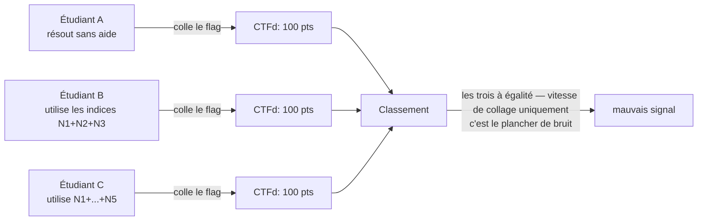
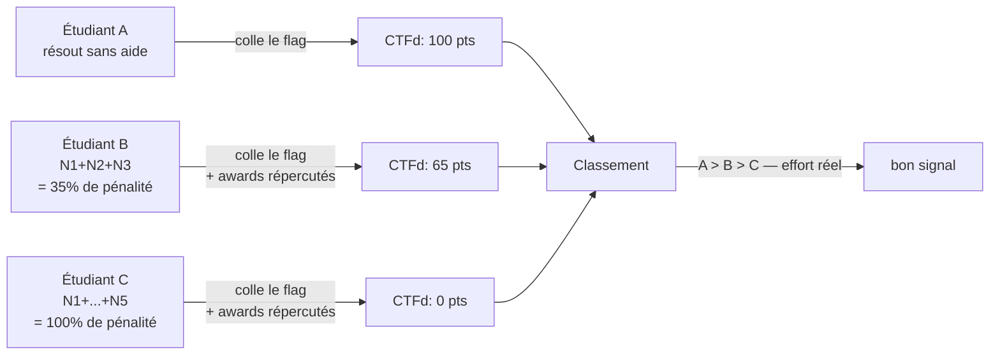
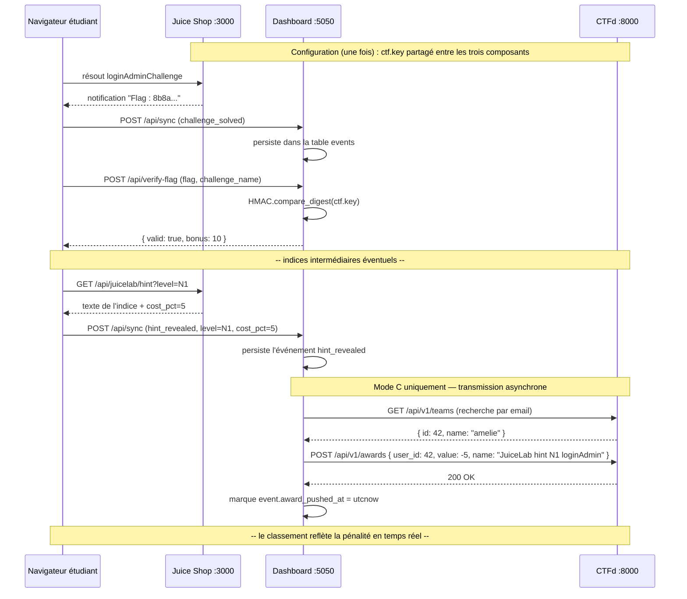
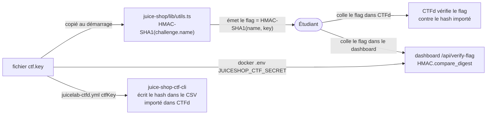
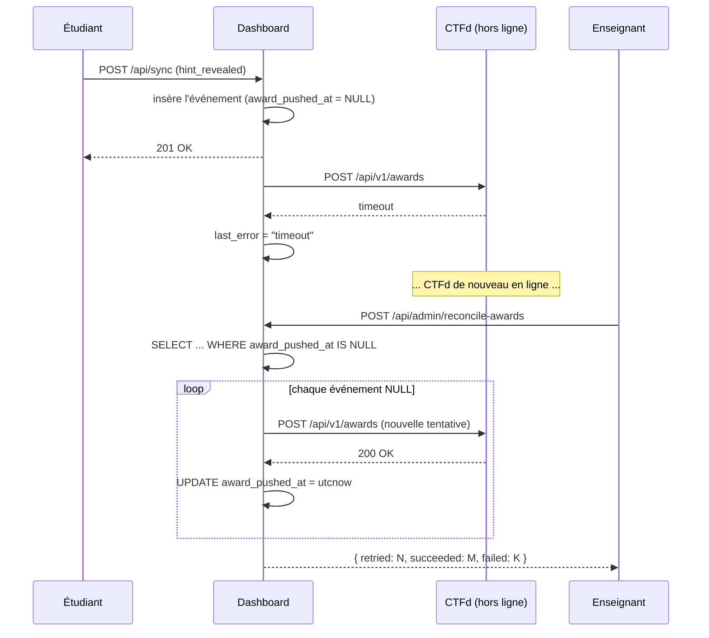

# CTF-INTEGRATION — Plongée approfondie dans le Mode C

> Version anglaise : [CTF-INTEGRATION.md](./CTF-INTEGRATION.md).

Ce document est la référence complète du **Mode C**, l'intégration optionnelle avec CTFd qui transforme JuiceLab en une compétition publique évaluant l'effort réel. Lisez [`README.md`](../README.md) pour la présentation générale et [`docker/README.md`](../docker/README.md) pour la mise en place opérationnelle. Ce fichier explique *pourquoi* le Mode C existe et *comment* la chaîne cryptographique est construite.

> **Audience** — coordinateurs de cours évaluant le Mode C, auditeurs OWASP vérifiant les propriétés de sécurité, et contributeurs implémentant de nouvelles formules de pénalité.

## Table des matières

- [Problématique du Mode C](#problématique-du-mode-c)
- [Pourquoi les pénalités d'indices importent pour un classement fondé sur l'effort réel](#pourquoi-les-pénalités-dindices-importent-pour-un-classement-fondé-sur-leffort-réel)
- [Diagramme d'architecture](#diagramme-darchitecture)
- [La chaîne HMAC — trois fichiers, un secret](#la-chaîne-hmac--trois-fichiers-un-secret)
- [Formules de pénalité](#formules-de-pénalité)
- [Correspondance d'équipe par e-mail — l'identité passerelle](#correspondance-déquipe-par-e-mail--lidentité-passerelle)
- [Réconciliation lorsque CTFd est hors ligne](#réconciliation-lorsque-ctfd-est-hors-ligne)
- [Propriétés de sécurité et limitations](#propriétés-de-sécurité-et-limitations)
- [Dépannage du Mode C](#dépannage-du-mode-c)
- [Références](#références)

---

## Problématique du Mode C

Une intégration naïve de CTFd avec Juice Shop ne voit que le **collage du flag**. Chaque étudiant reçoit le même flag (c'est `HMAC-SHA1(challenge.name, ctf.key)` — déterministe pour une clé donnée), de sorte que le classement ne mesure que :

1. Qui a résolu le défi en premier.
2. Qui a collé le flag le plus vite.

Un étudiant ayant consommé 4 indices (et qui devrait donc obtenir un score très faible) apparaît dans le classement au même niveau qu'un étudiant ayant résolu sans aide. La compétition récompense la *vitesse de collage*, pas l'*apprentissage*.

Le Mode C corrige cela en répercutant les pénalités d'indices de JuiceLab dans CTFd sous forme d'**awards négatifs**. Un étudiant qui révèle N3 voit son score CTFd baisser automatiquement de 20 % de la valeur de ce défi. Le classement reflète désormais l'effort réel.

C'est la différence entre :

- Un CTF qui favorise l'apprentissage : le classement classe l'effort, le résolveur sans aide est en tête, le résolveur à coups d'indices obtient tout de même des points mais moins.
- Un CTF qui récompense les recherches Google : le classement classe la vitesse de collage, quiconque trouve la réponse dans un tutoriel gagne.

Le Mode C de JuiceLab correspond à la première option.

---

## Pourquoi les pénalités d'indices importent pour un classement fondé sur l'effort réel

Sans pénalités d'indices côté CTFd :



Avec le Mode C :



La formule de pénalité est symétrique avec le tableau de bord JuiceLab : les **mêmes** coûts d'indices (5 / 10 / 20 / 35 / 50) alimentent à la fois le score du tableau de bord et les awards négatifs de CTFd. Un étudiant ne peut pas jouer l'un contre l'autre — ils affichent le même nombre sur les deux écrans.

---

## Diagramme d'architecture



La transmission est en mode **fire-and-forget** mais persistée : chaque événement possède une colonne `award_pushed_at`. Si CTFd est indisponible, la colonne reste NULL et `/api/admin/reconcile-awards` retente chaque ligne NULL.

---

## La chaîne HMAC — trois fichiers, un secret

Trois fichiers doivent contenir le **même** secret pour que la chaîne de flags fonctionne :



**Canari** — pour `challenge.name = "Score Board"` avec la `ctf.key` par défaut de ce dépôt :

```
expected_flag = HMAC-SHA1(b"Score Board", ctf_key) hex
              = "2614339936e8282e2f820f023d4d998a1f95e02a"
```

Si le tableau de bord retourne `{valid: false}` pour un flag copié verbatim par l'étudiant, le désalignement se trouve quelque part dans la chaîne. Relancez le canari sur chacun des trois fichiers :

```bash
# 1. Juice Shop side
cat juice-shop/ctf.key | head -c 80
node -e "console.log(require('crypto').createHmac('sha1', require('fs').readFileSync('juice-shop/ctf.key','utf8').trim()).update('Score Board').digest('hex'))"

# 2. Dashboard side
echo $JUICESHOP_CTF_SECRET | head -c 80
python -c "import hmac,hashlib,os; print(hmac.new(os.environ['JUICESHOP_CTF_SECRET'].encode(),b'Score Board',hashlib.sha1).hexdigest())"

# 3. CSV import side
grep -A1 "Score Board" cohort-2026.csv | grep -o "[0-9a-f]\{40\}"
```

Les trois doivent afficher `2614339936e8282e2f820f023d4d998a1f95e02a` (ou le même hash pour votre clé personnalisée). Si l'un diffère, réalignez cette source et réimportez / redémarrez.

> **La vérification du flag est une fonctionnalité de base (Mode A/B), pas réservée au Mode C.** L'endpoint `/api/verify-flag` du tableau de bord fonctionne SANS CTFd — seul le troisième fichier (CSV → CTFd) est spécifique au Mode C. Les deux premiers (`ctf.key` → Juice Shop, et `JUICESHOP_CTF_SECRET` → tableau de bord) suffisent pour le bouton « Vérifier le flag » du score-board et l'événement bonus `flag_verified` +10.
>
> **Si `JUICESHOP_CTF_SECRET` n'est pas défini sur le tableau de bord**, l'endpoint retourne `503 flag verification disabled (JUICESHOP_CTF_SECRET missing)` et la superposition affiche `Flag verification disabled (server secret missing)`. La procédure de configuration, la commande de récupération de `ctf.key` et la vérification du câblage se trouvent dans
> [TEACHER-DASHBOARD-FR.md section 5bis](TEACHER-DASHBOARD-FR.md#5bis-vital--juiceshop_ctf_secret-vérification-des-flags)
> (EN : [TEACHER-DASHBOARD-EN.md section 5bis](TEACHER-DASHBOARD-EN.md#5bis-vital--juiceshop_ctf_secret-flag-verification)).

---

## Formules de pénalité

La variable d'environnement `CTFD_PENALTY_FORMULA` sélectionne la formule. Deux sont fournies ; d'autres peuvent être ajoutées.

### `mirror_juicelab` (par défaut)

L'award CTFd est le **négatif du `cost_pct` JuiceLab**, appliqué à la valeur CTFd du défi :

```
ctfd_penalty(N) = - challenge.value * cost_pct[N] / 100
```

Pour un défi CTFd valant 100 points :

| Niveau | JuiceLab cost_pct | Award négatif CTFd |
|---|---|---|
| N1 | 5 | -5 |
| N2 | 10 | -10 |
| N3 | 20 | -20 |
| N4 | 35 | -35 |
| N5 | 50 | -50 |

Somme si les 5 sont révélés : -120 → le score CTFd pour ce défi est plafonné à 0.

### `flat` (alternative)

-10 fixe par indice quel que soit le niveau. Plus simple à expliquer à la promotion, mais ne reflète pas l'effort cognitif.

```
ctfd_penalty(N) = -10
```

### Ajouter une nouvelle formule

Deux étapes :

1. Ajouter une fonction dans `dashboard/penalty_formulae.py` retournant l'award négatif pour `(level, challenge_value)`.
2. Ajouter le nom à la liste `ALLOWED_FORMULAE` dans `dashboard/app.py`.

Squelette d'exemple :

```python
def harsh(level: str, challenge_value: int) -> int:
    """N1 -10, N2 -20, N3 -40, N4 -70, N5 -100. Penalises hint use harshly."""
    table = {"N1": -10, "N2": -20, "N3": -40, "N4": -70, "N5": -100}
    return table[level]
```

---

## Correspondance d'équipe par e-mail — l'identité passerelle

Les équipes CTFd sont pré-provisionnées par l'enseignant avec deux champs que JuiceLab utilise pour les retrouver :

- `affiliation` = l'identifiant de la promotion (`M2-IA-2026`).
- `email` = l'e-mail utilisé par l'étudiant pour s'inscrire sur Juice Shop.

Lorsqu'un événement `hint_revealed` parvient au tableau de bord, le pipeline de transmission :

1. Extrait l'e-mail du JWT dans la charge utile `juicelab-sync`.
2. Appelle `GET CTFD/api/v1/teams?affiliation=<COHORT_ID>` (filtré par promotion).
3. Parcourt la liste retournée à la recherche d'une équipe dont l'`email == <e-mail étudiant>`.
4. Mémorise la correspondance dans la table SQLite `student_team_mapping` pour les événements suivants.
5. Envoie un POST à `/api/v1/awards` avec le `team_id`.

Si aucune équipe ne correspond à l'e-mail, la transmission est silencieusement ignorée (l'événement reste dans le tableau de bord avec `award_pushed_at = NULL`). L'enseignant peut :

- Pré-provisionner l'équipe manquante et lancer `/api/admin/reconcile-awards` pour retenter.
- Ou accepter l'écart (l'étudiant est comptabilisé dans le tableau de bord JuiceLab, mais pas dans le classement CTFd).

> **Pourquoi l'`email` plutôt que l'`affiliation` seul ?** Une promotion peut contenir des homonymes ou des pseudonymes en double. L'e-mail est unique par construction (Juice Shop refuse les inscriptions en double). L'`affiliation` est le filtre grossier ; l'e-mail est la correspondance fine.

---

## Réconciliation lorsque CTFd est hors ligne

CTFd peut être temporairement inaccessible — redémarrage, incident réseau, défaillance du VPS de l'enseignant. Le pipeline de transmission est conçu pour **ne jamais perdre de données** :

1. Chaque événement `hint_revealed` est d'abord enregistré dans la base SQLite du tableau de bord. L'événement est persisté avant toute tentative vers CTFd.
2. La transmission vers CTFd s'exécute de façon asynchrone après l'insertion SQLite. En cas d'échec, `award_pushed_at` reste NULL et `last_error` enregistre la raison.
3. L'enseignant lance `/api/admin/reconcile-awards` (POST, token enseignant requis). Cette opération parcourt tous les événements dont `award_pushed_at IS NULL`, retente la transmission et enregistre le résultat.



L'enseignant peut lancer la réconciliation autant de fois que nécessaire — l'opération est idempotente car `/api/v1/awards` de CTFd accepte les awards en double, mais le tableau de bord ignore les événements déjà marqués.

---

## Propriétés de sécurité et limitations

Ce que le Mode C **garantit** :

| Propriété | Mécanisme |
|---|---|
| Le même flag ne peut pas être échangé deux fois pour obtenir un double crédit | CTFd déduplique par équipe + défi ; le tableau de bord déduplique par événement `flag_verified` |
| Un étudiant ne peut pas simuler une pénalité d'indice en sa faveur | L'événement `hint_revealed` provient de la route Juice Shop protégée par JWT — le `cost_pct` est fixé côté serveur, pas côté client |
| Un étudiant ne peut pas se faire passer pour une équipe CTFd (réclamer la pénalité de quelqu'un d'autre) | Le tableau de bord effectue la correspondance par e-mail extrait du JWT — pas depuis un champ client |
| Une indisponibilité de CTFd n'entraîne pas la perte des pénalités d'indices | Tous les événements sont persistés dans la base SQLite du tableau de bord ; la réconciliation retente |

Ce que le Mode C **ne garantit pas** :

| Risque | Atténuation hors Mode C |
|---|---|
| Un étudiant copie le flag de son camarade | Le flag est identique pour tous les membres de la même promotion. La lutte contre la collusion dans un CTF est de la responsabilité de l'enseignant (surveillance, liaison par IP, soumission à fenêtre temporelle). |
| Un étudiant crée deux équipes CTFd pour esquiver ses propres pénalités | Pré-provisionnez les équipes depuis un registre, verrouillez les inscriptions. |
| L'enseignant perd la `ctf.key` | Redéployez avec une nouvelle clé. Tous les flags deviennent obsolètes ; les étudiants doivent les coller à nouveau. |
| Le token administrateur CTFd fuite | Révoquez-le via `Admin > Settings > Access Tokens > Revoke` et mettez à jour le fichier `.env`. |

---

## Dépannage du Mode C

| Symptôme | Cause | Correction |
|---|---|---|
| `"enabled": false` sur `/api/admin/ctfd-status` | `CTFD_URL` ou `CTFD_ADMIN_TOKEN` absent | Éditez `.env`, `docker compose restart dashboard` |
| `"teams_mapped": 0` après plusieurs indices | L'e-mail du JWT ne correspond pas à l'e-mail de l'équipe | Alignez les e-mails ou vérifiez le champ `affiliation` des équipes CTFd |
| `"pending_pushes": N` continue d'augmenter | CTFd inaccessible ou token invalide | `last_error` indique la cause ; corrigez et lancez `/api/admin/reconcile-awards` |
| Award appliqué à la mauvaise équipe | La résolution par e-mail a pointé vers la mauvaise équipe | Videz la table `student_team_mapping`, le prochain événement refera la correspondance : `docker compose exec dashboard sqlite3 /app/data/dashboard.sqlite "DELETE FROM student_team_mapping;"` |
| Flag refusé par CTFd | Le `ctfKey` du CSV ne correspond pas à la `ctf.key` de Juice Shop | Régénérez le CSV avec le bon `ctfKey`, réimportez |
| Awards visibles dans l'admin CTFd mais le score ne change pas | CTFd dispose d'un cache de score | `Admin > Config > Cache > Clear` ou redémarrez CTFd |
| Pénalité d'indice appliquée mais bonus de flag manquant | L'événement `flag_verified` n'a pas atteint CTFd | Vérifiez les logs du tableau de bord pour l'`award_pushed_at` de l'événement `flag_verified` ; réconciliez si NULL |

Pour tout autre problème, ouvrez une Discussion. L'intégration CTFd est le domaine où le retour d'expérience terrain est le plus précieux.

---

## Références

| Référence | Utilisée pour |
|---|---|
| OWASP Foundation. *Juice Shop documentation : CTF mode.* https://pwning.owasp-juice.shop/companion-guide/latest/ | Mécanisme de flag de base |
| `juice-shop-ctf-cli` https://github.com/juice-shop/juice-shop-ctf | Génération du CSV pour l'import CTFd |
| CTFd Project. *CTFd v3 admin API.* https://docs.ctfd.io/ | Endpoints awards et équipes |
| RFC 2104 — *HMAC : Keyed-Hashing for Message Authentication.* | Primitives de signature flag et preuve |
| `juice-shop/ctf.key` (ce dépôt) | Valeur canari pour les tests d'alignement HMAC |
