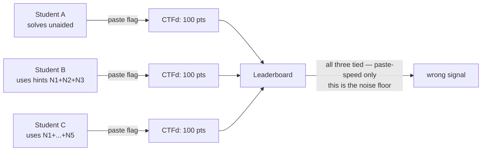
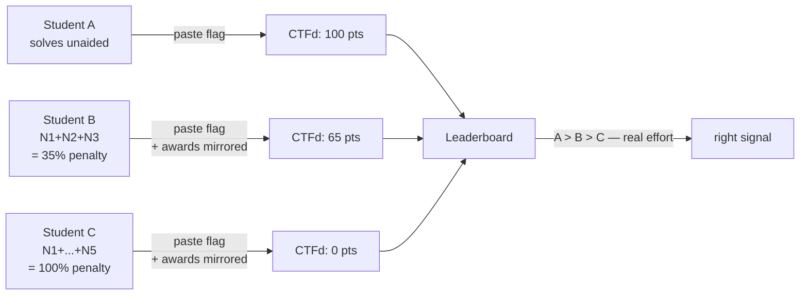
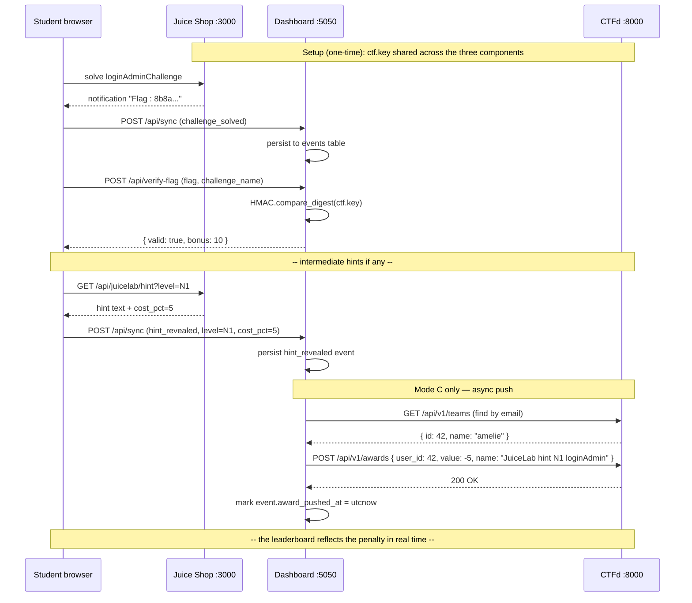
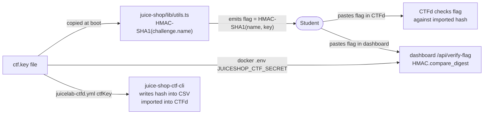
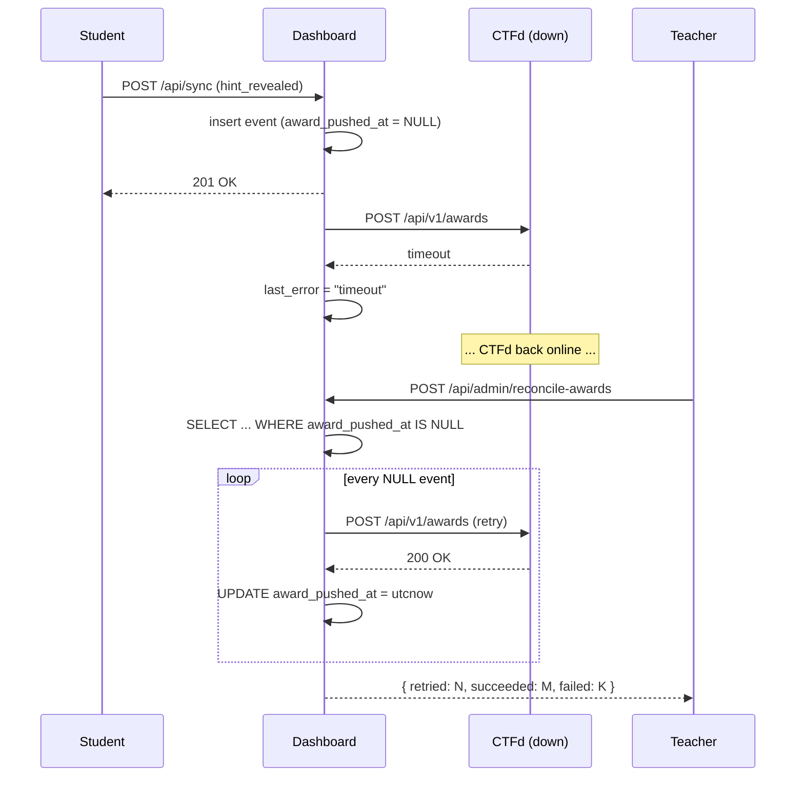

# CTF-INTEGRATION — Mode C deep-dive

This document is the comprehensive reference for **Mode C**, the optional CTFd integration that turns JuiceLab into a public, real-effort competition. Read [`README.md`](../README.md) for the elevator pitch and [`docker/README.md`](../docker/README.md) for the operational setup. This file explains *why* Mode C exists and *how* the cryptographic chain holds together.

> **Audience** — course coordinators evaluating Mode C, OWASP reviewers auditing the security claims, and contributors implementing new penalty formulae.

## Table of contents

- [The Mode C problem statement](#the-mode-c-problem-statement)
- [Why hint penalties matter for a real-effort scoreboard](#why-hint-penalties-matter-for-a-real-effort-scoreboard)
- [Architecture diagram](#architecture-diagram)
- [The HMAC chain — three files, one secret](#the-hmac-chain--three-files-one-secret)
- [Penalty formulae](#penalty-formulae)
- [Team mapping by email — the bridge identity](#team-mapping-by-email--the-bridge-identity)
- [Reconciliation when CTFd is offline](#reconciliation-when-ctfd-is-offline)
- [Security properties and limitations](#security-properties-and-limitations)
- [Troubleshooting Mode C](#troubleshooting-mode-c)
- [References](#references)

---

## The Mode C problem statement

A naive CTFd integration with Juice Shop only sees the **flag paste**. Every student gets the same flag (it is `HMAC-SHA1(challenge.name, ctf.key)` — deterministic for a given key), so the only thing the leaderboard measures is :

1. Who solved the challenge first.
2. Who pasted the flag fastest.

A student who burned 4 hints (and therefore should score very low) lands on the leaderboard at the same level as a student who solved unaided. The competition rewards *pasting speed*, not *learning*.

Mode C fixes this by mirroring the JuiceLab hint penalties into CTFd as **negative awards**. A student who reveals N3 sees their CTFd score drop by 20 % of that challenge's value automatically. The leaderboard now reflects real effort.

This is the difference between :

- A CTF that drives learning : the leaderboard ranks effort, the unaided solver is at the top, the hint-heavy solver still gets credit but lower.
- A CTF that rewards Googling : the leaderboard ranks paste speed, anyone who finds the answer in a tutorial wins.

JuiceLab's Mode C is the first option.

---

## Why hint penalties matter for a real-effort scoreboard

Without hint penalties on the CTFd side :



With Mode C :



The penalty formula is symmetrical with the JuiceLab dashboard : the **same** hint costs (5 / 10 / 20 / 35 / 50) drive both the dashboard score and the CTFd negative awards. A student cannot game one against the other — they show the same number on both screens.

---

## Architecture diagram



The push is **fire-and-forget** but persisted : every event has an `award_pushed_at` column. If CTFd is down, the column stays NULL and `/api/admin/reconcile-awards` retries every NULL row.

---

## The HMAC chain — three files, one secret

Three files must contain the **same** secret for the flag chain to work :



**Canary** — for `challenge.name = "Score Board"` with the default `ctf.key` of this repo :

```
expected_flag = HMAC-SHA1(b"Score Board", ctf_key) hex
              = "2614339936e8282e2f820f023d4d998a1f95e02a"
```

If the dashboard returns `{valid: false}` for a flag the student copied verbatim, the misalignment is somewhere in the chain. Re-run the canary against each of the three files :

```bash
# 1. Juice Shop side
cat juice-shop/ctf.key | head -c 80
node -e "console.log(require('crypto').createHmac('sha1', require('fs').readFileSync('juice-shop/ctf.key','utf8').trim()).update('Score Board').digest('hex'))"

# 2. Dashboard side
echo $JUICESHOP_CTF_SECRET | head -c 80
python -c "import hmac,hashlib,os; print(hmac.new(os.environ['JUICESHOP_CTF_SECRET'].encode(),b'Score Board',hashlib.sha1).hexdigest())"

# 3. CSV import side
grep -A1 "Score Board" cohort-2026.csv | grep -o "[0-9a-f]\{40\}"
```

All three must print `2614339936e8282e2f820f023d4d998a1f95e02a` (or the same hash for your custom key). If any one differs, re-align that source and re-import / restart.

---

## Penalty formulae

The `CTFD_PENALTY_FORMULA` env var selects the formula. Two are shipped ; more can be added.

### `mirror_juicelab` (default)

The CTFd award is the **negative of the JuiceLab cost_pct**, applied to the challenge's CTFd value :

```
ctfd_penalty(N) = - challenge.value * cost_pct[N] / 100
```

For a CTFd challenge worth 100 points :

| Level | JuiceLab cost_pct | CTFd negative award |
|---|---|---|
| N1 | 5 | -5 |
| N2 | 10 | -10 |
| N3 | 20 | -20 |
| N4 | 35 | -35 |
| N5 | 50 | -50 |

Sum if all 5 are revealed : -120 → CTFd score for that challenge clamps at 0.

### `flat` (alternative)

Flat -10 per hint regardless of level. Simpler to explain to the cohort but does not reflect cognitive effort.

```
ctfd_penalty(N) = -10
```

### Adding a new formula

Two steps :

1. Add a function in `dashboard/penalty_formulae.py` returning the negative award for `(level, challenge_value)`.
2. Add the name to the `ALLOWED_FORMULAE` list in `dashboard/app.py`.

Example skeleton :

```python
def harsh(level: str, challenge_value: int) -> int:
    """N1 -10, N2 -20, N3 -40, N4 -70, N5 -100. Penalises hint use harshly."""
    table = {"N1": -10, "N2": -20, "N3": -40, "N4": -70, "N5": -100}
    return table[level]
```

---

## Team mapping by email — the bridge identity

CTFd teams are pre-provisioned by the teacher with two fields that JuiceLab uses to find them :

- `affiliation` = the cohort id (`M2-IA-2026`).
- `email` = the email the student used to register on Juice Shop.

When a `hint_revealed` event reaches the dashboard, the push pipeline :

1. Extracts the email from the JWT in the `juicelab-sync` payload.
2. Calls `GET CTFD/api/v1/teams?affiliation=<COHORT_ID>` (filtered by cohort).
3. Searches the returned list for a team whose `email == <student email>`.
4. Caches the mapping in the `student_team_mapping` SQLite table for subsequent events.
5. POSTs to `/api/v1/awards` with the team_id.

If no team matches the email, the push is silently skipped (the event stays in the dashboard with `award_pushed_at = NULL`). The teacher can :

- Pre-provision the missing team and run `/api/admin/reconcile-awards` to retry.
- Or accept the gap (student counted in JuiceLab dashboard, not in CTFd leaderboard).

> **Why `email` over `affiliation` alone?** A cohort can have homonyms or duplicate handles. Email is unique by construction (Juice Shop refuses duplicate registrations). The `affiliation` is the coarse filter ; the email is the fine match.

---

## Reconciliation when CTFd is offline

CTFd may be unreachable temporarily — restart, network glitch, the teacher's VPS hiccup. The push pipeline is designed to **never lose data** :

1. Every `hint_revealed` event hits the dashboard SQLite first. The event is persisted before any CTFd attempt.
2. The CTFd push runs asynchronously after the SQLite insert. If it fails, `award_pushed_at` stays NULL and `last_error` records the reason.
3. The teacher runs `/api/admin/reconcile-awards` (POST, teacher token required). This iterates over every event with `award_pushed_at IS NULL`, retries the push, and logs the outcome.



The teacher can run reconciliation as many times as needed — the operation is idempotent because CTFd's `/api/v1/awards` accepts duplicate awards but the dashboard skips events already marked.

---

## Security properties and limitations

What Mode C **guarantees** :

| Property | Mechanism |
|---|---|
| The same flag cannot be redeemed twice for double credit | CTFd deduplicates by team + challenge ; the dashboard deduplicates by `flag_verified` event |
| A student cannot fake a hint penalty in their favour | The `hint_revealed` event originates from the JWT-gated Juice Shop route — the cost_pct is server-set, not client-set |
| A student cannot fake a CTFd team (claim someone else's penalty) | The dashboard maps by email extracted from the JWT — not from a client field |
| Down-time of CTFd does not lose hint penalties | All events persist in dashboard SQLite ; reconciliation retries |

What Mode C **does not** guarantee :

| Risk | Mitigation outside Mode C |
|---|---|
| A student copies their classmate's flag | The flag is the same for everyone of the same cohort. CTF anti-collusion is the teacher's problem (proctoring, IP-binding, time-windowed submission). |
| A student creates two CTFd teams to dodge their own penalties | Pre-provision teams from a roster, lock registration. |
| The teacher loses the `ctf.key` | Re-deploy with a new key. All flags become stale ; students must re-paste. |
| The CTFd admin token leaks | Rotate via `Admin > Settings > Access Tokens > Revoke` and update `.env`. |

---

## Troubleshooting Mode C

| Symptom | Cause | Fix |
|---|---|---|
| `"enabled": false` on `/api/admin/ctfd-status` | `CTFD_URL` or `CTFD_ADMIN_TOKEN` absent | Edit `.env`, `docker compose restart dashboard` |
| `"teams_mapped": 0` after several hints | Email JWT does not match team email | Align emails or check `affiliation` field of CTFd teams |
| `"pending_pushes": N` keeps growing | CTFd unreachable or token invalid | `last_error` indicates the cause ; fix and run `/api/admin/reconcile-awards` |
| Award applied to the wrong team | Email lookup resolved to the wrong team | Purge `student_team_mapping` table, next event re-maps : `docker compose exec dashboard sqlite3 /app/data/dashboard.sqlite "DELETE FROM student_team_mapping;"` |
| Flag refused by CTFd | `ctfKey` of CSV does not match `ctf.key` of Juice Shop | Re-generate CSV with the correct `ctfKey`, re-import |
| Awards visible in CTFd admin but score does not change | CTFd has score caching | `Admin > Config > Cache > Clear` or restart CTFd |
| Hint penalty applied but flag bonus missing | `flag_verified` event did not reach CTFd | Check the dashboard logs for the `award_pushed_at` of the flag_verified event ; reconcile if NULL |

For anything else, open a Discussion. The CTFd integration is the area where field experience is most valuable.

---

## References

| Reference | Used for |
|---|---|
| OWASP Foundation. *Juice Shop documentation : CTF mode.* https://pwning.owasp-juice.shop/companion-guide/latest/ | Substrate flag mechanism |
| `juice-shop-ctf-cli` https://github.com/juice-shop/juice-shop-ctf | CSV generation for CTFd import |
| CTFd Project. *CTFd v3 admin API.* https://docs.ctfd.io/ | Awards and teams endpoints |
| RFC 2104 — *HMAC : Keyed-Hashing for Message Authentication.* | Flag and proof signature primitives |
| `juice-shop/ctf.key` (this repo) | Canary value for HMAC alignment tests |
