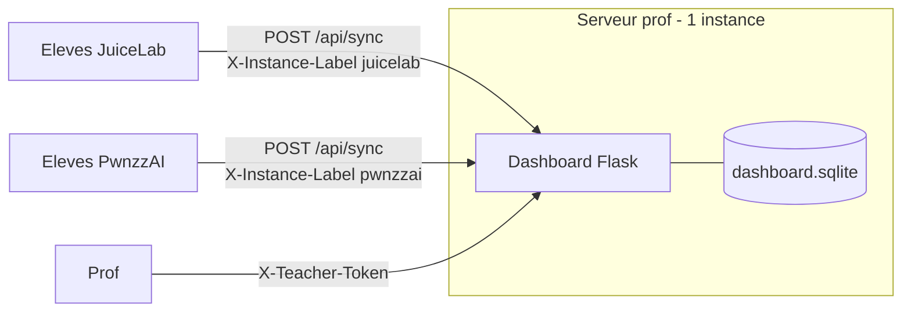

# Dashboard prof central — une instance, plusieurs clients

Le dashboard prof (Flask, `dashboard/`) se deploie **une seule fois**. JuiceLab
et PwnzzAI sont tous deux des **clients** qui pointent dessus ; aucun des deux
n'embarque ni ne re-deploie le serveur.

## Topologie



## Deployer (une fois, sur le serveur central)

Sans cloner le code eleve, via sparse checkout pinne :

```bash
# pinner une ref (SHA conseille en prod)
JUICELAB_DASHBOARD_REF=main \
  scripts/bootstrap-dashboard.sh /opt/juicelab-dashboard
```

Le script ne tire que `dashboard/` + `docker/`. Voir
`scripts/bootstrap-dashboard.sh`.

## Brancher les clients

- JuiceLab (overlay) : `JUICELAB_DASHBOARD_URL` -> URL du dashboard central.
- PwnzzAI (coach)   : meme `JUICELAB_DASHBOARD_URL`. Voir
  `PwnzzAI/scripts/deploy-dashboard.sh` si on deploie le dashboard depuis PwnzzAI.

## Coexistence des deux produits sur la meme instance

- `instance_label` (header `X-Instance-Label`) distingue la source de chaque
  evenement dans la matrice prof.
- Cohortes namespacees : `M2-*` (juicelab), `PWNZZAI-*` (pwnzzai).
- `DASHBOARD_CORS_ORIGINS` doit lister les origines eleves des DEUX produits si
  elles different.

## Anti-pattern

Ne PAS deployer un second dashboard "pour PwnzzAI". Une instance, deux clients.
Deux instances = deux bases SQLite = le prof voit ses eleves coupes en deux.
