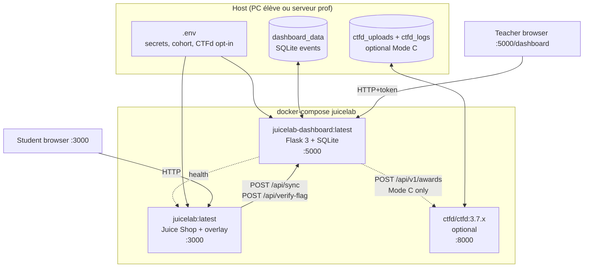

# Docker — guide opérateur détaillé

Ce document complète [`docker/README.md`](../docker/README.md) (procédures pas à pas) et [`INSTALL.md`](../INSTALL.md) (installation, 2 paths) avec :

- L'**anatomie** de chaque image, ce qu'elle contient, ce qu'elle ignore
- Les **décisions d'architecture** (multi-stage, pinned commit, overlay merge, build context)
- Les **leviers d'opération** : build args, env vars, volumes, network
- Les **procédures de rebase** quand OWASP Juice Shop publie une nouvelle version
- Le **troubleshooting** avancé : erreurs courantes et leur racine

Lecture conseillée AVANT d'auditer une production ou de modifier une Dockerfile. Lecture optionnelle pour un simple `docker compose up --build`.

---

## Table des matières

- [Topologie](#topologie)
- [`Dockerfile.juicelab` — anatomie](#dockerfilejuicelab--anatomie)
- [`Dockerfile.dashboard` — anatomie](#dockerfiledashboard--anatomie)
- [Build context et `.dockerignore`](#build-context-et-dockerignore)
- [Build args et env vars](#build-args-et-env-vars)
- [Volumes et persistance](#volumes-et-persistance)
- [Network et exposition](#network-et-exposition)
- [Cycle de vie : build → run → restart → stop](#cycle-de-vie--build--run--restart--stop)
- [Procédure de rebase OWASP](#procédure-de-rebase-owasp)
- [Cohorte : `provision.py` et compose surcharge](#cohorte--provisionpy-et-compose-surcharge)
- [Mode C avec CTFd dans le compose](#mode-c-avec-ctfd-dans-le-compose)
- [Image size et optimisation](#image-size-et-optimisation)
- [Sécurité runtime](#sécurité-runtime)
- [Troubleshooting](#troubleshooting)

---

## Topologie



Trois services. Deux obligatoires (`dashboard` et `juicelab`), un optionnel (`ctfd`). Pas de base de données externe — SQLite suffit pour le scope TD (30 élèves, 12 h).

---

## `Dockerfile.juicelab` — anatomie

Image multi-stage : un `builder` lourd (~2.5 GB pendant le build, tools de compilation + sources) qui produit un `runtime` slim (~700 MB).

### Stage 1 — `builder`

```dockerfile
FROM node:24-bullseye AS builder
WORKDIR /build
RUN apt-get update && apt-get install -y --no-install-recommends git ca-certificates
```

Pourquoi `node:24-bullseye` et pas `:alpine` :

- Le `npm install` de Juice Shop tire des deps avec build natifs (`bcrypt`, `sqlite3`, etc.) qui veulent `glibc`. Alpine = `musl`, donc échecs ou rebuilds lents.
- `bullseye` (Debian 11) reste maintenu et a un index `apt` complet pour `git` + `ca-certificates`.

#### Clone OWASP + checkout du commit pinné

```dockerfile
ARG JUICE_SHOP_REPO=https://github.com/juice-shop/juice-shop.git
ARG JUICE_SHOP_COMMIT=3b178fd
RUN git clone "${JUICE_SHOP_REPO}" /build/juice-shop && \
    cd /build/juice-shop && \
    git checkout "${JUICE_SHOP_COMMIT}"
```

Pourquoi un **commit hash** et pas un tag :

- Les tags OWASP (`v17.x.x`) bougent quand l'équipe rebase pour des fixes de sécurité. Un commit hash est immuable.
- Le commit `3b178fd` est l'ancêtre exact contre lequel `patches/juicelab-core.patch` a été généré. Tout autre commit ferait potentiellement échouer `git apply --3way` ou pire, appliquer le patch sur un fichier qui a changé sens.

Pourquoi pas `--depth 1` :

- `git apply --3way` peut avoir besoin d'ancêtres pour résoudre des dérives de contexte. Un `--depth 1` économise ~30 MB mais peut casser le merge 3-way.

#### Overlay merge

```dockerfile
COPY overlay/. /build/juice-shop/
```

La syntaxe `overlay/.` (avec le `.`) copie le **contenu** d'`overlay/` directement dans `/build/juice-shop/`, en mergeant les sous-dossiers existants (`data/`, `frontend/`, `routes/`). Sans le `.`, Docker créerait `/build/juice-shop/overlay/` — bug subtil.

Docker COPY merge récursif :

| Source overlay/ | Destination juice-shop/ | Résultat |
|---|---|---|
| `overlay/data/juicelab-private/` | `juice-shop/data/` existe (vide ou non) | `juice-shop/data/juicelab-private/` (les fichiers upstream de `data/` restent) |
| `overlay/frontend/src/app/juicelab-overlay/` | `juice-shop/frontend/src/app/` existe | nouveau sous-dossier ajouté, autres composants Angular intacts |
| `overlay/routes/juicelab.ts` | `juice-shop/routes/` existe | un fichier de plus, les autres routes intactes |

#### Patch apply

```dockerfile
COPY patches/juicelab-core.patch /build/juicelab-core.patch
RUN cd /build/juice-shop && \
    git apply --3way /build/juicelab-core.patch && \
    rm -f /build/juicelab-core.patch
```

`--3way` permet à `git apply` d'utiliser les blobs Git du clone pour résoudre les dérives de contexte (lignes décalées, indentation, etc.). Sans cette option, un patch qui ne matche pas exactement échoue avec un message générique.

Si le patch échoue (par exemple parce que `JUICE_SHOP_COMMIT` a été overridé vers un commit où les fichiers patches ont divergé), le build s'arrête ici. Le message d'erreur indique les hunks rejetés.

#### Build npm

```dockerfile
WORKDIR /build/juice-shop
RUN npm install --unsafe-perm 2>&1 | tail -20
RUN npm run build:server
```

`--unsafe-perm` est obligatoire parce que Juice Shop a des `postinstall` qui veulent toucher le système de fichiers (Angular CLI, hacking-instructor seed, etc.). Sans cette option, `node:24` les bloque.

`| tail -20` parce que `npm install` génère ~600 lignes de warnings qui polluent les logs Docker.

#### Slim down

```dockerfile
RUN rm -rf frontend/.angular frontend/node_modules .git tests cypress \
           frontend/cypress
```

- `frontend/.angular` (~200 MB) : cache du builder Angular, inutile au runtime.
- `frontend/node_modules` (~800 MB) : les builds frontend sont déjà bakés dans `dist/`. Les modules ne servent plus.
- `.git` (~80 MB) : on n'a plus besoin de l'historique au runtime.
- `tests` + `cypress` : tests E2E upstream non utiles en prod.

Réduction du stage : ~1.1 GB → ~700 MB.

### Stage 2 — `runtime`

```dockerfile
FROM node:24-bullseye-slim AS runtime
RUN apt-get update && apt-get install -y --no-install-recommends tini
COPY --from=builder /build/juice-shop /juice-shop
RUN useradd -m -u 1001 juicelab && \
    chown -R juicelab:juicelab /juice-shop && \
    chmod -R o-rwx /juice-shop/data/juicelab-private
USER juicelab
EXPOSE 3000
COPY --chown=juicelab:juicelab docker/entrypoint.sh /usr/local/bin/juicelab-entrypoint.sh
ENTRYPOINT ["/usr/bin/tini", "--", "/usr/local/bin/juicelab-entrypoint.sh"]
CMD ["node", "build/app.js"]
```

Décisions :

- **`-slim`** : retire les outils dev (~50 MB économisés).
- **`tini`** : init PID 1 qui reap les zombies. Sans tini, un orphelin de `node` peut s'accumuler en multi-restart.
- **Utilisateur `juicelab` UID 1001** : pas de root au runtime. UID stable pour matcher les volumes hôte si on veut monter des fichiers (rare en prod TD).
- **`chmod -R o-rwx /juice-shop/data/juicelab-private`** : empêche tout autre utilisateur de lire les hints/quiz/walkthroughs même si l'image est extraite. Triple ceinture : container isolation + UID isolation + filesystem permissions.
- **`entrypoint.sh`** : écrit le `config.json` du frontend en fonction des env vars (cohort, dashboard URL). Détails ci-dessous.

### `docker/entrypoint.sh`

Le script réécrit `/juice-shop/frontend/dist/frontend/browser/assets/juicelab/config.json` avec les valeurs d'env vars, parce que Juice Shop bundle le frontend statique au build, mais on veut configurer cohort_id et dashboard_url au déploiement.

```bash
cat > "${CONFIG_FILE}" <<EOF
{
  "dashboard_url": "${JUICELAB_DASHBOARD_URL}",
  "cohort_id": "${JUICELAB_COHORT_ID}",
  "instance_label": "${JUICELAB_INSTANCE_LABEL}",
  "default_language": "${JUICELAB_DEFAULT_LANGUAGE}"
}
EOF
```

Conséquence : pour changer le cohort id, on n'a pas besoin de rebuild — `docker compose restart juicelab` suffit avec un `.env` mis à jour.

---

## `Dockerfile.dashboard` — anatomie

Plus simple — pas de multi-stage parce qu'il n'y a pas de compile step. Python + Flask + SQLite, c'est tout.

```dockerfile
FROM python:3.11-slim AS runtime
ENV PYTHONDONTWRITEBYTECODE=1 PYTHONUNBUFFERED=1 DASHBOARD_PORT=5000
RUN apt-get update && apt-get install -y --no-install-recommends tini
WORKDIR /app
COPY dashboard/requirements.txt /app/requirements.txt
RUN pip install --no-cache-dir -r requirements.txt
COPY dashboard/ /app/
RUN useradd -m -u 1001 dash && mkdir -p /app/data && chown -R dash:dash /app
USER dash
EXPOSE 5000
ENTRYPOINT ["/usr/bin/tini", "--"]
CMD ["python", "app.py"]
```

Décisions :

- **`python:3.11-slim`** : Python 3.13 disponible mais 3.11 est plus stable pour `Flask 3.0.3` + `flask-cors 5.0.0` + `requests 2.32.3` à ce jour.
- **`requirements.txt` copié AVANT le reste** : Docker layer caching. Si le code change mais pas les deps, `pip install` reste en cache.
- **`--no-cache-dir`** : évite le cache pip (~150 MB économisés sur l'image).
- **`/app/data` créé puis chowné** : monté en volume par compose (`dashboard_data`). Sans `mkdir` initial, Docker crée le mount point en root et le `chown` échoue.

Image finale : ~180 MB (vs ~700 MB pour l'image juicelab).

---

## Build context et `.dockerignore`

### Pourquoi un `.dockerignore` racine

`docker-compose.yml` :

```yaml
services:
  juicelab:
    build:
      context: ..        # <-- la racine juice/
      dockerfile: docker/Dockerfile.juicelab
```

`context: ..` veut dire que le **build context** (ce qui est transféré au Docker daemon) est tout le contenu de `juice/`. Sans filtre, ça inclut :

- `juice-shop/` : 1.2 GB avec `node_modules/`
- `dashboard/data/dashboard.sqlite` : potentiellement plusieurs MB
- `.git/` du parent : 80 MB
- `.angular/`, `dist/`, etc.

Total : ~1.5 GB transférés au daemon à chaque `docker compose build`, même si le résultat ne change pas.

Avec `.dockerignore` racine bien fait : context réduit à ~5 MB (overlay + patches + docker + dashboard sources). Build context upload passe de 30 s à 1 s.

### Stratégie d'exclusion

Le `.dockerignore` racine (créé dans le commit `9690335`) est plus permissif que le `.gitignore` parce que le but est différent :

| Pattern | git | docker | Pourquoi |
|---|---|---|---|
| `node_modules/` | ✓ | ✓ | Lourd, recréé par `npm install` dans le builder |
| `juice-shop/` | ✓ | ✓ | Lourd, cloné dans le builder |
| `*.md` | ✗ | ✓ | Pas besoin de docs dans l'image |
| `docs/` | ✗ | ✓ | Idem |
| `.git/` | ✗ (tracked) | ✓ | Pas d'historique au runtime |
| `dashboard/data/` | ✓ | ✓ | SQLite local de dev, monté en volume au runtime |

Exception : `!docker/README.md` et `!overlay/README.md` sont conservés pour qu'un opérateur faisant un `docker exec -it juicelab cat /juice-shop/...` ait un contexte minimal in-container.

---

## Build args et env vars

### Build args (override à `docker build`)

| Arg | Default | Where set | Effet |
|---|---|---|---|
| `JUICE_SHOP_REPO` | `https://github.com/juice-shop/juice-shop.git` | `Dockerfile.juicelab` | URL de l'upstream à cloner. Peut pointer vers un fork. |
| `JUICE_SHOP_COMMIT` | `3b178fd` | `Dockerfile.juicelab` | Commit pinné de l'upstream. Doit matcher le base du patch. |

Usage :

```bash
docker build --build-arg JUICE_SHOP_COMMIT=v17.3.0 -f docker/Dockerfile.juicelab -t juicelab:v17.3.0 .
```

ou via compose :

```yaml
services:
  juicelab:
    build:
      args:
        JUICE_SHOP_COMMIT: v17.3.0
```

### Env vars (runtime)

| Var | Service | Required | Description |
|---|---|---|---|
| `DASHBOARD_TEACHER_TOKEN` | dashboard | ✓ | Token >= 16 chars pour `/login`, `/dashboard`, `/api/admin/*` |
| `DASHBOARD_PROOF_SECRET` | dashboard | ✓ | Secret HMAC-SHA-256 pour signer les `proof.md` |
| `DASHBOARD_DB` | dashboard | non | Path SQLite. Default `/app/data/dashboard.sqlite` (sous le volume) |
| `DASHBOARD_PORT` | dashboard | non | Default 5000 |
| `DASHBOARD_CORS_ORIGINS` | dashboard | ✓ pour cohort | Liste séparée par virgules des origines autorisées |
| `DASHBOARD_LOG_LEVEL` | dashboard | non | `DEBUG`, `INFO` (default), `WARNING`, `ERROR` |
| `DASHBOARD_DEFAULT_COHORT` | dashboard | non | Cohort par défaut pour `/dashboard` sans param |
| `JUICESHOP_CTF_SECRET` | dashboard | ✓ pour verify-flag | Contenu de `juice-shop/ctf.key`, partagé avec Juice Shop |
| `CTFD_URL` | dashboard | si Mode C | URL du serveur CTFd central. Vide → Mode A/B |
| `CTFD_ADMIN_TOKEN` | dashboard | si Mode C | Token API admin CTFd |
| `CTFD_PENALTY_FORMULA` | dashboard | non | `mirror_juicelab` (default) ou `uniform_10pct` |
| `CTFD_TEAM_MODE` | dashboard | non | `team` (default) ou `user` |
| `TEACHER_ADMIN_TOKEN` | juicelab | ✓ | Token Juice Shop pour `/api/juicelab/admin/state` |
| `JUICELAB_DASHBOARD_URL` | juicelab | ✓ | URL absolue VISIBLE DEPUIS LE BROWSER ÉLÈVE — pas l'URL réseau Docker |
| `JUICELAB_COHORT_ID` | juicelab | ✓ | Cohort identifier (ex. `M2-IA-2026`) |
| `JUICELAB_INSTANCE_LABEL` | juicelab | non | Identifie le container dans la dashboard (ex. `td-amelie`) |
| `JUICELAB_DEFAULT_LANGUAGE` | juicelab | non | `fr` (default) ou `en` |

---

## Volumes et persistance

```yaml
volumes:
  dashboard_data:
    driver: local
```

`dashboard_data` est monté sur `/app/data` dans le container dashboard. Contient :

- `dashboard.sqlite` : événements pédagogiques (hint_revealed, journal_filled, quiz_completed, challenge_solved, flag_verified) + le mapping student→team CTFd
- Pas de PII en clair — `student_token` est un UUID navigateur, l'email apparaît seulement dans `data_json` quand le frontend l'injecte explicitement (Mode C)

### Sauvegarder le volume

```bash
docker run --rm -v juicelab_dashboard_data:/data -v "$(pwd)":/backup alpine \
    tar czf /backup/dashboard-backup-$(date +%Y%m%d).tgz -C /data .
```

### Restaurer

```bash
docker compose down
docker run --rm -v juicelab_dashboard_data:/data -v "$(pwd)":/backup alpine \
    tar xzf /backup/dashboard-backup-YYYYMMDD.tgz -C /data
docker compose up -d
```

### Reset complet (perte de données)

```bash
docker compose down -v        # le -v supprime les volumes
```

### Volume CTFd (Mode C uniquement)

Si vous activez le service `ctfd` commenté, deux volumes supplémentaires :

- `ctfd_uploads` : pièces jointes des challenges, branding, etc.
- `ctfd_logs` : logs applicatifs CTFd

Mêmes commandes de backup, juste changer le nom du volume.

---

## Network et exposition

### Réseau Docker interne

```yaml
networks:
  juicelab_net:
    driver: bridge
```

Tous les services rejoignent `juicelab_net`. Conséquences :

- `juicelab-demo` peut joindre `dashboard` via `http://dashboard:5000` (DNS interne Docker)
- `dashboard` peut joindre `ctfd` via `http://ctfd:8000` (en Mode C local)
- Le browser de l'élève NE peut PAS résoudre `dashboard:5000` — il passe par l'IP publique du host avec le port mappé

### Mappings de ports

| Service | Port container | Port host (default) | Override |
|---|---|---|---|
| `juicelab-demo` | 3000 | 3000 | `JUICELAB_DEMO_PORT` dans `.env` |
| `dashboard` | 5000 | 5000 | `DASHBOARD_PORT` dans `.env` |
| `ctfd` (optionnel) | 8000 | 8000 | `CTFD_PORT` dans `.env` |

### Pour une cohorte

`provision.py` génère un `docker-compose.cohort.yml` qui ajoute `juicelab-<handle>` pour chaque élève, mappés sur `port_base + index` (3001, 3002, ...). Tous partagent le même réseau et le même dashboard.

---

## Cycle de vie : build → run → restart → stop

### Premier build (8 minutes)

```bash
cd docker
cp .env.example .env
# éditer .env : DASHBOARD_TEACHER_TOKEN, DASHBOARD_PROOF_SECRET, JUICELAB_COHORT_ID
docker compose --env-file .env up -d --build
```

Phases :

1. **0-5s** : build context envoyé au daemon (~5 MB grâce au `.dockerignore`)
2. **5-30s** : pull des images de base (`node:24-bullseye`, `python:3.11-slim`)
3. **30-60s** : `apt-get install git` dans le builder
4. **60-120s** : `git clone` upstream + `git checkout` du commit pinné
5. **120-130s** : `COPY overlay/` + `git apply --3way` patch
6. **130-460s** : `npm install` (la phase qui dure)
7. **460-500s** : `npm run build:server`
8. **500-510s** : slim down (rm node_modules etc.)
9. **510-520s** : runtime stage (COPY merge + useradd + chmod)
10. **520-530s** : démarrage des containers + healthcheck

### Rebuilds incrémentaux (~10 s avec cache)

Si vous modifiez :

- **`overlay/...`** ou **`patches/...`** : le layer `COPY overlay/.` ou `COPY patches/...` est invalidé → re-`npm install` + re-`build:server`. Compte ~4 min.
- **`dashboard/...`** : le layer `COPY dashboard/` du Dockerfile.dashboard est invalidé → re-`pip install` si requirements.txt a changé, sinon juste copie. Compte ~10 s.
- **`docker-compose.yml`** ou `.env` : pas de rebuild, juste `docker compose up -d`.
- **Rien de tout ça** : `docker compose up -d` est instantané (image déjà construite).

### Restart vs rebuild

| Cas | Commande | Effet |
|---|---|---|
| Changer cohort_id, dashboard_url, instance_label | `docker compose --env-file .env restart juicelab` | Re-exécute `entrypoint.sh`, réécrit `config.json`, redémarre node. Pas de rebuild. |
| Activer Mode C (CTFD_URL/TOKEN set) | `docker compose --env-file .env restart dashboard` | Le hook `_maybe_push_award_for_event` lit `CTFD_URL` au boot. |
| Patcher un fichier overlay | `docker compose --env-file .env up -d --build juicelab` | Rebuild de l'image juicelab puis recreate du container. |
| Changer la version OWASP cible | Voir [§ Procédure de rebase OWASP](#procédure-de-rebase-owasp) |

### Logs

```bash
docker compose logs -f dashboard
docker compose logs -f juicelab-demo
docker compose logs --since=5m dashboard | grep -i ctfd     # filtre Mode C
```

### Stop / down

```bash
docker compose --env-file .env stop           # arrête sans rm
docker compose --env-file .env down           # arrête + rm containers
docker compose --env-file .env down -v        # ... + rm volumes (DESTRUCTIF)
```

---

## Procédure de rebase OWASP

Quand OWASP Juice Shop publie une nouvelle version et que vous voulez en profiter :

### 1. Cloner la nouvelle base

```bash
cd /tmp
git clone https://github.com/juice-shop/juice-shop.git juice-shop-fresh
cd juice-shop-fresh
git log --oneline -5         # noter le nouveau commit hash, ex. abc1234
```

### 2. Tester l'application du patch

```bash
git apply --check --3way /path/to/juicelab/patches/juicelab-core.patch
```

Si la sortie est silencieuse → le patch s'applique tel quel. Sauter à l'étape 4.

Si la sortie liste des conflits → étape 3.

### 3. Résoudre les conflits

```bash
git apply --3way --reject /path/to/juicelab/patches/juicelab-core.patch
```

Cela génère des `*.rej` à côté de chaque fichier où un hunk n'a pas pu s'appliquer. Ouvrir chacun, comparer avec le contenu upstream actuel, et porter manuellement les changements. Une fois résolu :

```bash
cd /path/to/juicelab
# Régénérer le patch sur la nouvelle base
cd /tmp/juice-shop-fresh
git diff > /path/to/juicelab/patches/juicelab-core.patch
```

### 4. Bump le commit pinné

Dans `docker/Dockerfile.juicelab` :

```diff
-ARG JUICE_SHOP_COMMIT=3b178fd
+ARG JUICE_SHOP_COMMIT=abc1234
```

### 5. Build de validation

```bash
cd /path/to/juicelab/docker
docker compose --env-file .env build --no-cache juicelab
docker compose --env-file .env up -d
curl http://127.0.0.1:3000/api/Challenges/ | head -c 100      # doit renvoyer du JSON
```

### 6. Commit + push

```bash
git add docker/Dockerfile.juicelab patches/juicelab-core.patch
git commit -m "chore: rebase JuiceLab onto OWASP juice-shop <newversion>"
git push juicelab main
```

---

## Cohorte : `provision.py` et compose surcharge

`docker/provision.py` lit un `roster.txt` (un handle par ligne) et génère `docker-compose.cohort.yml` avec un service `juicelab-<handle>` par élève, sur des ports incrémentaux.

```bash
cd docker
python provision.py roster.txt --port-base 3001 \
    --output docker-compose.cohort.yml \
    --print-cors
```

`--print-cors` affiche la valeur exacte de `DASHBOARD_CORS_ORIGINS` à coller dans `.env`. Sans ça, le dashboard rejette les events des élèves avec un `403`.

Booter la cohorte :

```bash
docker compose -f docker-compose.yml -f docker-compose.cohort.yml \
    --env-file .env up -d --build
```

Le `-f` Multiple combine les deux fichiers compose. Le dashboard et le CTFd (si Mode C) restent partagés ; chaque `juicelab-<handle>` a son propre container Juice Shop avec sa SQLite Juice Shop interne (NPM session memory).

---

## Mode C avec CTFd dans le compose

Le service `ctfd` est commenté dans `docker-compose.yml`. Pour l'activer :

### 1. Décommenter

Retirer les `#` devant le bloc `ctfd:` et devant les volumes `ctfd_uploads:` / `ctfd_logs:`.

### 2. Ajouter `CTFD_SECRET_KEY` dans `.env`

```bash
echo "CTFD_SECRET_KEY=$(openssl rand -hex 32)" >> .env
```

### 3. Booter

```bash
docker compose --env-file .env up -d ctfd
```

### 4. Setup initial CTFd via web

Ouvrir <http://127.0.0.1:8000>, suivre le wizard (admin user, mode teams, etc.).

### 5. Importer les challenges JuiceLab

```powershell
npm install -g juice-shop-ctf-cli
@'
ctfFramework: CTFd
juiceShopUrl: http://127.0.0.1:3000
ctfKey: <contenu de juice-shop/ctf.key>
insertHints: none
'@ | Out-File juicelab-ctfd.yml
juice-shop-ctf --config juicelab-ctfd.yml --output cohort.csv
```

Admin CTFd > Config > Backup > Import CSV → "Challenges" → upload `cohort.csv`.

### 6. Générer un token admin CTFd

Admin > Settings > Access Tokens > Generate.

### 7. Ajouter au `.env`

```
CTFD_URL=http://ctfd:8000
CTFD_ADMIN_TOKEN=ctfd_xxxxxxxxxxxxxxxxxxxx
CTFD_PENALTY_FORMULA=mirror_juicelab
CTFD_TEAM_MODE=team
```

⚠️ Notez `http://ctfd:8000` (DNS interne) pour l'URL vue par le dashboard. Le browser élève voit `http://localhost:8000` pour soumettre les flags.

### 8. Restart le dashboard

```bash
docker compose --env-file .env restart dashboard
docker compose logs dashboard | grep -i ctfd          # attendu : "CTFd push enabled (Mode C)"
```

### 9. Pré-provisionner les teams

Pour chaque élève, créer une team CTFd avec `affiliation: <COHORT_ID>` et `email: <email Juice Shop>`. Le dashboard mappe student↔team par email.

Détails complets dans [`CTF-INTEGRATION.md`](./CTF-INTEGRATION.md).

---

## Image size et optimisation

### Mesurer

```bash
docker images juicelab juicelab-dashboard
```

Référence courante :

| Image | Taille | Composition |
|---|---|---|
| `juicelab:latest` | ~ 700 MB | node:24-bullseye-slim base (~150) + juice-shop build (~550) |
| `juicelab-dashboard:latest` | ~ 180 MB | python:3.11-slim base (~120) + dashboard + deps (~60) |

### Pistes d'optimisation (non appliquées par défaut)

- **Distroless pour le runtime juicelab** : passer de `bullseye-slim` à `gcr.io/distroless/nodejs24-debian12` économiserait ~80 MB mais retirerait shell / coreutils, ce qui complique le debug.
- **Multi-arch via buildx** : si vous voulez supporter Raspberry Pi (ARM64) en plus de x86_64, `docker buildx build --platform linux/amd64,linux/arm64`.
- **Build cache mount** : avec BuildKit, on peut mount un cache `/root/.npm` pour éviter les re-downloads. Économise ~3 min sur les rebuilds. Pas appliqué parce que le user typique fait peu de rebuilds.

---

## Sécurité runtime

### Utilisateur non-root

Les deux images runtime tournent sous UID 1001 (`juicelab` ou `dash`), pas en root. Conséquence : un attaquant qui exploite Juice Shop **dans le container** ne peut pas modifier `/usr/`, `/bin/`, etc. — la seule surface modifiable est `/juice-shop/data/` (et même là, `o-rwx` empêche un autre UID dans le container).

### Capabilities

`docker-compose.yml` ne spécifie pas de `cap_drop` ni `read_only: true`. Pour un déploiement multi-tenant ou public-facing :

```yaml
services:
  juicelab-demo:
    cap_drop: [ALL]
    cap_add: [NET_BIND_SERVICE]
    read_only: true
    tmpfs:
      - /tmp
      - /juice-shop/frontend/dist/frontend/browser/assets/juicelab    # entrypoint écrit ici
```

Idem pour `dashboard` (mais sans `tmpfs` pour `/app/data` puisqu'il y a un volume).

### Secrets dans `.env`

`.env` ne doit JAMAIS être committé (`.gitignore` couvre ça). Pour un déploiement managed (k8s, ECS, etc.), passer les secrets via Docker Secrets ou un secret manager — pas via `.env`.

### Network exposure

Par défaut, ports 3000 et 5000 sont exposés sur `0.0.0.0` du host (accessible depuis le LAN). Pour limiter à localhost :

```yaml
ports:
  - "127.0.0.1:3000:3000"
  - "127.0.0.1:5000:5000"
```

Pour un déploiement VPS public, placer un reverse-proxy (Caddy, Traefik, nginx) devant qui :

- Termine TLS
- Restreint le dashboard par IP (firewall)
- Ajoute des headers de sécurité (HSTS, CSP, etc.)

Caddyfile minimal :

```caddy
juicelab.tld {
    reverse_proxy localhost:3000
}
dashboard.juicelab.tld {
    @allowed remote_ip 1.2.3.4 5.6.7.8     # IP du prof
    reverse_proxy @allowed localhost:5000
    respond 403
}
```

---

## Troubleshooting

### Build échoue à `git apply --3way`

Symptôme : `error: <fichier>: patch does not apply` sur de nombreux fichiers
(`config/default.yml:458`, `server.ts:100`, etc.).

Deux causes distinctes :

1. **Fins de ligne CRLF (Windows) — la plus fréquente en TD.** Git for Windows
   (`core.autocrlf=true` par défaut) réécrit `patches/juicelab-core.patch` et les
   sources `overlay/` en CRLF au checkout. Le patch CRLF ne s'applique pas aux
   sources LF de Juice Shop clonées dans le conteneur Linux, et TOUS les hunks
   échouent. macOS / Linux (LF) ne sont jamais concernés.
   Fix : le dépôt impose désormais LF via `.gitattributes`. Un **clone neuf**
   récupère les fichiers en LF. Sur un vieux clone Windows :
   `git config --global core.autocrlf false` puis re-cloner. Détail élève :
   `STUDENT-INSTALL-FR.md` § 6.

2. **`JUICE_SHOP_COMMIT` overridé sans regénérer le patch.** Le patch a été
   généré contre `3b178fd` ; sur un autre commit, certains hunks ne matchent
   plus. Fix : revenir au default, ou suivre
   [§ Procédure de rebase](#procédure-de-rebase-owasp).

### Build échoue à `npm install`

Cause habituelle : un firewall qui bloque le registry npm depuis le builder, ou un timeout réseau.

Fix : configurer un proxy npm via `--build-arg HTTP_PROXY=...` (à ajouter au Dockerfile en ARG si récurrent).

### Runtime juicelab boucle au démarrage

Symptôme : `docker compose ps` montre `juicelab-demo` en `restarting` toutes les ~5 s.

Cause habituelle : `entrypoint.sh` échoue parce qu'une env var requise est absente (`JUICELAB_COHORT_ID`, `TEACHER_ADMIN_TOKEN`).

Fix : `docker compose logs juicelab-demo` indique l'env var manquante. La compléter dans `.env`.

### Dashboard health check `unhealthy`

Symptôme : `docker compose ps` montre `dashboard (unhealthy)`.

Cause habituelle : `DASHBOARD_TEACHER_TOKEN` < 16 chars (refus de boot des routes /api/admin/*) ou `DASHBOARD_PROOF_SECRET` < 16 chars.

Fix : mettre 32+ chars dans `.env`, `docker compose restart dashboard`.

### CORS rejette les events

Symptôme : navigateur élève voit `Access-Control-Allow-Origin: missing` sur `POST /api/sync`.

Cause habituelle : `DASHBOARD_CORS_ORIGINS` ne liste pas l'origine d'où le frontend appelle.

Fix : passer toutes les origines des élèves (output de `provision.py --print-cors`) ou `*` pour debug temporaire (jamais en prod).

### Flag verify retourne `{valid: false}`

Cause habituelle : `JUICESHOP_CTF_SECRET` côté dashboard ≠ `ctf.key` côté Juice Shop.

Fix : canary test
```bash
docker compose exec dashboard python -c "import hmac, hashlib; print(hmac.new(b'TRwzkRJnHOTckssAeyJbysWgP!Qc2T', b'Score Board', hashlib.sha1).hexdigest())"
```
Doit retourner `2614339936e8282e2f820f023d4d998a1f95e02a`. Sinon les clés ne sont pas alignées.

### Volume permission denied

Symptôme : dashboard crashe au boot avec `PermissionError: /app/data/dashboard.sqlite`.

Cause : volume hôte monté avec un UID différent de 1001.

Fix : `docker volume rm juicelab_dashboard_data` puis `docker compose up -d` recrée le volume avec les bons droits, OU `chown -R 1001:1001 /var/lib/docker/volumes/juicelab_dashboard_data/_data` sur l'host.

### Mode C : pending_pushes monte mais aucun award dans CTFd

Cause habituelle : email JWT élève ≠ email team CTFd. Le mapping `_resolve_ctfd_team` échoue silencieusement (retry à chaque event).

Fix :
1. `curl -H "X-Teacher-Token: $TOKEN" http://127.0.0.1:5000/api/admin/ctfd-status` → vérifier `teams_mapped`.
2. Si `teams_mapped: 0` après plusieurs hints, l'email ne match pas.
3. Aligner l'email de la team CTFd avec l'email Juice Shop.
4. `POST /api/admin/reconcile-awards` pour rattraper les pending.

### Build context > 100 MB

Symptôme : `docker compose build` affiche `Sending build context to Docker daemon  1.2GB`.

Cause : `.dockerignore` racine manquant ou mal configuré (en particulier `juice-shop/` non exclu).

Fix : vérifier que `juice/.dockerignore` (racine) contient au minimum :
```
juice-shop/
**/node_modules
**/.git
```

---

## Références

- [`docker/README.md`](../docker/README.md) — procédures rapides smoke / cohorte / VPS / Mode C
- [`INSTALL.md`](../INSTALL.md) — installation complète, 2 paths (100% Docker / native dev)
- [`ARCHITECTURE.md`](../ARCHITECTURE.md) — architecture système, diagrammes Mermaid
- [`overlay/README.md`](../overlay/README.md) — structure de l'overlay et workflow de mise à jour
- [`CTF-INTEGRATION.md`](./CTF-INTEGRATION.md) — Mode C deep-dive
- [Docker Compose specification](https://docs.docker.com/reference/compose-file/)
- [Docker BuildKit](https://docs.docker.com/build/buildkit/)
- [`provision.py`](../docker/provision.py) — generator de cohorte
