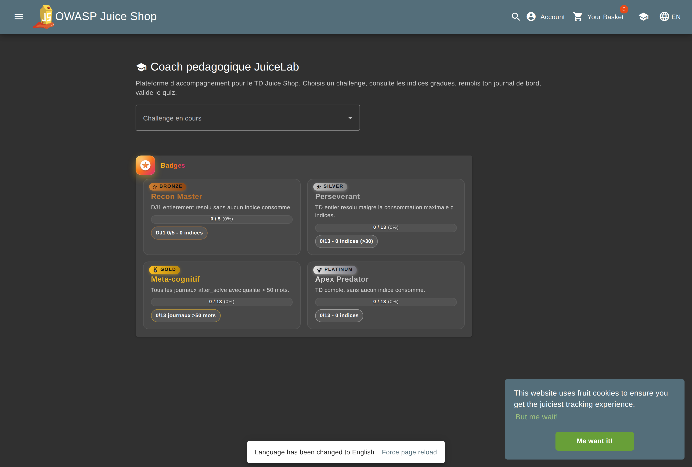

# Guide d'installation eleve — JuiceLab

> Objectif : avoir OWASP Juice Shop + l'overlay JuiceLab fonctionnel sur ton portable en **5 a 10 minutes**, sur `http://127.0.0.1:3000`.

> Version anglaise : [STUDENT-INSTALL-EN.md](./STUDENT-INSTALL-EN.md).

---

## 0. Choisis ton mode AVANT d'installer

Il y a **deux modes** et ils ne s'installent pas pareil. Lis ce tableau en premier.

| Ta situation | Mode | Ce que tu lances | Le dashboard prof ? |
|---|---|---|---|
| **TD avec un enseignant** (cas normal) | **Cohorte** | Juice Shop **seul** ; tes events partent vers le dashboard du prof | **NON, tu ne l'installes PAS.** C'est le prof qui l'heberge. |
| Tu bosses **seul, sans prof** (revision, autonomie) | **Solo** | Juice Shop **+** ton propre dashboard local | Oui, en local sur `127.0.0.1:5050` |

> **ATTENTION — erreur frequente.** En TD, **n'installe pas le dashboard sur ton portable**. Chaque eleve qui lance son propre dashboard se retrouve isole : le prof ne voit pas ta progression dans sa matrice cohorte. Utilise le **mode cohorte** (commande avec `-d`, section 3.2) et demande l'**IP du dashboard prof** a ton enseignant.

---

## 1. Ce qui sera installe

| Conteneur | Port | Role | Installe en mode... |
|---|---|---|---|
| `juicelab-juiceshop` | 3000 | OWASP Juice Shop + l'overlay pedagogique JuiceLab (`/#/juicelab`) | Cohorte **et** Solo |
| `juicelab-dashboard` | 5000 | Dashboard enseignant (matrice cohorte, indices consommes, journal) | **Solo uniquement** |
| `juicelab-db` | interne | Volume SQLite pour le log d'evenements | Solo uniquement |

En **mode cohorte**, seul `juicelab-juiceshop` tourne chez toi ; tes events sont pousses vers le dashboard du prof (tu n'as donc pas de conteneur dashboard ni de base locale).

Le premier build telecharge ~700 Mo et prend 5 a 8 minutes. Ensuite, chaque `docker compose up` est de l'ordre de 10 secondes.

Aucune donnee sensible ne quitte ton portable au-dela des events de progression envoyes au dashboard prof que tu as designe.

---

## 2. Prerequis

| Outil | Version minimum | Ou le trouver |
|---|---|---|
| **Docker Desktop** (Windows / macOS) ou **Docker Engine** (Linux) | 24+ | <https://www.docker.com/products/docker-desktop> |
| **Docker Compose v2** | livre avec Docker Desktop ; sur Linux : `sudo apt install docker-compose-v2` (distro) ou `docker-compose-plugin` (dépôt officiel Docker) — voir § Annexe A | — |
| **Git** | n'importe quelle version recente | <https://git-scm.com/downloads> |
| **OpenSSL** | livre avec Git for Windows, macOS et toutes les distros Linux | — |
| **RAM** | 4 Go libres | — |
| **Disque** | 3 Go libres | — |

Sanity check rapide :

```bash
docker --version            # Docker version 24.x ou plus
docker compose version      # Docker Compose v2.x ou plus
git --version
openssl version             # n'importe quelle sortie
```

Si `docker compose version` echoue, ton Docker est trop vieux. Sur Linux : `sudo apt install docker-compose-v2` (Ubuntu/Debian standard) ou `sudo apt install docker-compose-plugin` (dépôt officiel Docker). Sur Windows / macOS : mets a jour Docker Desktop.

---

## 3. Installation en une commande (recommande)

Meme flux sur Linux, macOS et Windows.

### 3.1 Cloner le repo

```bash
git clone https://github.com/mo0ogly/juicelab.git
cd juicelab
```

### 3.2 Lancer l'installeur

Remplace `M2-IA-2026` par l'identifiant de cohorte que ton enseignant t'a donne, et `192.168.1.10` par l'**IP du dashboard prof** qu'il t'a communiquee. Sans `-c`, le script demande la cohorte de maniere interactive.

#### Mode cohorte — TD avec un enseignant (recommande)

Juice Shop seul, events pousses vers le dashboard du prof. **Tu n'installes pas de dashboard.**

```bash
# Linux / macOS
./scripts/install-student.sh -c M2-IA-2026 -d 192.168.1.10
```

```powershell
# Windows PowerShell 7+
.\scripts\install-student.ps1 -Cohort M2-IA-2026 -Dashboard 192.168.1.10
```

> **Port du dashboard prof.** Defaut `5050`. Si ton enseignant expose un autre port (souvent `5000`), ajoute-le a l'adresse : `-d 192.168.1.10:5000` (ou `-Dashboard 192.168.1.10:5000`). L'URL d'envoi des events suivra ce port.

#### Mode solo — sans prof (autonomie)

Installe Juice Shop **et** un dashboard local sur `127.0.0.1:5050`. N'utilise ce mode que si tu travailles seul.

```bash
# Linux / macOS
./scripts/install-student.sh -c M2-IA-2026
```

```powershell
# Windows PowerShell 7+
.\scripts\install-student.ps1 -Cohort M2-IA-2026
```

Si le script bash n'est pas executable :

```bash
chmod +x scripts/install-student.sh
```

Si PowerShell se plaint de la politique d'execution, lance une fois :

```powershell
Set-ExecutionPolicy -Scope CurrentUser -ExecutionPolicy RemoteSigned
```

puis recommence.

> **PowerShell 7+ est requis.** Windows 10 a PowerShell 5.1 par defaut, qui est trop vieux. Installe PowerShell 7 depuis <https://learn.microsoft.com/fr-fr/powershell/scripting/install/installing-powershell-on-windows>.

### 3.3 Ce que fait l'installeur

Dans l'ordre :

1. Verifie que Docker, Docker Compose et OpenSSL sont disponibles.
2. Copie `docker/.env.example` vers `docker/.env` s'il n'existe pas encore.
3. Genere trois secrets aleatoires de 32 caracteres (`TEACHER_ADMIN_TOKEN`, `DASHBOARD_TEACHER_TOKEN`, `DASHBOARD_PROOF_SECRET`) avec `openssl rand -hex 16` (ou le RNG .NET sur Windows si OpenSSL est absent).
4. Ecrit `JUICELAB_COHORT_ID` selon l'argument `-c`, le fichier env, ou un prompt interactif, et `JUICELAB_INSTANCE_LABEL` selon `-l`. Ce label est le **nom de ton poste** visible par le prof dans sa matrice cohorte — il est independant du compte Juice Shop que tu creeras ensuite.
5. En mode cohorte (`-d HOST`), ecrit `DASHBOARD_PUBLIC_HOST` = l'IP du dashboard prof, puis lance `docker compose up -d --build juicelab-demo` (Juice Shop seul). En mode solo, lance `docker compose up -d --build` (Juice Shop + dashboard local).
6. Attend que `http://127.0.0.1:3000/` reponde (et, en mode solo, `http://127.0.0.1:5050/api/health`).
7. Affiche les URLs et les tokens.

L'installeur est **idempotent** : le relancer ne regenere pas les tokens deja valides. Pour une reinstallation propre, ajoute `--reset` (bash) ou `-Reset` (PowerShell).

### 3.4 Autres modes

| Commande | Effet |
|---|---|
| `./scripts/install-student.sh -c COHORTE -d IP_PROF[:PORT]` | **mode cohorte** : Juice Shop seul, events vers le dashboard prof a `IP_PROF` (port `5050` par defaut, `:5000` ou autre si precise) |
| `./scripts/install-student.sh -c COHORTE` | **mode solo** : Juice Shop + dashboard local sur `127.0.0.1:5050` |
| `./scripts/install-student.sh` | interactif, demande le cohort_id (mode solo) |
| `./scripts/install-student.sh -y` | non interactif, accepte tous les defauts (cohort = `M2-IA-2026`, mode solo) |
| `./scripts/install-student.sh --reset` | `docker compose down -v` + reinstall complet (efface les events) |
| `.\scripts\install-student.ps1 -Yes` | idem, PowerShell |
| `.\scripts\install-student.ps1 -Reset` | idem, PowerShell |

---

## 4. Verifier l'installation

Ouvre ces URLs dans ton navigateur :

| URL | Attendu |
|---|---|
| <http://127.0.0.1:3000/#/score-board> | Score-board Juice Shop avec un bouton **TD** sur chacun des 13 challenges selectionnes |
| <http://127.0.0.1:3000/#/juicelab> | Ecran « Connecte-toi a Juice Shop » (normal avant login) |
| `http://<DASHBOARD>:5050/login` | Page de login dashboard |
| `http://<DASHBOARD>:5050/api/health` | `{"ok": true}` |

> **`<DASHBOARD>` = quelle adresse ?** En **mode solo**, c'est `127.0.0.1` (le dashboard tourne sur ton portable). En **mode cohorte**, le dashboard est **distant** : utilise l'**IP du serveur prof** (`-d <IP>`), jamais `127.0.0.1`. Ton Juice Shop, lui, reste toujours sur `127.0.0.1:3000`. Le port hote du dashboard est **5050** par defaut (`5000` n'est que le port interne du conteneur).

> **`/#/juicelab` affiche « Connecte-toi a Juice Shop » ?** C'est normal. Le panneau JuiceLab est reserve aux comptes authentifies. Suis le smoke test ci-dessous — le panneau s'affiche des que tu es connecte.

> **`!!! Dashboard prof injoignable` a l'installation ?** Aussi normal si le prof n'a pas encore lance son dashboard, ou si tu n'es pas sur le meme reseau. L'installation est quand meme reussie : les events seront pousses des que le dashboard sera disponible.

Smoke test bout-en-bout :

1. Cree un compte sur Juice Shop (`/#/register`).
2. Resous **Score Board** (le lien est dans le code source de la page — `Ctrl+U`).
3. Clique sur **TD** dans la carte Score Board.
4. Dans le dialogue, remplis le journal *After* (quelques phrases qui expliquent ta resolution).
5. Colle le flag, clique **Verify**.
6. Connecte-toi au dashboard (`/login`, colle le `DASHBOARD_TEACHER_TOKEN` affiche par l'installeur).
7. Ouvre `/dashboard?cohort=<ta-cohorte>`. Tu dois voir ta ligne avec `solved`, `journal`, `quiz`, `flag verified`.

Une fois connecte, le panneau Coach pedagogique s'affiche sur `/#/juicelab` (briefing, indices gradues, quiz, badges) :



Si quelque chose echoue, voir § 6 ci-dessous.

> **Deux identites distinctes**
>
> | Identifiant | Origine | Role |
> |---|---|---|
> | **Label** (`-l fabrice`) | `docker/.env`, defini par le prof a l'install | Identifie **ton poste** dans la matrice du prof — fixe, independant de Juice Shop |
> | **Email Juice Shop** | Compte que tu crees sur `/#/register` | Deverrouille le panneau JuiceLab — peut etre n'importe quelle adresse |
>
> Le prof voit la colonne `fabrice` dans sa matrice cohorte. L'email du compte Juice Shop n'est jamais affiche en TD standard (scenario 4).

Pour le compte Juice Shop, deux options :
- **Email fictif** : `fabrice@juicelab.local` ou n'importe quelle adresse au format `x@y.z` — Juice Shop ne verifie pas que l'adresse existe.
- **Login Google** : le bouton "Login with Google" fonctionne sur `127.0.0.1:3000`. OWASP a prevu un proxy (`local3000.owasp-juice.shop`) qui intercepte le callback OAuth et le redirige vers localhost. L'email reel de ton compte Google sera alors utilise comme identifiant Juice Shop.

---

## 5. Utilisation au quotidien

Une fois installe, tu n'as **pas** besoin de relancer l'installeur. La stack survit aux reboots :

```bash
# Demarrer / reprendre
cd juicelab/docker
docker compose --env-file .env up -d

# Arreter (conserve l'historique des events)
docker compose --env-file .env down

# Logs en direct (utile quand quelque chose casse)
docker compose --env-file .env logs -f

# Reset complet (efface la base — repart de zero)
docker compose --env-file .env down -v
```

Ta progression Juice Shop, tes journaux et tes reponses au quiz sont stockes cote client dans `localStorage` (cle `juicelab_state_v1`). Ils survivent aux redemarrages de conteneurs mais **pas** a un `docker compose down -v` (la base du dashboard est aussi effacee).

---

## 6. Depannage

### Port deja utilise (`3000` ou `5000`)

Une autre appli squatte le port. Soit tu l'arretes, soit tu changes le port hote dans `docker/docker-compose.yml` et tu rebuild.

### `docker compose: command not found`

Ton Docker est trop vieux ou le plugin Compose est manquant.
- Linux (Ubuntu/Debian standard) : `sudo apt install docker-compose-v2`
- Linux (dépôt officiel Docker) : `sudo apt install docker-compose-plugin`
- Windows / macOS : mets a jour Docker Desktop.

> **Note :** les deux paquets sont mutuellement exclusifs — n'installe pas les deux. Sur Ubuntu 25.04 et plus, utilise `docker-compose-v2`.

### `permission denied` sur le script (Linux / macOS)

```bash
chmod +x scripts/install-student.sh
```

### PowerShell : *"l'execution de scripts est desactivee sur ce systeme"*

Une fois par utilisateur :

```powershell
Set-ExecutionPolicy -Scope CurrentUser -ExecutionPolicy RemoteSigned
```

### Le build echoue sur des doublons SVG `flag-icons`

Ce bug a ete patche cote repo (voir `overlay/frontend/src/assets/flag-icons-patched.min.css`). Si tu le rencontres encore, tu as clone une vieille revision : `git pull` puis relance l'installeur avec `--reset`.

### Le build echoue : `patch does not apply` (Windows / fins de ligne)

Symptome — le build s'arrete a l'etape `git apply` avec, sur de nombreux fichiers :

```
error: patch failed: config/default.yml:458
error: config/default.yml: patch does not apply
```

Cause — tu es sous **Windows** et Git a converti les fins de ligne du patch en CRLF
(`core.autocrlf=true` par defaut). Le patch CRLF ne s'applique pas aux sources LF
de Juice Shop dans le conteneur Linux. macOS / Linux ne sont pas concernes.

Correctif — le depot impose desormais des fins de ligne LF (`.gitattributes`).
**Re-clone proprement** pour recuperer les fichiers au bon format :

```powershell
cd ..
Remove-Item -Recurse -Force juicelab
git clone https://github.com/mo0ogly/juicelab.git
cd juicelab
.\scripts\install-student.ps1 -Dashboard 187.124.39.123 -Cohort JUICELAB-JUIN-2026 -Label PRENOM
```

Si l'erreur persiste apres re-clone, force la config Git AVANT de re-cloner :

```powershell
git config --global core.autocrlf false
```

### Le dashboard retourne 401 / 403

Le token dans le cookie de ton navigateur ne correspond pas a celui de `docker/.env`. Ouvre `docker/.env`, copie la valeur de `DASHBOARD_TEACHER_TOKEN`, reconnecte-toi sur `/login`.

### Les conteneurs sont en crash-loop

```bash
cd juicelab/docker
docker compose --env-file .env logs --tail=200 juiceshop
docker compose --env-file .env logs --tail=200 dashboard
```

Envoie les 50 dernieres lignes du conteneur en faute a ton enseignant.

### J'ai perdu mes tokens enseignant

```bash
grep TOKEN juicelab/docker/.env
```

Les tokens sont en clair dans ce fichier sur ton portable. Pour les regenerer : supprime les lignes correspondantes dans `docker/.env` et relance l'installeur — il en genere des neufs.

### Le dashboard ne recoit pas mes events (erreur CORS `X-User-Email`) ou preuve / verif de flag en 503

Symptomes dans la console du navigateur :

- `Request header field X-User-Email is not allowed by Access-Control-Allow-Headers`
- `Echec du telechargement de la preuve : HTTP 503 (proof signing disabled)`

Ce sont des bugs corriges dans une version recente du repo. Mets a jour ton clone et relance l'installeur dans **ton mode habituel** (il est idempotent : il ajoute le secret de preuve manquant et reapplique les fixes sans toucher a tes tokens existants) :

```bash
cd juicelab
git pull
# memes arguments que ton install initiale :
./scripts/install-student.sh -c M2-IA-2026 -d 192.168.1.10   # mode cohorte
# ou, en mode solo :
./scripts/install-student.sh -c M2-IA-2026
```

> **Mode cohorte :** l'erreur 503 de preuve vient du **dashboard du prof**, pas de chez toi (tu n'as pas de dashboard local). Signale-la a ton enseignant — c'est a lui de definir `DASHBOARD_PROOF_SECRET` cote serveur. L'erreur CORS, elle, est corrigee cote dashboard prof apres son `git pull`.

Verification CORS (le header doit apparaitre dans la reponse du dashboard interroge) :

```bash
curl -s -i -X OPTIONS http://<IP_DASHBOARD>:5050/api/sync \
  -H 'Origin: http://127.0.0.1:3000' \
  -H 'Access-Control-Request-Headers: X-User-Email' | grep -i allow-headers
```

Note : la verification de flag CTF reste desactivee tant que `JUICESHOP_CTF_SECRET` n'est pas renseigne dans le `docker/.env` du dashboard (la sync et la preuve fonctionnent sans). Demande la cle a ton enseignant si l'exercice exige la verif de flag.

---

## 7. Desinstaller

```bash
cd juicelab/docker
docker compose --env-file .env down -v   # arret + suppression des volumes
cd ../..
rm -rf juicelab                          # suppression du repo clone
docker image prune                       # optionnel, libere du disque
```

---

## 8. Ou demander de l'aide

- Ouvre une issue sur <https://github.com/mo0ogly/juicelab/issues> avec :
  - ton OS + version de Docker Desktop
  - les 50 dernieres lignes de `docker compose logs`
  - la commande exacte qui a echoue et la sortie complete

Ton enseignant et `gabrielhociel@gmail.com` sont les mainteneurs.

---

## Annexe A — Installer Docker et Docker Compose sur Linux

Deux méthodes **mutuellement exclusives**. Choisis l'une OU l'autre.

### Méthode A — paquets de la distribution (recommandée pour un TD)

```bash
sudo apt update
sudo apt install -y docker-compose-v2
sudo usermod -aG docker $USER
newgrp docker   # ou se déconnecter puis se reconnecter
docker compose version
```

`docker-compose-v2` tire `docker.io` comme dépendance : une seule commande installe tout. C'est le choix pragmatique pour un poste étudiant — la fraîcheur de version ne compte pas ici.

### Méthode B — dépôt officiel Docker (si tu veux la dernière version)

```bash
# Configurer le dépôt officiel : https://docs.docker.com/engine/install/ubuntu/
sudo apt install -y docker-ce docker-ce-cli containerd.io \
    docker-buildx-plugin docker-compose-plugin
sudo usermod -aG docker $USER
newgrp docker
docker compose version
```

> **Piège :** si tu as déjà installé la méthode A, purge-la d'abord : `sudo apt remove docker-compose-v2 docker.io`

### Vérification (commune)

```bash
docker run --rm hello-world
docker compose version
```

### Note arm64 (Apple Silicon / Snapdragon)

Sur les machines arm64 (Qualcomm X1E, Apple M1/M2/M3), le build Docker peut échouer avec `E: Dynamic MMap ran out of room`. C'est un bug connu : la liste des paquets Debian bullseye est trop volumineuse pour le cache APT par défaut. Le `Dockerfile.juicelab` du projet intègre déjà le correctif (`APT::Cache-Start "100663296"`). Si tu rencontres cette erreur sur un autre Dockerfile, la solution est :

```dockerfile
RUN printf 'APT::Cache-Start "100663296";\n' > /etc/apt/apt.conf.d/70cache \
 && apt-get update \
 && apt-get install -y --no-install-recommends <paquet> \
 && rm -rf /var/lib/apt/lists/* /etc/apt/apt.conf.d/70cache
```
