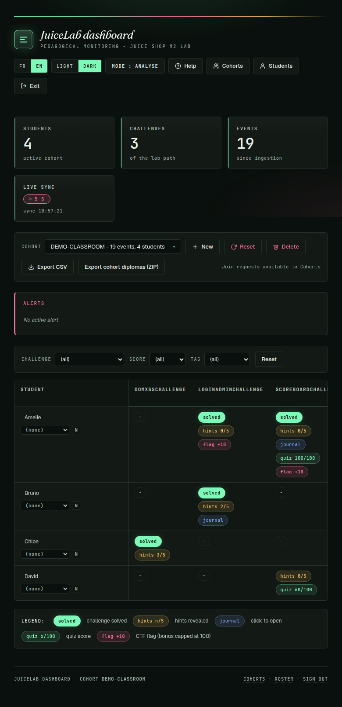
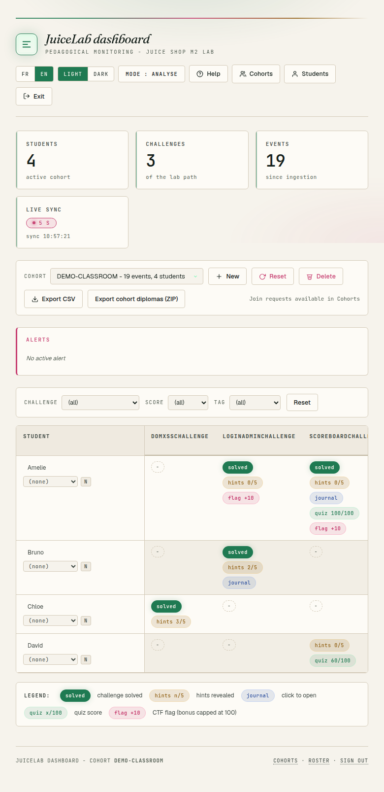

# Guide enseignant — installer et exploiter le dashboard JuiceLab

> Topologie multi-produits (JuiceLab + PwnzzAI sur un seul dashboard) :
> voir [DASHBOARD-CENTRAL.md](DASHBOARD-CENTRAL.md).

> Localized version: [TEACHER-DASHBOARD-EN.md](./TEACHER-DASHBOARD-EN.md).

> Cible : enseignant qui veut deployer le dashboard JuiceLab sur sa machine (laptop, VM ou VPS) pour suivre une cohorte d'eleves en temps reel.

> Coté élève, voir : [STUDENT-INSTALL-FR.md](./STUDENT-INSTALL-FR.md).

---

## 1. Ce que fait le dashboard

Le dashboard JuiceLab est un service Flask (port `5000` par défaut) qui :

- reçoit les évènements POSTés par les overlays JuiceLab des élèves (challenge résolu, indices consommés, journal écrit, quiz validé, flag vérifié)
- agrège ces évènements dans une base SQLite locale (`data/dashboard.sqlite`)
- expose une matrice cohorte (qui a fait quoi) au format HTML + JSON + CSV
- gère la cohorte (création, renommage, suppression, purge orphelins)
- vérifie cryptographiquement les flags (HMAC-SHA256 avec un secret partagé Juice Shop ↔ dashboard)

Aucun élève n'accède au dashboard : tout est protégé par un cookie `teacher_token` issu de `DASHBOARD_TEACHER_TOKEN`.

L'UI s'ouvre par défaut sur un **thème clair** (lisible en salle, vidéoprojecteur). Un sélecteur **clair / sombre** est dans la topbar, juste à côté du sélecteur de langue ; le choix est mémorisé par navigateur (`localStorage`).



### 1.1 Topologie : un dashboard central pour plusieurs produits

Le dashboard se déploie **une seule fois**. JuiceLab **et** PwnzzAI sont tous deux des **clients** qui pointent dessus via `JUICELAB_DASHBOARD_URL` ; aucun des deux n'embarque ni ne redéploie le serveur. Une instance, une base SQLite, une matrice cohorte unifiée. Détails, topologie et anti-patterns : [DASHBOARD-CENTRAL.md](./DASHBOARD-CENTRAL.md).

---

## 2. Prérequis

| Outil | Version min | Notes |
|---|---|---|
| Docker Desktop / Docker Engine | 24+ | recommandé pour la production |
| Docker Compose v2 | livré | sinon `sudo apt install docker-compose-plugin` |
| OU Python | 3.10+ | si tu lances `python3 app.py` directement (dev / debug) |
| OpenSSL | livré partout | génération de tokens |
| Réseau | élèves doivent atteindre `http://<TON_IP>:<PORT>` | LAN salle, VPN, ou VPS public |
| RAM | 100 Mo libres | dashboard seul est très léger |

---

## 3. Installation — chemin recommandé (Docker)

C'est le seul chemin maintenu. `python3 app.py` direct = dev / debug uniquement.

### 3.1 Cloner

```bash
git clone https://github.com/mo0ogly/juicelab.git
cd juicelab
```

### 3.2 Générer `docker/.env` avec des tokens forts

L'installeur étudiant marche aussi pour toi — il bootstrappe `.env` proprement :

```bash
./scripts/install-student.sh -c <NOM_DE_COHORTE>
# ex: ./scripts/install-student.sh -c ANSSI
```

Ce qu'il fait pour ton dashboard :

- copie `docker/.env.example` → `docker/.env`
- génère `TEACHER_ADMIN_TOKEN` + `DASHBOARD_TEACHER_TOKEN` via `openssl rand -hex 16` (32 chars)
- garde tout token déjà valide (idempotent)
- lance `docker compose --env-file .env up -d --build`
- attend `http://127.0.0.1:3000/` et `http://127.0.0.1:5000/api/health`
- affiche les deux tokens à la fin

> **Note : l'installeur démarre AUSSI un Juice Shop local**, parce qu'il est conçu pour un poste élève. Si tu veux uniquement le dashboard sur ta machine prof (et pas un Juice Shop concurrent), édite `docker/docker-compose.yml` et commente le service `juiceshop` AVANT de lancer le script.

### 3.3 Vérifier

```bash
curl http://127.0.0.1:5000/api/health
# attendu : {"ok": true, "ts": "..."}

grep DASHBOARD_TEACHER_TOKEN docker/.env
# colle la valeur dans http://127.0.0.1:5000/login
```

---

## 4. Installation alternative — Python direct (dev / debug uniquement)

```bash
cd dashboard
pip install -r requirements.txt   # ou: python3 -m venv venv && . venv/bin/activate && pip install -r requirements.txt
export DASHBOARD_TEACHER_TOKEN="$(openssl rand -hex 16)"
export DASHBOARD_PROOF_SECRET="$(openssl rand -hex 16)"
export DASHBOARD_PORT=5050
python3 app.py
```

⚠️ **Piège classique** documenté en RETEX : si tu lances `python3 app.py` à la main, **ce process N'utilise PAS `docker/.env`**. `docker/.env` est lu uniquement par `docker compose --env-file`. Un `grep DASHBOARD_TEACHER_TOKEN docker/.env` te donnera UN token, mais le process Python tournera avec UN AUTRE (celui que tu as `export` dans le shell qui l'a lancé).

Pour vérifier ce que le process tourne réellement :

```bash
PID=$(pgrep -f "python3.*app.py")
cat /proc/$PID/environ | tr '\0' '\n' | grep DASHBOARD_TEACHER_TOKEN
```

C'est la valeur affichée par cette commande qu'il faut coller dans `/login`.

---

## 5. Variables d'environnement complètes

Toutes lues par `dashboard/app.py`. À mettre dans `docker/.env` (pour Docker) ou exporter dans le shell (pour Python direct).

| Variable | Default | Usage |
|---|---|---|
| **`DASHBOARD_TEACHER_TOKEN`** | (vide → 503) | secret de login enseignant. Min 16 chars, sinon dashboard refuse de booter |
| **`DASHBOARD_PROOF_SECRET`** | (vide ou < 16 chars → signature désactivée, **503**) | HMAC-SHA256 qui signe **les preuves de lab, les diplômes ET le téléchargement de preuve côté élève** (overlay + coach PwnzzAI). Min 16 chars. Voir l'encadré ci-dessous. |
| `JUICESHOP_CTF_SECRET` | (vide) | secret CTF côté Juice Shop, doit matcher si tu actives flag verification |
| `DASHBOARD_DB` | `./data/dashboard.sqlite` | chemin du fichier SQLite |
| `DASHBOARD_PORT` | `5000` | port HTTP |
| `DASHBOARD_BIND` | `0.0.0.0` | interface d'écoute. **Production : `127.0.0.1` + reverse proxy** |
| `DASHBOARD_CORS_ORIGINS` | `http://127.0.0.1:3000,http://localhost:3000` | origines autorisées à POSTer (ajoute les ports élèves si différents) |
| `DASHBOARD_DEFAULT_COHORT` | (vide) | cohorte affichée par défaut quand `?cohort=` absent |
| `DASHBOARD_LOG_LEVEL` | `INFO` | logging Python (DEBUG/INFO/WARNING/ERROR) |
| `DASHBOARD_HTTPS` | `false` | si `true` : cookies `Secure` + header HSTS |
| `TEACHER_ADMIN_TOKEN` | — | secret admin Juice Shop (purge instances, reset accounts) |
| `JUICELAB_COHORT_ID` | — | cohorte par défaut côté Juice Shop overlay |
| `JUICELAB_DEFAULT_LANGUAGE` | `fr` | langue UI overlay |

### ⚠️ VITAL — `DASHBOARD_PROOF_SECRET` (signature des preuves et diplômes)

Le dashboard signe les preuves de lab, les diplômes et le bouton
« Télécharger la preuve » (overlay Juice Shop **et** coach PwnzzAI) avec un
HMAC-SHA256 sous cette variable.

**Symptôme si absente ou < 16 chars :** clic sur diplôme/preuve →
`503 diploma signing disabled (DASHBOARD_PROOF_SECRET missing)`, et le
bouton de preuve élève renvoie une erreur.

**Mise en place (une seule fois, sur la machine qui sert le dashboard) :**

```bash
# 1. générer un secret fort (>= 16 chars ; 64 chars hex recommandés)
openssl rand -hex 32
# 2. l'ajouter au .env Docker
echo 'DASHBOARD_PROOF_SECRET=<le_hex_genere>' >> docker/.env
# 3. rebuild (le code est bâti dans l'image, pas un simple restart)
./scripts/dashboard.sh rebuild
```

**Ne JAMAIS le changer une fois des preuves/diplômes signés.** L'ancien
secret est requis pour les vérifier (`python dashboard/verify_proof.py`).
Le changer rend invérifiables toutes les preuves déjà émises. Choisis-le
une fois, sauvegarde-le hors ligne.

> Rappel déploiement : `docker/.env` n'est lu que par
> `docker compose --env-file`. Un `python3 app.py` lancé à la main ignore ce
> fichier — le secret doit alors être `export`é dans le shell appelant.

### Générer / vérifier les secrets en une commande

`./juice.sh secrets` génère et **persiste** les secrets manquants (`DASHBOARD_TEACHER_TOKEN`, `DASHBOARD_PROOF_SECRET`) dans `docker/.env`. La commande est **idempotente** : un secret déjà valide (≥ 16 chars) n'est JAMAIS réécrit — sinon les preuves/diplômes déjà signés deviendraient invérifiables. À lancer une fois avant le premier build ; `./juice.sh build` l'appelle aussi automatiquement.

---

## 6. Piloter le dashboard — `scripts/dashboard.sh`

Le code du dashboard est **bâti dans l'image Docker** (pas monté en volume) : un changement de `.py` / `.css` / template exige un **rebuild**, pas un simple restart. Le volume SQLite survit à toutes les sous-commandes ci-dessous — aucune ne détruit les données.

### Menu interactif

Lancé **sans argument**, `scripts/dashboard.sh` affiche un menu numéroté :

```bash
./scripts/dashboard.sh
```

```
=== JuiceLab dashboard prof ===
  1) update   - git pull + rebuild (deployer une maj)
  2) rebuild  - rebuild image (sans git pull)
  3) start    - demarrer
  4) stop     - arreter
  5) restart  - redemarrer (sans rebuild)
  6) status   - etat + healthcheck
  7) logs     - suivre les logs (Ctrl-C pour sortir)
  0) quitter
```

### Sous-commandes directes (scriptables)

| Commande | Effet |
|---|---|
| `dashboard.sh update` | **`git pull origin main` PUIS rebuild** — déployer une mise à jour du code |
| `dashboard.sh rebuild` | rebuild image + recreate (sans git pull) |
| `dashboard.sh start` | démarre (sans rebuild) |
| `dashboard.sh stop` | arrête le conteneur |
| `dashboard.sh restart` | stop + start (sans rebuild) |
| `dashboard.sh status` | état + healthcheck |
| `dashboard.sh logs` | suit les logs (`Ctrl-C` pour sortir) |
| `dashboard.sh menu` | force le menu interactif |

`update` est le chemin standard pour appliquer un nouveau commit : il fait le `git pull origin main` sur la racine du repo puis enchaîne le rebuild. Si le repo est déjà à jour, il rebuild quand même pour réappliquer l'image. Chaque action qui (re)démarre le conteneur attend le `healthcheck` avant de rendre la main.

---

## 7. Persister le dashboard avec systemd (LAN / cours sur plusieurs jours)

Pour que le dashboard survive aux reboots et redémarre tout seul, crée un service systemd user :

`~/.config/systemd/user/juicelab-dashboard.service` :

```ini
[Unit]
Description=JuiceLab dashboard
After=network-online.target docker.service
Wants=network-online.target

[Service]
Type=simple
WorkingDirectory=/home/fpizzi/juice/docker
ExecStart=/usr/bin/docker compose --env-file .env up dashboard
ExecStop=/usr/bin/docker compose --env-file .env stop dashboard
Restart=on-failure
RestartSec=5

[Install]
WantedBy=default.target
```

Activer :

```bash
systemctl --user daemon-reload
systemctl --user enable --now juicelab-dashboard.service
loginctl enable-linger $USER          # pour que le service tourne même sans session ouverte
journalctl --user -u juicelab-dashboard -f
```

Si tu fais le `python3 app.py` direct, remplace `ExecStart` par :

```ini
WorkingDirectory=/home/fpizzi/juice/dashboard
EnvironmentFile=/home/fpizzi/juice/docker/.env
ExecStart=/usr/bin/python3 app.py
```

⚠️ Sans `EnvironmentFile=`, systemd ne lira PAS `docker/.env` — le service démarrerait sans token et te donnerait un 503 sur `/login`.

---

## 8. Réseau — exposer le dashboard aux élèves

Les élèves doivent atteindre `http://<TON_IP>:<PORT>`. Trois cas :

### Cas 1 : LAN salle physique

```bash
hostname -I        # ton IP, ex: 10.200.192.6
```

Vérifie que le firewall autorise le port :

```bash
sudo ufw allow 5000/tcp                                  # Ubuntu/Debian
# ou : sudo firewall-cmd --add-port=5000/tcp --permanent && sudo firewall-cmd --reload   # Fedora/RHEL
```

Test depuis un poste élève :

```bash
curl http://10.200.192.6:5000/api/health
```

### Cas 2 : VPN (élèves à distance)

Tu publies dans le VPN, élèves doivent être dessus. Utilise l'IP VPN, pas l'IP LAN.

### Cas 3 : VPS public

Lis [`docs/VPS_HARDENING.md`](./VPS_HARDENING.md) (HSTS, reverse proxy nginx + TLS Let's Encrypt, `DASHBOARD_BIND=127.0.0.1`). N'expose JAMAIS Flask brut sur internet.

---

## 9. Vérifier que les élèves arrivent bien

Une fois ton dashboard up et le message envoyé aux élèves :

```bash
# liste les évènements ingérés (la table events)
docker exec juicelab-dashboard \
  sqlite3 /app/data/dashboard.sqlite \
  "SELECT cohort_id, COUNT(*) FROM events GROUP BY cohort_id;"

# tail logs pour voir les POST en direct
cd docker
docker compose --env-file .env logs -f dashboard
```

UI :
- `/admin/cohorts` — liste / crée / purge cohortes
- `/admin/students?cohort=ANSSI` — matrice avec ligne par élève
- `/dashboard?cohort=ANSSI` — vue agrégée
- `/api/cohorts/ANSSI/csv` — export CSV (auth via header `X-Teacher-Token: <token>`)



---

## 10. Gestion cohorte — workflow type

### Créer une cohorte

Pas besoin de la créer manuellement : la cohorte est créée auto au premier event qu'un élève POST avec `cohort_id: "ANSSI"`. Tu peux aussi la pré-créer via l'UI `/admin/cohorts` ou :

```bash
curl -X POST -H "X-Teacher-Token: <TOKEN>" -H "Content-Type: application/json" \
  -d '{"cohort_id":"ANSSI","label":"M2 ANSSI 2026"}' \
  http://127.0.0.1:5000/api/cohorts
```

Format `cohort_id` accepté : `[a-zA-Z0-9_.-]{1,64}`.

### Approuver / bloquer un élève (optionnel)

Par défaut, n'importe quel `student_token` envoyant un event pour une cohorte connue est accepté (statut `validated` implicite).

Tu peux activer le workflow d'approbation manuel : voir `docs/COHORT_WORKFLOW.md`.

### Purger les orphelins (élèves test)

```bash
curl -X POST -H "X-Teacher-Token: <TOKEN>" \
  http://127.0.0.1:5000/api/cohorts/ANSSI/purge-orphans
```

Supprime les events de student_tokens qui n'existent pas dans la table `students` (utile après tests).

### Reset complet d'une cohorte

```bash
curl -X POST -H "X-Teacher-Token: <TOKEN>" \
  http://127.0.0.1:5000/api/cohorts/ANSSI/reset
```

⚠️ **Irréversible.** Wipe events + students pour cette cohorte.

---

## 11. Sécurité — checklist avant un vrai TD

- [ ] `DASHBOARD_TEACHER_TOKEN` ≥ 32 chars, généré aléatoirement (`openssl rand -hex 16`). **JAMAIS** `change-me-please-1234567890` (placeholder de tests).
- [ ] `DASHBOARD_PROOF_SECRET` configuré (≥ 16 chars). **Requis** pour preuves de lab, diplômes et téléchargement de preuve élève — sinon `503`. Voir l'encadré section 5.
- [ ] `JUICESHOP_CTF_SECRET` matche celui du Juice Shop côté élève (si flag verify activé).
- [ ] `DASHBOARD_BIND=127.0.0.1` + reverse proxy si VPS exposé internet.
- [ ] `DASHBOARD_HTTPS=true` derrière un reverse proxy TLS.
- [ ] Firewall ouvert UNIQUEMENT pour le port que les élèves doivent atteindre.
- [ ] `.env` dans `.gitignore` (déjà fait, vérifie `git status` après modif).
- [ ] Backup régulier de `data/dashboard.sqlite` (volume Docker `juicelab_dashboard_db`) avant la fin du TD.

---

## 12. Backup / restore de la base

```bash
# backup (à chaud, SQLite supporte les lecteurs concurrents)
docker exec juicelab-dashboard \
  sqlite3 /app/data/dashboard.sqlite ".backup '/tmp/db.backup'"
docker cp juicelab-dashboard:/tmp/db.backup ./dashboard-$(date +%Y%m%d-%H%M).sqlite

# restore
docker cp ./dashboard-20260512-1430.sqlite juicelab-dashboard:/app/data/dashboard.sqlite
docker compose --env-file .env restart dashboard
```

---

## 13. Dépannage

### `/login` donne 503 "Dashboard disabled"

`DASHBOARD_TEACHER_TOKEN` non set ou < 16 chars dans l'env du process. Voir § 4 piège.

### Le token de `docker/.env` ne marche pas

Tu lances `python3 app.py` direct → ce process ignore `docker/.env`. Vérifie via `cat /proc/$PID/environ | tr '\0' '\n' | grep TOKEN`.

### Élèves voient `CORS error`

Ajoute leur origine à `DASHBOARD_CORS_ORIGINS` (séparateur virgule) dans `docker/.env` puis :

```bash
docker compose --env-file .env restart dashboard
```

### Élèves voient `403 join not approved`

Tu as activé le workflow d'approbation manuel et n'as pas validé l'élève. Soit valide via `/admin/students`, soit désactive le workflow (voir `docs/COHORT_WORKFLOW.md`).

### Conteneur dashboard crash-loop

```bash
docker compose --env-file .env logs --tail=200 dashboard
```

Cause fréquente : `DASHBOARD_TEACHER_TOKEN` < 16 chars → exit fail-fast au boot.

---

## 14. Pour aller plus loin

- [`docs/DASHBOARD-CENTRAL.md`](./DASHBOARD-CENTRAL.md) — un dashboard central, plusieurs produits clients (JuiceLab + PwnzzAI)
- [`docs/COHORT_WORKFLOW.md`](./COHORT_WORKFLOW.md) — workflow approbation manuelle
- [`docs/CLASSROOM-DEPLOYMENT.md`](./CLASSROOM-DEPLOYMENT.md) — déploiement multi-poste salle
- [`docs/CTF-INTEGRATION.md`](./CTF-INTEGRATION.md) — intégration CTFd (Mode C)
- [`docs/SECURITY_POSTURE.md`](./SECURITY_POSTURE.md) — modèle de menace + mitigations
- [`docs/THREAT_MODEL.md`](./THREAT_MODEL.md) — analyse formelle
- [`docs/VPS_HARDENING.md`](./VPS_HARDENING.md) si tu déploies sur internet
