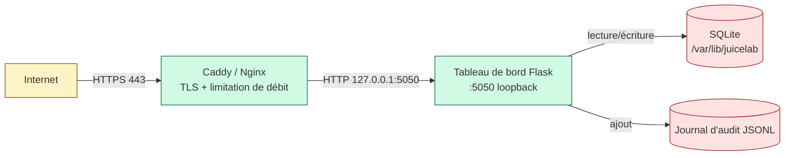

# Modèle de menaces — tableau de bord enseignant JuiceLab

> Version anglaise : [THREAT_MODEL.md](./THREAT_MODEL.md).

Ce document est le complément sécurité de
[`SECURITY.md`](../SECURITY.md). Il énumère les actifs, les
acteurs, les surfaces d'attaque et les contrôles dans le périmètre du
tableau de bord Flask + SQLite. L'application OWASP Juice Shop qui
s'exécute en dessous (répertoire `juice-shop/`) est **hors périmètre** —
consultez le modèle de menaces amont d'OWASP.

> Audience : les évaluateurs préparant le tableau de bord pour un
> déploiement de niveau OWASP, les opérateurs en salle considérant un VPS
> public, et les auditeurs vérifiant la politique de divulgation.

## Actifs

| # | Actif | Sensibilité |
|---|---|---|
| A1 | Secret de session enseignant (`DASHBOARD_TEACHER_TOKEN`) | **CRITIQUE** — point de défaillance unique pour la surface protégée |
| A2 | Secret HMAC de preuve (`DASHBOARD_PROOF_SECRET`) | **ÉLEVÉE** — la rotation invalide toutes les preuves PDF antérieures |
| A3 | Secret du drapeau CTF (`JUICESHOP_CTF_SECRET`) | ÉLEVÉE — partagé avec le mode CTF de Juice Shop |
| A4 | Table des événements (`dashboard.sqlite::events`) | MOYENNE — état pédagogique, inclut le texte du journal étudiant |
| A5 | Registre des étudiants (`dashboard.sqlite::students`) | MOYENNE — adresse e-mail + nom d'affichage + affectation de cohorte |
| A6 | Cookie CSRF (`csrf_token`) | FAIBLE — courte durée de vie, par session |
| A7 | Code source et catalogues i18n | FAIBLE — publics sur le fork |

## Acteurs

| Code | Acteur | Capacités |
|---|---|---|
| T1 | Enseignant (utilisateur attendu) | Administration complète sur `/admin/cohorts` et `/dashboard` une fois authentifié. Peut effectuer la rotation de cohorte, approuver / rejeter, exporter les preuves. |
| T2 | Étudiant (utilisateur attendu) | Soumet `POST /api/cohort/join`, puis envoie des événements à `/api/sync` après approbation de l'enseignant. Session navigateur sur Juice Shop uniquement ; aucune session sur l'hôte du tableau de bord. |
| T3 | Attaquant anonyme externe | Peut atteindre les points de terminaison publics depuis Internet si le tableau de bord est exposé. Aucun identifiant, aucun JWT, aucun cookie. |
| T4 | Pair de cohorte | Un étudiant validé qui tente d'usurper les événements d'un autre étudiant ou d'exfiltrer le texte du journal d'un pair. |
| T5 | Opérateur malveillant | Clé SSH ou jeton CI compromis sur l'hôte. Hors de la frontière de menace de l'application, documenté par souci d'exhaustivité. |
| T6 | Attaquant sur la chaîne d'approvisionnement | Compromet une dépendance transitive (`flask`, `flask-cors`, etc.) et pousse une mise à jour malveillante. |

## Inventaire des surfaces d'attaque

| Surface | Préfixe URL | Authentification | Sensible ? |
|---|---|---|---|
| Pages HTML d'administration | `/dashboard`, `/admin/*`, `/login`, `/logout` | Cookie `teacher_token` + cookie CSRF | oui |
| API JSON protégée | `/api/cohorts*`, `/api/students*`, `/api/cohort` (simple), `/api/journal-text`, `/api/admin/*` | En-tête `X-Teacher-Token` OU cookie + CSRF | oui |
| Ingestion publique | `POST /api/sync`, `POST /api/verify-flag` | Vérification de statut côté serveur + HMAC | partielle |
| Adhésion publique | `POST /api/cohort/join`, `GET /api/cohort/exists` | Limitation de débit par IP | partielle |
| Interrogation publique | `GET /api/student/status` | Limitation de débit par IP | faible |
| Santé publique | `GET /api/health` | aucune | aucune |
| Preuve publique | `GET /api/proof` | Signature HMAC-SHA256 + présence du secret | oui |
| Ressources statiques | `/static/*` | aucune | faible |

## Frontières de confiance

## Principales menaces et contrôles (cartographiés selon STRIDE)

| ID | Catégorie | Menace | Impact | Probabilité | Contrôle |
|---|---|---|---|---|---|
| TH-01 | **S**poofing | L'attaquant usurpe le cookie `teacher_token` | Prise de contrôle totale de l'administration | Faible (secret de 32 octets + HTTPS) | `hmac.compare_digest`, `httponly=true`, `samesite=Lax`, longueur minimale de 16 caractères, drapeau `Secure` en mode HTTPS |
| TH-02 | **S**poofing | L'étudiant usurpe le `student_token` (UUID) d'un autre étudiant | Mauvaise attribution dans la matrice de cohorte | Moyenne (l'UUID est côté client, l'attaquant peut le lire depuis les outils de développement) | Le champ e-mail est collecté lors de l'adhésion, l'enseignant peut vérifier visuellement le display_name par rapport à l'e-mail. La signature HMAC de la preuve empêche de forger un proof.md valide. |
| TH-03 | **T**ampering | CSRF sur `/admin/cohorts` pendant que le navigateur de l'enseignant visite un site attaquant | Suppression de cohorte, injection d'approbation | Faible (SameSite=Lax) | Motif double-submit cookie (`X-CSRF-Token` renvoyé depuis le cookie `csrf_token`). Les clients API via l'en-tête `X-Teacher-Token` contournent cela, car le modèle de menace ne s'applique pas. |
| TH-04 | **T**ampering | Injection SQL via l'adresse e-mail ou le code de cohorte fournis par l'étudiant | Lecture / écriture hors intention dans la base de données | Faible (l'audit confirme 0 f-string dans execute) | Chaque `conn.execute(...)` utilise des paramètres `?`. La fonction `_clean_id()` normalise cohort_id par expression régulière. L'expression régulière de l'e-mail normalise à la frontière. |
| TH-05 | **T**ampering | Preuve HMAC falsifiée | L'étudiant obtient une preuve valide sans résoudre le challenge | Faible (secret de 32 octets) | `hmac.compare_digest` pour la vérification du drapeau, `secrets.token_hex(32)` pour le CSRF, `HMAC-SHA256` sur la preuve. |
| TH-06 | **R**epudiation | L'enseignant nie avoir approuvé ou rejeté un étudiant | Notation contestée | Faible (salles à enseignant unique) | L'événement `decision` est journalisé dans `audit.jsonl` avec l'horodatage, la cohorte, le préfixe du jeton étudiant et la chaîne decided_by. |
| TH-07 | **I**nformation disclosure | Jeton enseignant divulgué dans les journaux HTTP (URL ou corps) | Rotation du jeton nécessaire | Moyenne (tendance par défaut au copier-coller) | Le jeton est lu depuis le cookie ou l'en-tête, n'apparaît jamais dans l'URL. Le format de journal JSON de Caddy garde le corps séparé. |
| TH-08 | **I**nformation disclosure | La fenêtre modale du journal enseignant expose le texte d'un pair par déduction de l'URL | Violation de la vie privée des pairs | Faible | `/api/journal-text` est protégé par le jeton enseignant. Aucune forme `/api/journal-text/<student>` que les étudiants pourraient itérer. |
| TH-09 | **I**nformation disclosure | Trace d'erreur Flask détaillée en production | Fuite de la pile d'appels | Faible | `debug=False` imposé ; `app.run(debug=False)` dans `__main__`. Les déploiements de production utilisent un serveur WSGI (gunicorn / uwsgi). |
| TH-10 | **D**enial of service | Flood de `/api/cohort/join` pour remplir la liste des étudiants en attente | Perturbation opérationnelle | Élevée si le tableau de bord est public | Limitation de débit par fenêtre glissante par IP (10 / heure / IP) + visibilité par cohorte pour que l'enseignant repère les anomalies. |
| TH-11 | **D**enial of service | Flood de `/api/sync` avec des données parasites pour remplir `events` | Pression sur le disque | Moyenne | La vérification de statut `status='validated'` côté serveur rejette les étudiants non approuvés. Caddy + fail2ban détecte les rafales soutenues. |
| TH-12 | **D**enial of service | Requête SQL longue sur la vue de la matrice de cohorte | Blocage du processus worker | Faible (serveur de développement Flask mono-processus, petites cohortes) | Index sur `(cohort_id)`, `(student_token)`, `(cohort_id, status)`. Les sous-requêtes restent dans COUNT, pas d'explosion de JOIN. |
| TH-13 | **E**levation of privilege | La session UI compromise injecte de nouveaux points de terminaison d'administration | Porte dérobée persistante | Faible | Les routes sont enregistrées au démarrage via `create_app()` ; aucun eval dynamique, aucun chargement de plugin depuis une entrée utilisateur. La fabrique d'application est en lecture seule à l'exécution. |
| TH-14 | **E**levation | Injection de commande dans un sous-processus | Exécution de code sur l'hôte | Faible (aucun `subprocess.run` avec une entrée utilisateur) | L'audit confirme 0 `subprocess.run(shell=True)` avec des données utilisateur. |
| TH-15 | **E**levation | Chaîne d'approvisionnement des dépendances | Exécution de code | Faible à moyenne | `requirements.txt` épinglé aux versions majeures. Exécuter `pip-audit` et `safety` avant chaque publication. Le suivi du durcissement dans SECURITY.md enregistre chaque cycle. |

## Menaces hors périmètre

| Hors périmètre | Raison | Voir |
|---|---|---|
| Bogues du cœur d'OWASP Juice Shop | Projet amont | https://github.com/juice-shop/juice-shop/security/policy |
| Durcissement de CTFd | Service externe | https://docs.ctfd.io/docs/security/ |
| Système d'exploitation hôte compromis | Couche d'infrastructure | `docs/VPS_HARDENING.md` |
| DDoS au niveau réseau | Délégué au proxy inverse / CDN | Caddy + mode proxy Cloudflare |
| Accès physique au fichier SQLite | Couche OS / système de fichiers | LUKS / chiffrement des sauvegardes |
| CVE du noyau OS | Mises à jour automatiques | `docs/VPS_HARDENING.md` § 9 |

## Preuves d'audit

| Preuve | Emplacement |
|---|---|
| Revue statique | `dashboard/tests/test_*_api.sh` (84 PASS), audits grep (comparaison à temps constant, SQL paramétré, pas d'eval/exec/shell). |
| Piste d'audit (exécution) | Lignes de `data/audit.jsonl` pour login_success, login_fail, csrf_fail, sync_blocked, join_request, decision. |
| En-têtes | `curl -sI https://your-dashboard/api/health` retourne 5 en-têtes de durcissement. |
| Limitation de débit | `test_misc_api.sh M-10` prouve le 429 en cas de flood. |
| Drapeaux de cookie | `curl -sI` affiche `HttpOnly`, `SameSite=Lax`, `Secure` (quand `HTTPS=true`). |
| CSRF | `test_csrf_api.sh` 12/12 couvre les quatre chemins d'application. |

## Cycle de vie

Ce modèle de menaces est révisé à chaque cycle PDCA sur le tableau de bord.
Le suivi du durcissement dans `SECURITY.md` liste les cycles, les
constatations et le commit qui a clôturé chacune d'elles. Les modifications
majeures du modèle (nouveau type de point de terminaison, nouvel acteur, nouvel
actif) sont consignées dans `docs/COHORT_WORKFLOW.md` § 10.
