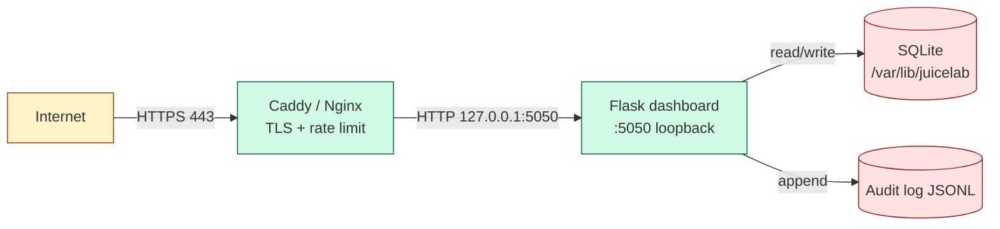

# Threat model — JuiceLab teacher dashboard

> French version: [THREAT_MODEL-FR.md](./THREAT_MODEL-FR.md).

This document is the security-side companion to
[`SECURITY.md`](../SECURITY.md). It enumerates the assets, the
actors, the attack surfaces, and the controls in scope of the
Flask + SQLite dashboard. The OWASP Juice Shop application running
underneath (`juice-shop/` directory) is **out of scope** here — see
the upstream OWASP threat model.

> Audience : reviewers preparing the dashboard for an OWASP-grade
> deployment, classroom operators considering a public VPS, and
> auditors verifying the disclosure policy.

## Assets

| # | Asset | Sensitivity |
|---|---|---|
| A1 | Teacher session secret (`DASHBOARD_TEACHER_TOKEN`) | **CRITICAL** — single point of failure for the gated surface |
| A2 | Proof HMAC secret (`DASHBOARD_PROOF_SECRET`) | **HIGH** — rotation invalidates every prior PDF proof |
| A3 | CTF flag secret (`JUICESHOP_CTF_SECRET`) | HIGH — shared with the Juice Shop CTF mode |
| A4 | Events table (`dashboard.sqlite::events`) | MEDIUM — pedagogical state, includes student journal text |
| A5 | Students roster (`dashboard.sqlite::students`) | MEDIUM — email + display name + cohort assignment |
| A6 | CSRF cookie (`csrf_token`) | LOW — short-lived, per-session |
| A7 | Source code & i18n catalogs | LOW — public on the fork |

## Actors

| Code | Actor | Capabilities |
|---|---|---|
| T1 | Teacher (intended user) | Full admin on `/admin/cohorts` and `/dashboard` once authenticated. Can rotate cohort, approve / reject, export proofs. |
| T2 | Student (intended user) | Submits POST /api/cohort/join, then sends events to /api/sync after teacher approval. Browser session on Juice Shop only ; no session on the dashboard host. |
| T3 | External anonymous attacker | Can reach public endpoints from the internet if the dashboard is exposed. No credentials, no JWT, no cookies. |
| T4 | Cohort peer | A validated student who tries to spoof another student's events or to exfiltrate peer journal text. |
| T5 | Malicious operator | Compromised SSH key or CI token on the host. Out of the application's threat boundary but documented for completeness. |
| T6 | Supply-chain attacker | Compromises a transitive dependency (`flask`, `flask-cors`, etc.) and pushes a malicious update. |

## Attack surface inventory

| Surface | URL prefix | Authentication | Sensitive ? |
|---|---|---|---|
| HTML admin pages | `/dashboard`, `/admin/*`, `/login`, `/logout` | Cookie `teacher_token` + CSRF cookie | yes |
| Gated JSON API | `/api/cohorts*`, `/api/students*`, `/api/cohort` (single), `/api/journal-text`, `/api/admin/*` | Header `X-Teacher-Token` OR cookie + CSRF | yes |
| Public ingestion | `POST /api/sync`, `POST /api/verify-flag` | server-side status gate + HMAC | partial |
| Public join | `POST /api/cohort/join`, `GET /api/cohort/exists` | rate limit per IP | partial |
| Public polling | `GET /api/student/status` | rate limit per IP | low |
| Public health | `GET /api/health` | none | none |
| Public proof | `GET /api/proof` | HMAC-SHA256 signature + secret presence | yes |
| Static assets | `/static/*` | none | low |

## Trust boundaries

## Top threats and controls (STRIDE-mapped)

| ID | Category | Threat | Impact | Likelihood | Control |
|---|---|---|---|---|---|
| TH-01 | **S**poofing | Attacker spoofs the `teacher_token` cookie | Full admin takeover | Low (32-byte secret + HTTPS) | `hmac.compare_digest`, `httponly=true`, `samesite=Lax`, 16-char minimum length, `Secure` flag in HTTPS mode |
| TH-02 | **S**poofing | Student spoofs another student's `student_token` (UUID) | Wrong attribution in cohort matrix | Medium (UUID is client-side, attacker can read it from DevTools) | Email field collected at join time, teacher can cross-check display_name vs email visually. HMAC proof signing prevents forging a valid proof.md. |
| TH-03 | **T**ampering | CSRF on `/admin/cohorts` while teacher's browser visits attacker site | Cohort deletion, approval injection | Low (SameSite=Lax) | Double-submit cookie pattern (`X-CSRF-Token` echoed from `csrf_token` cookie). API clients via `X-Teacher-Token` header bypass since the threat model does not apply. |
| TH-04 | **T**ampering | SQL injection via student-supplied email or cohort code | Database read / write outside intent | Low (audit confirms 0 f-string in execute) | Every `conn.execute(...)` uses `?` placeholders. `_clean_id()` regex normalises cohort_id. Email regex normalises at boundary. |
| TH-05 | **T**ampering | Forged HMAC proof | Student gets a valid proof without solving | Low (32-byte secret) | `hmac.compare_digest` on flag check, `secrets.token_hex(32)` for CSRF, `HMAC-SHA256` on proof. |
| TH-06 | **R**epudiation | Teacher denies they approved or rejected a student | Disputed grading | Low (single-teacher classrooms) | `decision` event logged in `audit.jsonl` with timestamp, cohort, student token prefix, decided_by string. |
| TH-07 | **I**nformation disclosure | Teacher token leaked in HTTP logs (URL or body) | Token rotation needed | Medium (default-prone to copy-paste) | Token is read from cookie or header, never appears in URL. Caddy log format JSON keeps body separate. |
| TH-08 | **I**nformation disclosure | Teacher journal modal exposes peer text via URL guess | Peer privacy violation | Low | `/api/journal-text` is gated by teacher token. No `/api/journal-text/<student>` form that students could iterate. |
| TH-09 | **I**nformation disclosure | Verbose Flask error trace in production | Stack leak | Low | `debug=False` enforced ; `app.run(debug=False)` in `__main__`. Production deployments use a WSGI server (gunicorn / uwsgi). |
| TH-10 | **D**enial of service | Flood `/api/cohort/join` to fill the student pending list | Operational disruption | High if dashboard is public | Per-IP sliding-window rate limit (10 / hour / IP) + per-cohort visibility for the teacher to spot anomalies. |
| TH-11 | **D**enial of service | Flood `/api/sync` with garbage to fill `events` | Disk pressure | Medium | Server-side `status='validated'` gate rejects unapproved students. Caddy + fail2ban catches sustained bursts. |
| TH-12 | **D**enial of service | Long-running SQL on the cohort matrix view | Worker stall | Low (single-process Flask dev server, small cohorts) | Indexes on `(cohort_id)`, `(student_token)`, `(cohort_id, status)`. Subqueries kept inside COUNT, no JOIN explosion. |
| TH-13 | **E**levation of privilege | Compromised UI session injects new admin endpoints | Persistent backdoor | Low | Routes registered at boot via `create_app()` ; no dynamic eval, no plugin loading from user input. Application factory is read-only at runtime. |
| TH-14 | **E**levation | Subprocess command injection | Code execution on the host | Low (no `subprocess.run` with user input) | Audit confirms 0 `subprocess.run(shell=True)` with user data. |
| TH-15 | **E**levation | Dependency supply-chain | Code execution | Low-medium | `requirements.txt` pinned to majors. Run `pip-audit` and `safety` before each release. The hardening tracker in SECURITY.md records each cycle. |

## Out-of-scope threats

| Out of scope | Why | See |
|---|---|---|
| OWASP Juice Shop core bugs | Upstream project | https://github.com/juice-shop/juice-shop/security/policy |
| CTFd hardening | External service | https://docs.ctfd.io/docs/security/ |
| Compromised host OS | Infrastructure layer | `docs/VPS_HARDENING.md` |
| Network-level DDoS | Up to the reverse proxy / CDN | Caddy + Cloudflare proxy mode |
| Physical access to the SQLite file | OS / fs layer | LUKS / backup encryption |
| OS kernel CVEs | Auto-updates | `docs/VPS_HARDENING.md` § 9 |

## Audit evidence

| Evidence | Where |
|---|---|
| Static review | `dashboard/tests/test_*_api.sh` (84 PASS), grep audits (timing-safe compare, parameterized SQL, no eval/exec/shell). |
| Audit trail (runtime) | `data/audit.jsonl` lines for login_success, login_fail, csrf_fail, sync_blocked, join_request, decision. |
| Headers | `curl -sI https://your-dashboard/api/health` returns 5 hardening headers. |
| Rate limit | `test_misc_api.sh M-10` proves 429 on flood. |
| Cookie flags | `curl -sI` shows `HttpOnly`, `SameSite=Lax`, `Secure` (when HTTPS=true). |
| CSRF | `test_csrf_api.sh` 12/12 covers the four enforcement paths. |

## Lifecycle

This threat model is reviewed at every PDCA cycle on the dashboard.
The hardening tracker in `SECURITY.md` lists the cycles, the
findings, and the commit that closed each one. Major model changes
(new endpoint type, new actor, new asset) are logged in
`docs/COHORT_WORKFLOW.md` § 10.
