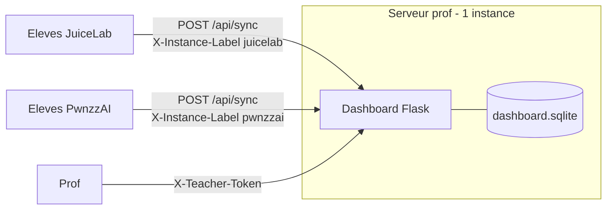

# Dashboard prof central partage — Implementation Plan

> **For Claude:** REQUIRED SUB-SKILL: Use superpowers:executing-plans to implement this plan task-by-task.

**Goal:** Rendre le dashboard prof JuiceLab deployable seul (sans le code eleve juice) via un clone `git sparse-checkout` pinne, une seule instance centrale consommee par juicelab ET PwnzzAI.

**Architecture:** Le code `dashboard/` reste dans le repo `juice` (source de verite, deja decouple : 0 dependance sur juice-shop/overlay). On ajoute un compose dashboard-only, un bootstrap sparse pinne, et cote PwnzzAI un wrapper de deploiement + config. Aucun refactor du code Flask.

**Tech Stack:** docker compose, bash, git sparse-checkout (cone mode), Flask/SQLite (existant, non modifie).

**Design de reference:** `docs/plans/2026-06-01-dashboard-central-partage-design.md`

**Repos:**
- `juice` = mo0ogly/juicelab — `/home/fpizzi/juice`
- `PwnzzAI` = mo0ogly/PwnzzAI — `/home/fpizzi/PwnzzAI`

---

## Notes transverses

- Pas de test unitaire pertinent ici (yaml/bash/docs). Les gates sont :
  `docker compose config` (valide le yaml + resolution env), `bash -n`
  (syntaxe shell), et un dry-run logique du sparse clone.
- Strip CRLF avant chaque commit sur les fichiers touches :
  `sed -i 's/\r$//' <fichier>`.
- Co-Authored-By dans juice : `Claude Opus 4.8 (1M context) <noreply@anthropic.com>`.
  Cote PwnzzAI : **aucune reference a Claude** dans commits/docs (contrainte user).
- Le volume SQLite de prod existant s'appelle `juicelab_dashboard_data` (projet
  compose `juicelab`). Le compose dashboard-only DOIT garder `name: juicelab`
  pour pointer le **meme** volume et ne pas repartir sur une base vide.

---

## Task 1 (juice): compose dashboard-only

**Files:**
- Create: `/home/fpizzi/juice/docker/docker-compose.dashboard.yml`

**Step 1: Ecrire le fichier**

```yaml
# JuiceLab dashboard-only — deploiement de la SEULE partie prof.
#
# Ne demarre QUE le dashboard Flask (pas de juice-shop, pas d'overlay eleve).
# C'est le compose tire par scripts/bootstrap-dashboard.sh sur une machine
# vierge (sparse checkout dashboard/ + docker/). Pour le dev local complet
# (dashboard + juice-shop), utiliser docker-compose.yml.
#
#   cd docker
#   cp .env.example .env   # renseigner les secrets
#   docker compose --env-file .env -f docker-compose.dashboard.yml up -d --build
#
# name: juicelab => meme projet/volume que docker-compose.yml : la base
# SQLite (volume juicelab_dashboard_data) est partagee, pas reinitialisee.

name: juicelab

services:

  dashboard:
    build:
      context: ..
      dockerfile: docker/Dockerfile.dashboard
    image: juicelab-dashboard:latest
    container_name: juicelab-dashboard
    environment:
      DASHBOARD_TEACHER_TOKEN: "${DASHBOARD_TEACHER_TOKEN:?must be set in .env}"
      DASHBOARD_PROOF_SECRET: "${DASHBOARD_PROOF_SECRET:-}"
      DASHBOARD_PORT: "5000"
      DASHBOARD_DB: "/app/data/dashboard.sqlite"
      DASHBOARD_BIND: "${DASHBOARD_BIND:-0.0.0.0}"
      DASHBOARD_CORS_ORIGINS: "${DASHBOARD_CORS_ORIGINS:-}"
      DASHBOARD_LOG_LEVEL: "${DASHBOARD_LOG_LEVEL:-INFO}"
      CTFD_URL: "${CTFD_URL:-}"
      CTFD_ADMIN_TOKEN: "${CTFD_ADMIN_TOKEN:-}"
      CTFD_PENALTY_FORMULA: "${CTFD_PENALTY_FORMULA:-mirror_juicelab}"
      CTFD_TEAM_MODE: "${CTFD_TEAM_MODE:-team}"
    volumes:
      - dashboard_data:/app/data
    ports:
      - "${DASHBOARD_PORT:-5050}:5000"
    networks: [juicelab_net]
    healthcheck:
      test: ["CMD", "python", "-c", "import urllib.request,sys; urllib.request.urlopen('http://127.0.0.1:5000/api/health', timeout=8); sys.exit(0)"]
      interval: 10s
      timeout: 12s
      retries: 5
    restart: unless-stopped
    security_opt:
      - no-new-privileges:true
    cap_drop:
      - ALL

networks:
  juicelab_net:
    driver: bridge

volumes:
  dashboard_data:
    driver: local
```

**Step 2: Valider le yaml + resolution env**

Run:
```bash
cd /home/fpizzi/juice/docker
DASHBOARD_TEACHER_TOKEN=test-token-1234567890 \
  docker compose -f docker-compose.dashboard.yml config >/dev/null && echo OK
```
Expected: `OK` (aucune erreur yaml, le service juice-shop est absent de la sortie).

**Step 3: Verifier qu'un seul service est defini**

Run:
```bash
cd /home/fpizzi/juice/docker
DASHBOARD_TEACHER_TOKEN=x1234567890123456 \
  docker compose -f docker-compose.dashboard.yml config --services
```
Expected: une seule ligne `dashboard`.

**Step 4: Commit**

```bash
cd /home/fpizzi/juice
sed -i 's/\r$//' docker/docker-compose.dashboard.yml
git add docker/docker-compose.dashboard.yml
git commit -m "feat(docker): compose dashboard-only (partie prof deployable seule)"
```

---

## Task 2 (juice): bootstrap sparse pinne

**Files:**
- Create: `/home/fpizzi/juice/scripts/bootstrap-dashboard.sh`

**Step 1: Ecrire le script**

```bash
#!/usr/bin/env bash
#
# bootstrap-dashboard.sh - deploie la SEULE partie prof (dashboard Flask) sur
# une machine vierge, sans cloner le code eleve juice.
#
# Tire UNIQUEMENT dashboard/ + docker/ via git sparse-checkout a une ref
# pinnee, puis lance docker-compose.dashboard.yml. Jamais overlay/, juice-shop/,
# scripts d'install eleve.
#
# Usage :
#   scripts/bootstrap-dashboard.sh [TARGET_DIR]
#
# Variables d'env :
#   JUICELAB_REPO_URL      defaut https://github.com/mo0ogly/juicelab.git
#   JUICELAB_DASHBOARD_REF branche ou SHA a deployer (defaut: main ; PIN conseille)
#   DASHBOARD_ENV_FILE     chemin du .env a utiliser (defaut: <TARGET>/docker/.env)
#
set -euo pipefail

REPO_URL="${JUICELAB_REPO_URL:-https://github.com/mo0ogly/juicelab.git}"
REF="${JUICELAB_DASHBOARD_REF:-main}"
TARGET="${1:-${JUICELAB_DASHBOARD_DIR:-./juicelab-dashboard}}"

if ! command -v docker >/dev/null 2>&1; then
  echo "ERREUR: docker absent." >&2; exit 1
fi

# 1. Sparse clone (cone) ou reutilisation d'un clone existant.
#    Set = dashboard docker scripts. `scripts` est inclus pour que ce bootstrap
#    ne se supprime pas lui-meme du working tree (narrowing) et pour qu'un
#    wrapper externe (PwnzzAI) puisse le reutiliser. scripts/ ne contient aucun
#    code PRODUIT eleve (overlay/juice-shop) : juste des bootstrappers.
if [ ! -d "$TARGET/.git" ]; then
  echo "[bootstrap] sparse clone $REPO_URL -> $TARGET (dashboard/ + docker/ + scripts/)"
  git clone --filter=blob:none --sparse "$REPO_URL" "$TARGET"
  git -C "$TARGET" sparse-checkout set dashboard docker scripts
else
  echo "[bootstrap] clone existant detecte dans $TARGET"
  git -C "$TARGET" sparse-checkout set dashboard docker scripts
  git -C "$TARGET" fetch --filter=blob:none origin
fi

# 2. Checkout de la ref pinnee.
echo "[bootstrap] checkout ref: $REF"
git -C "$TARGET" checkout -q "$REF"
echo "[bootstrap] HEAD: $(git -C "$TARGET" rev-parse --short HEAD)"

# 3. Garde-fou : on ne doit avoir tire QUE dashboard/ + docker/.
extra="$(git -C "$TARGET" ls-tree --name-only HEAD | grep -Ev '^(dashboard|docker)$' || true)"
checked_out="$(cd "$TARGET" && ls -A | grep -Ev '^\.git$' | sort | tr '\n' ' ')"
echo "[bootstrap] presents sur le disque: $checked_out"

# 4. .env.
ENV_FILE="${DASHBOARD_ENV_FILE:-$TARGET/docker/.env}"
if [ ! -f "$ENV_FILE" ]; then
  cp "$TARGET/docker/.env.example" "$ENV_FILE"
  echo "[bootstrap] $ENV_FILE cree depuis .env.example."
  echo "[bootstrap] RENSEIGNE les secrets (DASHBOARD_TEACHER_TOKEN >= 16,"
  echo "[bootstrap] DASHBOARD_PROOF_SECRET >= 16) puis relance ce script."
  exit 1
fi

# 5. Up.
echo "[bootstrap] docker compose up (dashboard-only)"
( cd "$TARGET/docker" && docker compose --env-file "$ENV_FILE" \
    -f docker-compose.dashboard.yml up -d --build )
echo "[bootstrap] dashboard lance. Sante: docker inspect juicelab-dashboard --format '{{.State.Health.Status}}'"
```

**Step 2: Syntaxe**

Run: `bash -n /home/fpizzi/juice/scripts/bootstrap-dashboard.sh && echo OK`
Expected: `OK`.

**Step 3: Dry-run du sparse (sans docker, dossier temp)**

Run:
```bash
tmp="$(mktemp -d)"
git clone --filter=blob:none --sparse https://github.com/mo0ogly/juicelab.git "$tmp/d"
git -C "$tmp/d" sparse-checkout set dashboard docker scripts
( cd "$tmp/d" && ls -A | grep -Ev '^\.git$' | sort )
```
Expected: exactement `dashboard`, `docker`, `scripts` (PAS de `overlay`,
`juice-shop`, `docs`, `patches`). Nettoyer : `rm -rf "$tmp"`.

**Step 4: chmod + commit**

```bash
cd /home/fpizzi/juice
chmod +x scripts/bootstrap-dashboard.sh
sed -i 's/\r$//' scripts/bootstrap-dashboard.sh
git add scripts/bootstrap-dashboard.sh
git commit -m "feat(scripts): bootstrap-dashboard.sh (deploy prof seul via sparse pinned)"
```

---

## Task 3 (juice): doc topologie

**Files:**
- Create: `/home/fpizzi/juice/docs/DASHBOARD-CENTRAL.md`
- Modify: `/home/fpizzi/juice/docs/TEACHER-DASHBOARD-FR.md` (ajout d'un lien en tete)

**Step 1: Ecrire `docs/DASHBOARD-CENTRAL.md`**

```markdown
# Dashboard prof central — une instance, plusieurs clients

Le dashboard prof (Flask, `dashboard/`) se deploie **une seule fois**. JuiceLab
et PwnzzAI sont tous deux des **clients** qui pointent dessus ; aucun des deux
n'embarque ni ne re-deploie le serveur.

## Topologie



## Deployer (une fois, sur le serveur central)

Sans cloner le code eleve, via sparse checkout pinne :

```bash
# pinner une ref (SHA conseille en prod)
JUICELAB_DASHBOARD_REF=main \
  scripts/bootstrap-dashboard.sh /opt/juicelab-dashboard
```

Le script ne tire que `dashboard/` + `docker/`. Voir
`scripts/bootstrap-dashboard.sh`.

## Brancher les clients

- JuiceLab (overlay) : `JUICELAB_DASHBOARD_URL` -> URL du dashboard central.
- PwnzzAI (coach)   : meme `JUICELAB_DASHBOARD_URL`. Voir
  `PwnzzAI/scripts/deploy-dashboard.sh` si on deploie le dashboard depuis PwnzzAI.

## Coexistence des deux produits sur la meme instance

- `instance_label` (header `X-Instance-Label`) distingue la source de chaque
  evenement dans la matrice prof.
- Cohortes namespacees : `M2-*` (juicelab), `PWNZZAI-*` (pwnzzai).
- `DASHBOARD_CORS_ORIGINS` doit lister les origines eleves des DEUX produits si
  elles different.

## Anti-pattern

Ne PAS deployer un second dashboard "pour PwnzzAI". Une instance, deux clients.
Deux instances = deux bases SQLite = le prof voit ses eleves coupes en deux.
```

**Step 2: Lien en tete de `docs/TEACHER-DASHBOARD-FR.md`**

Ajouter juste apres le titre H1 du fichier :

```markdown
> Topologie multi-produits (JuiceLab + PwnzzAI sur un seul dashboard) :
> voir [DASHBOARD-CENTRAL.md](DASHBOARD-CENTRAL.md).
```

**Step 3: Verifier le mermaid (pas de box-drawing ASCII, regle CLAUDE.md)**

Run: `grep -n 'flowchart\|sequenceDiagram' /home/fpizzi/juice/docs/DASHBOARD-CENTRAL.md`
Expected: au moins une ligne `flowchart`.

**Step 4: Commit**

```bash
cd /home/fpizzi/juice
sed -i 's/\r$//' docs/DASHBOARD-CENTRAL.md docs/TEACHER-DASHBOARD-FR.md
git add docs/DASHBOARD-CENTRAL.md docs/TEACHER-DASHBOARD-FR.md
git commit -m "docs: topologie dashboard central (1 instance, juicelab + pwnzzai clients)"
```

---

## Task 4 (PwnzzAI): variable de pin dans .env.example

**Files:**
- Modify: `/home/fpizzi/PwnzzAI/.env.example`

**Step 1: Ajouter les variables**

Sous le bloc `# --- Avance ---` (apres `PWNZZAI_COMMIT=...`), ajouter :

```bash

# --- Deploiement du dashboard prof (optionnel) ---
# Si tu deploies le dashboard central DEPUIS cette machine via
# scripts/deploy-dashboard.sh : ref (SHA conseille) du repo juicelab dont on
# tire la partie prof. Laisse vide si le dashboard tourne deja ailleurs.
JUICELAB_DASHBOARD_REF=main
# URL du repo juicelab (source de la partie prof, sparse checkout).
JUICELAB_REPO_URL=https://github.com/mo0ogly/juicelab.git
```

**Step 2: Verifier**

Run: `grep -n 'JUICELAB_DASHBOARD_REF\|JUICELAB_REPO_URL' /home/fpizzi/PwnzzAI/.env.example`
Expected: les deux cles presentes.

**Step 3: Commit (PwnzzAI — pas de reference Claude)**

```bash
cd /home/fpizzi/PwnzzAI
sed -i 's/\r$//' .env.example
git add .env.example
git commit -m "feat(env): variables de deploiement du dashboard prof central"
```

---

## Task 5 (PwnzzAI): wrapper deploy-dashboard.sh

**Files:**
- Create: `/home/fpizzi/PwnzzAI/scripts/deploy-dashboard.sh`

**Step 1: Creer le dossier + le script**

```bash
#!/usr/bin/env bash
#
# deploy-dashboard.sh - deploie le dashboard prof JuiceLab central depuis cette
# machine, SANS embarquer le code eleve juice.
#
# Wrapper fin autour du bootstrap sparse de juicelab : on tire UNIQUEMENT la
# partie prof (dashboard/ + docker/) a une ref pinnee. Installer PwnzzAI ne tire
# jamais l'overlay ni le juice-shop eleve.
#
# Usage :
#   scripts/deploy-dashboard.sh [TARGET_DIR]
#
# Lit .env si present (JUICELAB_REPO_URL, JUICELAB_DASHBOARD_REF).
#
set -euo pipefail

HERE="$(cd "$(dirname "${BASH_SOURCE[0]}")/.." && pwd)"
TARGET="${1:-${JUICELAB_DASHBOARD_DIR:-$HERE/.juicelab-dashboard}}"

# Charger .env si present (sans ecraser l'env deja exporte).
if [ -f "$HERE/.env" ]; then
  set -a; . "$HERE/.env"; set +a
fi

REPO_URL="${JUICELAB_REPO_URL:-https://github.com/mo0ogly/juicelab.git}"
REF="${JUICELAB_DASHBOARD_REF:-main}"
BOOTSTRAP="$TARGET/scripts/bootstrap-dashboard.sh"

echo "[deploy-dashboard] source: $REPO_URL @ $REF -> $TARGET"

# 1. Premier clone sparse si besoin (le bootstrap inclut scripts/ dans son set,
#    donc une fois present il ne se supprime pas lui-meme).
if [ ! -d "$TARGET/.git" ]; then
  git clone --filter=blob:none --sparse "$REPO_URL" "$TARGET"
  git -C "$TARGET" sparse-checkout set dashboard docker scripts
  git -C "$TARGET" checkout -q "$REF"
fi

# 2. Deleguer au bootstrap officiel (source unique de la logique de deploiement).
#    Lui-meme re-set le sparse (dashboard docker scripts), fetch, checkout REF,
#    cree le .env si absent, et up le compose dashboard-only.
chmod +x "$BOOTSTRAP"
JUICELAB_REPO_URL="$REPO_URL" JUICELAB_DASHBOARD_REF="$REF" \
  "$BOOTSTRAP" "$TARGET"
```

> Note d'implementation : le bootstrap reste la **source unique** de la logique
> de deploiement ; le wrapper ne fait que faire le premier clone (pour disposer
> du bootstrap) puis l'appeler. `scripts/` de juice ne contient aucun code
> PRODUIT eleve (install-student.* sont des bootstrappers, pas l'overlay ni le
> juice-shop).

**Step 2: Syntaxe**

Run: `bash -n /home/fpizzi/PwnzzAI/scripts/deploy-dashboard.sh && echo OK`
Expected: `OK`.

**Step 3: chmod + commit (PwnzzAI — pas de reference Claude)**

```bash
cd /home/fpizzi/PwnzzAI
chmod +x scripts/deploy-dashboard.sh
sed -i 's/\r$//' scripts/deploy-dashboard.sh
git add scripts/deploy-dashboard.sh
git commit -m "feat(scripts): deploy-dashboard.sh (dashboard prof central, zero code eleve juice)"
```

---

## Task 6 (PwnzzAI): doc

**Files:**
- Modify: `/home/fpizzi/PwnzzAI/README.md` (section "Dashboard prof")
- Modify: `/home/fpizzi/PwnzzAI/docs/PARITY-JUICELAB.md` (note topologie)

**Step 1: Ajouter au README une sous-section**

Inserer (a l'endroit qui parle du dashboard / cohorte) :

```markdown
### Dashboard prof (central, partage)

Le dashboard prof se deploie **une seule fois** et sert juicelab ET PwnzzAI.
PwnzzAI n'embarque pas le serveur : il pointe dessus via `JUICELAB_DASHBOARD_URL`.

Si tu veux le deployer depuis cette machine (sans cloner le code eleve juice) :

```bash
scripts/deploy-dashboard.sh
```

Cela tire uniquement la partie prof (dashboard + docker) du repo juicelab a la
ref `JUICELAB_DASHBOARD_REF`, puis lance le compose dashboard-only. Renseigne
les secrets dans le `.env` genere (`DASHBOARD_TEACHER_TOKEN`,
`DASHBOARD_PROOF_SECRET`, >= 16 caracteres) puis relance.

Anti-pattern : ne deploie pas un second dashboard. Une instance, deux clients.
```

**Step 2: Note dans PARITY-JUICELAB.md**

Ajouter en fin de fichier :

```markdown
## Topologie dashboard

Le dashboard prof est central et unique. PwnzzAI le consomme comme client
(`JUICELAB_DASHBOARD_URL`) ou le deploie via `scripts/deploy-dashboard.sh`
(sparse checkout pinne de la seule partie prof). Le code serveur n'est jamais
duplique dans ce repo. Detail cote juicelab : `docs/DASHBOARD-CENTRAL.md`.
```

**Step 3: Commit (PwnzzAI — pas de reference Claude)**

```bash
cd /home/fpizzi/PwnzzAI
sed -i 's/\r$//' README.md docs/PARITY-JUICELAB.md
git add README.md docs/PARITY-JUICELAB.md
git commit -m "docs: dashboard prof central partage (1 instance, PwnzzAI client)"
```

---

## Verification finale (apres toutes les tasks)

1. **juice** : `cd docker && DASHBOARD_TEACHER_TOKEN=x1234567890123456 docker compose -f docker-compose.dashboard.yml config --services` -> `dashboard` seul.
2. **juice** : `bash -n scripts/bootstrap-dashboard.sh` -> exit 0.
3. **Sparse reel** : un clone sparse `set dashboard docker` ne pose QUE
   `dashboard/` + `docker/` sur le disque (pas overlay/juice-shop).
4. **PwnzzAI** : `bash -n scripts/deploy-dashboard.sh` -> exit 0.
5. **PwnzzAI** : `grep JUICELAB_DASHBOARD_REF .env.example` present.
6. **Push** : `git push origin main` sur les DEUX repos (pull --no-rebase si diverge).

## Criteres de succes (rappel design)

- Machine vierge : bootstrap lance le dashboard sans telecharger overlay/juice-shop.
- compose dashboard-only ne demarre QUE le dashboard.
- PwnzzAI deploie le dashboard sans cloner le repo juice complet.
- Une instance, deux clients (instance_label + cohortes namespacees).
- `docker-compose.yml` full (dev local juice) intact.
